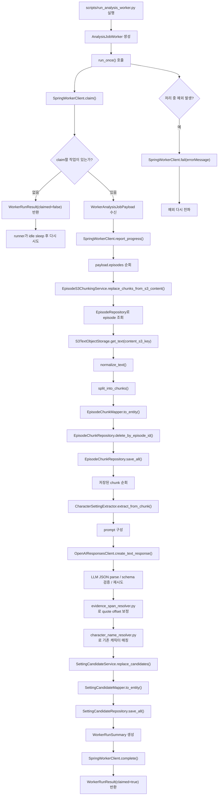

# AI Worker Workflow

Python AI Worker가 Spring 내부 Worker API로 분석 작업을 claim한 뒤, 실제 원문 분석을 수행하는 흐름을 정리합니다.

프로젝트 전체 분석 job 생성, 업로드 batch와 episode 연결, 사용자-facing 조회 API는 Spring 백엔드 문서가 기준입니다. 이 문서는 Spring 문서의 "Python AI Worker" 구간을 Python 코드 기준으로 자세히 펼친 문서입니다.

## 한 줄 요약

```text
Spring claim
-> episode별 S3 원문 로드
-> 원문 정규화/청킹
-> chunk별 LLM 설정 후보 추출
-> evidence quote 위치 보정
-> setting_candidates 저장
-> Spring complete/fail 보고
```

Python Worker는 `analysis_jobs.status`를 DB에서 직접 바꾸지 않습니다. 상태 변경은 Spring 내부 API에 보고하고, Python은 분석에 필요한 원문 청크와 설정 후보 저장을 담당합니다.

## 전체 흐름



## 단계별 설명

### 1. Worker 실행

`scripts/run_analysis_worker.py`가 Worker를 실행합니다.

- `--once`: claim을 한 번만 시도합니다.
- `--max-iterations`: 로컬 점검용 반복 횟수를 제한합니다.
- 옵션이 없으면 claim 가능한 작업이 생길 때까지 반복 실행합니다.

이 파일은 운영 queue consumer가 아니라, 현재 API polling 기반 Worker를 로컬 또는 서버 프로세스로 실행하기 위한 진입점입니다.

### 2. 분석 작업 claim

`AnalysisJobWorker.run_once()`는 `SpringWorkerClient.claim()`을 호출합니다.

Spring이 claim 가능한 `PENDING` 작업을 찾으면 `RUNNING`으로 바꾸고, Python에 `WorkerAnalysisJobPayload`를 반환합니다. claim할 작업이 없으면 Python은 오류로 처리하지 않고 `claimed=false` 결과를 반환합니다.

payload에는 분석 대상 `episodes`와 캐릭터명 매칭에 사용할 기존 캐릭터 목록인 `knownCharacters`가 함께 포함됩니다.

이 단계에서 Python은 `analysis_jobs` 테이블을 직접 수정하지 않습니다.

### 3. 회차 원문 로드와 청킹

claim payload의 episode 목록을 기준으로 `EpisodeS3ChunkingService`가 회차별 원문을 처리합니다.

처리 순서는 다음과 같습니다.

```text
episode_id로 DB episode 조회
-> episode.content_s3_key 확인
-> S3에서 원문 text 조회
-> 원문 정규화
-> 문단/길이 기준 청킹
-> 기존 episode_chunks 삭제
-> 새 episode_chunks 저장
```

청킹 결과는 LLM 입력으로도 사용되고, 나중에 설정 후보의 근거 위치를 표시할 때 기준 원문으로도 사용됩니다.

### 4. chunk별 설정 후보 추출

저장된 chunk마다 `CharacterSettingExtractor`를 호출합니다.

이 단계에서 하는 일은 다음과 같습니다.

- 시스템 프롬프트를 읽습니다.
- chunk 원문, 회차 번호, 회차 제목을 user prompt로 구성합니다.
- OpenAI Responses API를 호출합니다.
- LLM 응답을 JSON으로 파싱합니다.
- Pydantic schema로 필수 필드와 타입을 검증합니다.
- 파싱/검증 실패 시 설정된 횟수만큼 재시도합니다.

현재 추출 결과는 바로 확정 설정이 아니라, 사용자 검토 전 상태인 `setting_candidates` 후보로 저장됩니다.

프롬프트는 Spring의 설정 확정 흐름과 맞도록 아래 출력 계약을 요구합니다.

- `attribute_name`은 `age`, `level`, `stats.<스탯명>`, `skills.<스킬명>`, `items.<아이템명>`, `status.<상태명>`, `time.<시간 또는 사건명>` 형태로 반환합니다.
- `attribute_value`는 목록/검토 화면 표시용 summary이며, 식별자나 로직 판단 기준으로 사용하지 않습니다.
- `value_json`은 실제 값의 source of truth입니다. 나이/레벨은 `{"value": number}` 형태를 우선 사용합니다.
- `evidence_spans[].quote`는 원문 일부를 요약/의역하지 않고 그대로 복사합니다.
- `evidence_spans[].start_offset`, `end_offset`은 LLM 값이 아니라 Python 후처리에서 다시 계산합니다.

### 5. evidence quote 위치 보정

`AnalysisJobWorker`는 LLM 추출 결과를 저장하기 전에 `evidence_spans[].quote` 위치를 보정합니다.

처리 기준은 다음과 같습니다.

```text
LLM이 반환한 quote
-> chunk_text exact match 검색
-> 실패 시 공백/줄바꿈 정규화 기반 검색
-> chunk 내부 위치에 episode_chunks.start_offset 더하기
-> 회차 전체 원문 기준 start_offset/end_offset 저장
```

LLM이 반환한 숫자 offset은 참고하지 않습니다. quote를 찾지 못하면 후보 자체는 저장하되, 잘못된 위치를 저장하지 않도록 `start_offset`, `end_offset`은 `null`로 둡니다.

### 6. setting_candidates 저장

`SettingCandidateService`는 검증된 LLM 추출 결과를 DB 저장 모델로 변환합니다.

저장 기준은 다음과 같습니다.

- `analysis_job_id`와 연결합니다.
- `work_id`, `episode_id`, `source_chunk_id`를 함께 저장합니다.
- `entity_name`, `attribute_name`, `attribute_value`, `value_json`, `evidence_spans`를 후보 단위로 저장합니다.
- `raw_entity_mention`은 원문에 실제 등장한 캐릭터 표현이고, 없으면 `entity_name`으로 fallback해 저장합니다.
- Spring claim payload의 `knownCharacters`와 후보 이름을 비교해 `matched_character_id`, `match_status`를 저장합니다.
- `evidence_spans[].start_offset`, `end_offset`은 회차 전체 원문 기준 위치입니다.
- 후보는 기본적으로 `PENDING_REVIEW` 상태입니다.

사용자가 후보를 승인/수정/반려하는 흐름은 Spring 사용자-facing API가 담당합니다.

### 7. 완료/실패 보고

모든 episode/chunk 처리가 끝나면 Python Worker는 `SpringWorkerClient.complete()`를 호출합니다.

요약 정보는 `summaryJson`으로 전달합니다.

예시:

```json
{
  "episodeCount": 3,
  "chunkCount": 18,
  "candidateCount": 42
}
```

처리 중 예외가 발생하면 `SpringWorkerClient.fail()`을 호출해 실패 사유를 Spring에 보고합니다.

## 책임 경계

| 책임 | 담당 |
| --- | --- |
| 분석 job 생성 | Spring |
| 작품 소유권/사용자 권한 검증 | Spring |
| claim 가능한 job 선택과 `RUNNING` 전환 | Spring |
| S3 원문 읽기 | Python |
| 원문 정규화/청킹 | Python |
| `episode_chunks` 저장 | Python |
| LLM 호출과 JSON 검증/재시도 | Python |
| evidence quote 위치 보정 | Python |
| `setting_candidates` 후보 저장 | Python |
| 사용자 후보 조회/수정/승인/반려 | Spring |
| `SUCCEEDED` / `FAILED` 상태 반영 | Spring 내부 API 호출을 통해 처리 |

## 관련 코드 읽는 순서

처음 읽을 때는 아래 순서가 가장 이해하기 쉽습니다.

1. `scripts/run_analysis_worker.py`
   - Worker 프로세스가 어떻게 반복 실행되는지 봅니다.
2. `app/worker/analysis_job_worker.py`
   - claim부터 complete/fail까지 전체 orchestration을 봅니다.
3. `app/clients/spring_worker_client.py`
   - Spring 내부 API와 어떤 payload를 주고받는지 봅니다.
4. `app/services/episode_s3_chunking_service.py`
   - episode_id에서 S3 원문을 읽고 chunk 저장으로 넘기는 흐름을 봅니다.
5. `app/services/episode_chunk_service.py`
   - 원문 정규화, 청킹, 기존 chunk 교체 저장 흐름을 봅니다.
6. `app/analysis/setting_extractor.py`
   - LLM 프롬프트 구성, 호출, JSON 검증, 재시도 흐름을 봅니다.
7. `app/analysis/evidence_span_resolver.py`
   - LLM이 반환한 quote를 chunk 원문에서 찾아 회차 전체 기준 offset으로 보정하는 흐름을 봅니다.
8. `app/services/setting_candidate_service.py`
   - 검증된 추출 결과가 `setting_candidates`로 저장되는 흐름을 봅니다.

## 후속 작업

- `NVM-225`: `AMBIGUOUS` 중 화자/대명사 후보에 한해 adjacent chunk를 참고하는 resolver fallback을 검토합니다.
- `NVM-141`: `episode_chunks` 임베딩과 pgvector Top-K 검색 PoC를 구현합니다.
- Queue/SQS consumer 도입은 API polling 방식의 한계가 확인된 뒤 검토합니다.
