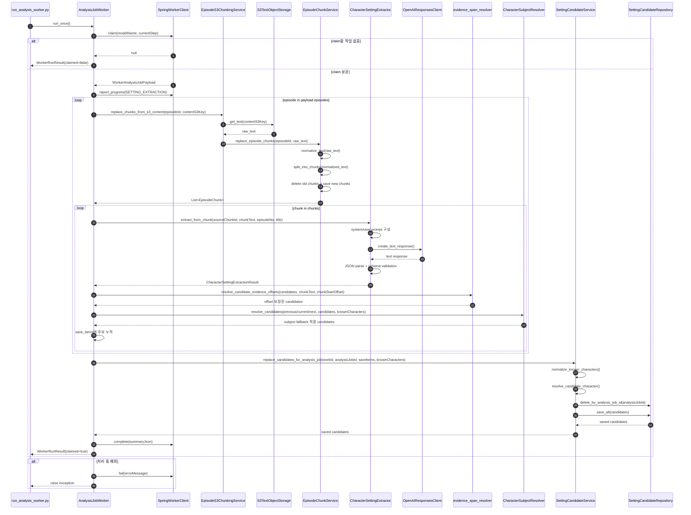

# AI Worker Workflow

Python AI Worker가 Spring 내부 Worker API로 분석 작업을 claim한 뒤, S3 원문을 읽고 청킹/LLM 추출/후보 저장/완료 보고까지 수행하는 흐름을 정리합니다.

프로젝트 전체 분석 job 생성, 업로드 batch와 episode 연결, 사용자-facing 조회/수정/확정 API는 Spring 백엔드 문서가 기준입니다. 이 문서는 Spring 문서의 "Python AI Worker" 구간을 Python 코드 기준으로 자세히 펼친 문서입니다.

## 한 줄 요약

```text
Spring claim
-> claim payload의 episodes/knownCharacters 수신
-> episode별 S3 원문 raw text 조회
-> 분석 기준 원문으로 normalize
-> 정규화 원문 기준 paragraph/chunk offset 계산
-> chunk_text를 LLM에 전달
-> LLM 설정 후보 JSON 파싱/검증
-> quote를 chunk_text에서 다시 찾아 evidence offset 보정
-> 지칭어/placeholder 후보를 LLM subject fallback으로 해소
-> raw/entity 캐릭터명을 knownCharacters와 비교
-> setting_candidates 교체 저장
-> Spring complete/fail 보고
```

Python Worker는 `analysis_jobs.status`를 DB에서 직접 바꾸지 않습니다. 상태 변경은 Spring 내부 API에 보고하고, Python은 분석에 필요한 `episode_chunks`와 `setting_candidates` 저장을 담당합니다.

## 주요 문자열과 기준

| 이름 | 의미 | 생성/사용 위치 | 기준 |
| --- | --- | --- | --- |
| `raw_text` | S3에서 읽은 회차 원문 문자열 | `S3TextObjectStorage.get_text()` | S3 객체 내용 그대로 |
| `normalized_text` | 분석 기준으로 정리된 회차 원문 | `normalize_text(raw_text)` | 이후 chunk/offset 계산의 기준 |
| `Paragraph.text` | 정규화 원문에서 공백이 아닌 한 줄 | `split_paragraphs()` | `normalized_text` 기준 start/end offset 보유 |
| `chunk_text` | LLM에 전달되는 청크 원문 | `normalized_text[start_offset:end_offset]` | 재조립 문자열이 아니라 정규화 원문 slice |
| `evidence_spans[].quote` | LLM이 근거로 복사한 원문 일부 | LLM 응답 | `chunk_text` 안에서 다시 검색 |
| `start_offset/end_offset` | 근거 문장의 위치 | `evidence_span_resolver.py` | 정규화된 회차 원문 전체 기준 |
| `raw_entity_mention` | 원문에 실제 등장한 캐릭터 표현 | LLM 응답 | 예: `나`, `프넬린의 두 번째 딸 아이나르` |
| `entity_name` | LLM이 청크 문맥에서 정리한 후보 캐릭터명 | LLM 응답 | 예: `아이나르`, `비요른 얀델` |
| `knownCharacters.name` | Spring이 내려준 기존 캐릭터명 | claim payload | 캐릭터 매칭 비교 대상 |
| subject fallback | 지칭어/placeholder 후보의 주체 해소 | `character_subject_resolver.py` | previous/current/next chunk 기준 |

중요한 기준:

- offset은 원본 업로드 파일 기준이 아니라 `normalize_text()` 이후의 정규화된 회차 원문 기준입니다.
- `chunk_text`는 문단을 새로 이어 붙인 값이 아니라 정규화 원문에서 잘라낸 slice입니다.
- LLM이 반환한 숫자 offset은 신뢰하지 않고, `quote`를 실제 `chunk_text`에서 찾아 다시 계산합니다.
- 캐릭터명 매칭은 LLM이 DB 매칭을 직접 하는 것이 아니라, Python resolver가 `knownCharacters`와 비교해 계산합니다.

## 전체 흐름

```mermaid
flowchart TD
    A["scripts/run_analysis_worker.py 실행"] --> B["AnalysisJobWorker 생성"]
    B --> C["run_once() 호출"]
    C --> D["SpringWorkerClient.claim()"]

    D --> E{"claim할 작업이 있는가?"}
    E -- "없음" --> F["WorkerRunResult(claimed=false) 반환"]
    F --> G["runner가 idle sleep 후 다시 claim 시도"]

    E -- "있음" --> H["WorkerAnalysisJobPayload 수신<br/>analysisJobId, work, episodes, knownCharacters"]
    H --> I["SpringWorkerClient.report_progress()<br/>currentStep=SETTING_EXTRACTION"]
    I --> J["payload.episodes 순회"]

    J --> K["contentS3Key 확인"]
    K -->|"없음"| KX["INVALID_REQUEST 예외"]
    K -->|"있음"| L["S3에서 raw_text 조회"]
    L --> M["normalize_text(raw_text)<br/>분석 기준 원문 생성"]
    M --> N["split_paragraphs()<br/>문단별 offset 계산"]
    N --> O["split_into_chunks()<br/>문단/길이 기준 청크 draft 생성"]
    O --> P["EpisodeChunkMapper.to_entity()<br/>chunk_text는 normalized_text slice"]
    P --> Q["기존 episode_chunks 삭제"]
    Q --> R["새 episode_chunks 저장"]

    R --> S["저장된 chunk 순회"]
    S --> T["LLM user prompt 구성<br/>metadata + chunk_text"]
    T --> U["OpenAI Responses API 호출"]
    U --> V{"JSON parse / schema 검증 성공?"}
    V -- "실패, 재시도 남음" --> U
    V -- "실패, 재시도 소진" --> VX["LlmExtractionError"]
    V -- "성공" --> W["ExtractedSettingCandidate 목록 생성"]

    W --> X["quote를 chunk_text에서 exact match 검색"]
    X --> Y{"quote를 찾았는가?"}
    Y -- "예" --> Z["chunk local offset 계산"]
    Y -- "아니오" --> AA["공백/줄바꿈 정규화 후 재검색"]
    AA --> AB{"정규화 검색 성공?"}
    AB -- "예" --> Z
    AB -- "아니오" --> AC["start/end offset = null 유지"]
    Z --> AD["chunk.start_offset 더해<br/>회차 전체 offset으로 보정"]
    AC --> AE["지칭어 + placeholder 후보<br/>LLM subject fallback"]
    AD --> AE
    AE --> AEF["save_items에 후보 추가"]

    AEF --> AF{"모든 episode/chunk 처리 완료?"}
    AF -- "아니오" --> J
    AF -- "예" --> AG["knownCharacters 이름을 한 번 정규화"]
    AG --> AH["raw_entity_mention/entity_name 정규화"]
    AH --> AI["기존 캐릭터 매칭 상태 계산<br/>MATCHED / UNRESOLVED / AMBIGUOUS"]
    AI --> AJ["analysis_job_id 기준<br/>기존 setting_candidates 삭제"]
    AJ --> AK["새 setting_candidates 저장"]
    AK --> AL["summaryJson 생성<br/>episodeCount, chunkCount, candidateCount"]
    AL --> AM["SpringWorkerClient.complete()"]
    AM --> AN["WorkerRunResult(claimed=true) 반환"]

    C --> ERR{"처리 중 예외 발생?"}
    ERR -- "예" --> FAIL["SpringWorkerClient.fail(errorMessage)"]
    FAIL --> RAISE["예외 다시 전파<br/>현재 runner loop도 중단"]
```



## Sequence



## 단계별 상세

### 1. Worker 실행과 claim

`scripts/run_analysis_worker.py`는 `AnalysisJobWorker.run_once()`를 반복 호출하는 CLI runner입니다.

- `--once`: claim을 한 번만 시도합니다.
- `--max-iterations`: 로컬 점검용 반복 횟수를 제한합니다.
- `--idle-sleep-seconds`: claim할 작업이 없을 때 다음 polling 전 대기 시간입니다.
- `--model-name`: Spring claim payload와 LLM extractor에 사용할 모델명을 넘깁니다.

claim 결과가 없으면 Worker는 오류로 처리하지 않고 `WorkerRunResult(claimed=false)`를 반환합니다. 반복 실행 모드에서는 이 경우에만 sleep 후 다시 claim합니다.

claim 결과가 있으면 Spring은 해당 작업을 `RUNNING`으로 전환한 payload를 반환합니다. Python은 `analysis_jobs` 테이블을 직접 수정하지 않습니다.

payload에서 Python이 직접 사용하는 값:

| 값 | 사용처 |
| --- | --- |
| `analysis_job_id` | 후보 저장 연결, complete/fail 보고 |
| `work_id`, `work_title` | 후보 저장, runner 출력 |
| `episodes[].episode_id` | chunk 저장, 후보 episode 연결 |
| `episodes[].episode_no`, `episodes[].title` | LLM user prompt metadata |
| `episodes[].content_s3_key` | S3 원문 조회 |
| `knownCharacters[].character_id`, `name` | 기존 캐릭터 매칭 |

### 2. S3 원문 조회와 정규화

`EpisodeS3ChunkingService.replace_chunks_from_s3_content()`는 claim payload의 `content_s3_key`를 그대로 사용합니다.

이 값을 다시 DB에서 조회하지 않는 이유는 claim 시점의 payload가 Worker가 처리해야 할 기준 입력이기 때문입니다. Worker가 episode를 다시 조회하면 claim 이후 바뀐 값을 볼 수 있어 작업 기준이 흔들릴 수 있습니다.

처리 흐름:

```text
content_s3_key 없음
-> INVALID_REQUEST

content_s3_key 있음
-> S3TextObjectStorage.get_text(content_s3_key)
-> raw_text
-> EpisodeChunkService.replace_episode_chunks(episode_id, raw_text)
```

`normalize_text(raw_text)`는 다음 규칙으로 분석 기준 원문을 만듭니다.

| 입력 노이즈 | 처리 |
| --- | --- |
| `\r\n`, `\r` | `\n`으로 통일 |
| BOM `\ufeff` | 제거 |
| zero-width space `\u200b` | 제거 |
| non-breaking space `\u00a0` | 일반 공백으로 치환 |
| tab `\t` | 일반 공백으로 치환 |
| 각 줄 끝 공백 | 제거 |
| 3개 이상 연속 줄바꿈 | 2개 줄바꿈으로 축약 |
| 전체 앞뒤 공백 | 제거 |

이후 모든 청크 offset과 evidence offset은 `raw_text`가 아니라 `normalized_text` 기준입니다.

### 3. 문단 분리와 청킹

`split_paragraphs(normalized_text)`는 정규화된 회차 원문을 줄 단위로 순회합니다.

- 공백뿐인 줄은 문단으로 만들지 않습니다.
- 각 문단은 `Paragraph(index, text, start_offset, end_offset)`을 가집니다.
- `start_offset`, `end_offset`은 `normalized_text` 전체 기준입니다.
- 줄바꿈 문자는 cursor 계산에는 포함하지만, `Paragraph.text`에는 포함하지 않습니다.

`split_into_chunks()`는 문단 경계를 우선해 청크를 만듭니다.

기본값:

| 값 | 의미 |
| --- | --- |
| `target_chars = 1000` | 가능하면 이 길이를 넘으면 chunk를 확정 |
| `min_chars = 300` | 너무 짧은 chunk를 피하기 위한 최소 기준 |
| `max_chars = 1500` | 한 문단 자체가 너무 긴 경우 문단 내부 분할 기준 |

청킹 규칙:

1. 한 문단이 `max_chars`보다 길면, 현재까지 모은 문단을 먼저 chunk로 확정합니다.
2. 긴 문단은 문단 하나 안에서 `max_chars` 단위로 나눕니다.
3. 일반 문단은 현재 chunk 후보에 합쳐봅니다.
4. 합친 길이가 `target_chars`를 넘고, 기존 chunk 후보가 이미 `min_chars` 이상이면 기존 chunk를 확정합니다.
5. 문맥 보존을 위해 문단 경계를 우선하므로, chunk 길이가 항상 `target_chars` 이하로 고정되지는 않습니다.

`EpisodeChunkDraft.chunk_text`는 문단 문자열을 새로 조립하지 않습니다.

```text
start_offset = 첫 문단 start_offset
end_offset = 마지막 문단 end_offset
chunk_text = normalized_text[start_offset:end_offset]
```

이 방식 덕분에 `chunk_text` 안에서 찾은 quote 위치에 `chunk.start_offset`을 더하면 정규화된 회차 원문 전체 기준 offset으로 변환할 수 있습니다.

### 4. episode_chunks 교체 저장

`EpisodeChunkService.replace_episode_chunks()`는 한 회차의 기존 chunk를 지우고 새 chunk를 저장합니다.

처리 흐름:

```text
raw_text
-> normalize_text()
-> split_into_chunks()
-> EpisodeChunkMapper.to_entity()
-> delete_by_episode_id(episode_id)
-> save_all(chunks)
-> commit
```

삭제와 저장은 같은 DB 트랜잭션 안에서 처리합니다. 중간에 예외가 발생하면 rollback하고 예외를 다시 던집니다.

주의할 점:

- chunk 저장은 episode 단위로 즉시 일어납니다.
- 이후 LLM 추출이나 후보 저장에서 실패하면 Spring에는 fail을 보고하지만, 이미 성공적으로 저장된 `episode_chunks`는 별도 보상 삭제를 하지 않습니다.
- 같은 episode를 다시 처리하면 기존 chunk를 삭제하고 새 chunk로 교체하므로 chunk가 중복 누적되지 않습니다.

### 5. chunk별 LLM 설정 후보 추출

`AnalysisJobWorker`는 저장된 chunk마다 `CharacterSettingExtractor.extract_from_chunk()`를 호출합니다.

LLM 입력은 시스템 프롬프트와 user prompt로 나뉩니다.

user prompt에는 다음 값이 들어갑니다.

```json
{
  "metadata": {
    "source_chunk_id": "episode_chunks.id",
    "episode_no": 1,
    "episode_title": "1화"
  },
  "chunk_text": "LLM이 분석할 청크 원문"
}
```

LLM 응답 처리:

1. 응답 텍스트 앞뒤 공백을 제거합니다.
2. JSON 코드블록으로 감싼 경우 바깥 fence를 제거합니다.
3. 앞뒤 설명 문장이 섞인 경우 첫 JSON 객체 범위를 잘라냅니다.
4. `json.loads()`로 파싱합니다.
5. `CharacterSettingExtractionResult` Pydantic schema로 검증합니다.

재시도 기준:

- JSON 문법이 깨진 경우 재시도합니다.
- 필수 필드 누락, UUID 형식 오류, enum 범위 오류, confidence 범위 오류처럼 schema 검증에 실패하면 재시도합니다.
- schema상 유효한 문자열이지만 프롬프트 정책상 애매한 값은 현재 재시도하지 않습니다.

LLM 출력 계약:

| 필드 | 역할 |
| --- | --- |
| `source_chunk_id` | 후보가 나온 chunk 식별자 |
| `entity_type` | 현재는 캐릭터 중심 |
| `entity_name` | LLM이 청크 문맥에서 정리한 후보 캐릭터명 |
| `raw_entity_mention` | 원문에 실제 등장한 표현 |
| `attribute_name` | `age`, `level`, `skills.<명칭>` 같은 설정 key |
| `attribute_value` | 목록/검토 화면 표시용 요약 문자열 |
| `value_type` | 값 타입 |
| `value_json` | 실제 값의 source of truth |
| `evidence_spans[].quote` | 원문에서 복사한 근거 문장 |
| `evidence_spans[].start_offset/end_offset` | LLM 값은 사용하지 않고 후처리에서 재계산 |
| `confidence` | 후보 신뢰도 |

### 6. evidence quote 위치 보정

LLM이 반환한 `evidence_spans[].start_offset`, `end_offset`은 신뢰하지 않습니다. 대신 `quote`를 실제 `chunk_text`에서 다시 찾아 위치를 계산합니다.

처리 흐름:

```text
LLM quote
-> chunk_text.find(quote)
-> 찾으면 chunk local offset 계산
-> 못 찾으면 text/quote의 연속 공백을 공백 하나로 정규화해 다시 검색
-> 찾으면 정규화 문자열 위치를 원래 chunk_text 위치로 복원
-> chunk.start_offset 더하기
-> 회차 전체 기준 start_offset/end_offset 저장
```

공백 정규화 검색은 `chunk_text`와 `quote`의 줄바꿈/탭/연속 공백 차이만 보정합니다.

예:

```text
chunk_text = "그는   검을\n들었다"
quote      = "그는 검을 들었다"
```

exact match는 실패하지만, 공백 정규화 후에는 찾을 수 있습니다. 이때 정규화 문자열의 각 문자가 원래 `chunk_text`의 어느 범위였는지 `ranges`에 저장해두고, match 결과를 다시 원래 chunk local offset으로 되돌립니다.

quote를 찾지 못한 경우:

- 후보 자체는 저장합니다.
- `start_offset`, `end_offset`은 `null`로 유지합니다.
- 잘못된 위치를 저장하지 않는 것을 우선합니다.

offset 기준:

```text
chunk local start/end
+ episode_chunks.start_offset
= normalized episode text 전체 기준 start/end
```

### 7. 지칭어 subject fallback

LLM 설정 추출 결과 중 `raw_entity_mention`이 지칭어이고 `entity_name`이 `미상`/지칭어 같은 placeholder인 후보는 current chunk만으로 주체가 풀리지 않은 상태입니다.

이 후보는 바로 저장하지 않고, current chunk 기준으로 묶어 LLM subject resolver에 한 번 더 전달합니다.

입력 범위:

| 값 | 설명 |
| --- | --- |
| `previous_chunk` | 현재 후보가 나온 chunk 바로 앞 chunk. 없으면 null |
| `current_chunk` | 후보가 실제 추출된 chunk |
| `next_chunk` | 현재 후보가 나온 chunk 바로 다음 chunk. 없으면 null |
| `known_characters` | Spring claim payload의 기존 캐릭터 목록 |
| `candidates` | 같은 current chunk에서 나온 fallback 대상 후보 목록 |

fallback 호출 단위:

```text
같은 current chunk에서 나온 fallback 대상 후보 N개
-> previous/current/next chunk와 함께 LLM 1회 호출

서로 다른 current chunk에서 나온 후보
-> 문맥이 다르므로 별도 호출
```

fallback은 설정 후보를 다시 추출하지 않습니다. LLM은 입력 candidates의 `candidate_id`별로 주체명만 판단합니다.

fallback 진입/처리 기준:

| 상황 | fallback 호출 | 처리 |
| --- | --- | --- |
| raw가 지칭어이고 entity가 기존 캐릭터 1명과 매칭 | 호출하지 않음 | 기존 매칭 로직에서 `MATCHED` |
| raw가 지칭어이고 entity가 기존 캐릭터 여러 명과 매칭 | 호출하지 않음 | 기존 매칭 로직에서 `AMBIGUOUS` |
| raw가 지칭어이고 entity가 기존 캐릭터와 매칭 실패 | 호출하지 않음 | 신규 캐릭터 가능성이 있으므로 `UNRESOLVED` |
| raw가 지칭어이고 entity가 없거나 `미상`/지칭어 같은 placeholder | 호출함 | previous/current/next chunk로 주체만 재판단 |
| fallback 응답의 `resolved_entity_name`이 구체 이름 | - | candidate의 `entity_name`만 치환하고 기존 매칭 로직으로 진행 |
| fallback 응답의 `resolved_entity_name`이 null | - | 잘못된 placeholder 후보가 저장되지 않도록 폐기 |
| fallback 응답의 `resolved_entity_name`이 `미상`, `그녀`, `주인공` 같은 placeholder/지칭어 | - | 실제 해소 실패로 보고 폐기 |

응답 처리:

| 응답 | 처리 |
| --- | --- |
| `resolved_entity_name`이 구체 캐릭터명 | 후보의 `entity_name`만 치환한 뒤 일반 캐릭터명 매칭 로직으로 진행 |
| `resolved_entity_name`이 없음/null | 잘못된 `미상` 후보가 저장되지 않도록 저장 전 폐기 |
| `resolved_entity_name`이 `미상`, `그녀`, `주인공` 같은 placeholder/지칭어 | 실제 해소 실패로 보고 저장 전 폐기 |

`MATCHED`, `UNRESOLVED`, `AMBIGUOUS` 같은 최종 매칭 상태는 LLM이 정하지 않습니다. subject fallback 이후 Python의 기존 `character_name_resolver`가 `knownCharacters`와 비교해 계산합니다.

previous/next chunk는 판단 문맥으로만 사용합니다. `source_chunk_id`, `evidence_spans`, offset 기준은 후보가 실제 추출된 current chunk를 유지합니다.

단순 문자열 검색으로 지칭 대상을 확정하지 않는 이유:

- 주변 chunk에 특정 캐릭터 이름이 등장해도 그 지칭어의 실제 주체라는 보장은 없습니다.
- 웹소설은 대화, 회상, 시점 전환이 섞일 수 있습니다.
- 잘못된 자동 매칭은 후보 누락보다 데이터 오염 위험이 큽니다.

현재 Worker summary에는 fallback 호출/해소/폐기 개수만 남깁니다. 어떤 후보가 fallback 대상이었는지, 어떤 chunk에서 해소됐는지, 어떤 후보가 폐기됐는지는 최종 `settingCandidates[]`만으로는 알 수 없습니다.

후보별 fallback 위치를 확인하려면 별도 trace가 필요합니다.

```json
{
  "chunk_index": 7,
  "source_chunk_id": "chunk-id",
  "candidate_id": "candidate-0",
  "raw_entity_mention": "나는",
  "original_entity_name": "미상",
  "resolved_entity_name": "비요른 얀델",
  "result": "RESOLVED",
  "discard_reason": null
}
```

trace 저장 위치는 아직 정책 결정이 필요합니다.

| 선택지 | 용도 | 주의점 |
| --- | --- | --- |
| debug runner JSON | 로컬 검증과 PR 리뷰 | 운영 조회 불가 |
| Worker summary JSON | job 단위 관측성 | summary 크기 제한 필요 |
| `setting_candidates.raw_ai_result_json` | 저장 후보별 이력 확인 | 폐기 후보는 연결할 row가 없음 |
| 별도 로그/실패 이력 테이블 | 운영 디버깅 | 스키마/보존 기간 정책 필요 |

### 8. 캐릭터명 매칭

LLM은 기존 캐릭터 DB와 확정 매칭하지 않습니다. Python resolver가 Spring claim payload의 `knownCharacters`와 후보의 `raw_entity_mention`, `entity_name`을 비교해 `matched_character_id`, `match_status`를 계산합니다.

매칭 전 정규화:

| 대상 | 정규화 |
| --- | --- |
| `knownCharacters.name` | analysis job 단위에서 한 번 정규화 후 재사용 |
| `raw_entity_mention` | 후보마다 정규화 |
| `entity_name` | 후보마다 정규화 |

이름 정규화 기준:

- `None`이면 빈 문자열로 봅니다.
- 앞뒤 공백을 제거합니다.
- 이름 앞뒤의 따옴표, 괄호, 꺾쇠 등을 제거합니다.
- 연속 공백, 탭, 줄바꿈을 공백 하나로 줄입니다.
- 대소문자 차이를 없애기 위해 `casefold()`를 사용합니다.

매칭 결정 기준:

| 상황 | 결과 | 이유 |
| --- | --- | --- |
| `raw_entity_mention`이 `나`, `내 캐릭터`, `주인공`, `그`, `그녀` 같은 지칭어 + entity가 기존 캐릭터 1명과 매칭 | `MATCHED` | 같은 청크에서 LLM이 구체화한 후보명이 기존 캐릭터 하나와 유일하게 연결되면 문맥 추론을 살림 |
| `raw_entity_mention`이 지칭어 + entity가 기존 캐릭터 여러 명과 매칭 | `AMBIGUOUS` | LLM 정리명만으로도 하나를 고를 수 없음 |
| `raw_entity_mention`이 지칭어 + entity가 없거나 `미상`/지칭어 같은 placeholder | subject fallback 대상 | previous/current/next chunk 문맥으로 주체만 해소한 뒤 일반 매칭 로직으로 진행 |
| `raw_entity_mention`이 지칭어 + entity가 기존 캐릭터와 매칭 실패 | `UNRESOLVED` | 기존 캐릭터와 연결할 근거는 없지만 신규 캐릭터 후보일 수 있음 |
| `raw_entity_mention` 없음 + `entity_name`도 지칭어 | `AMBIGUOUS` | 비교 가능한 명확한 캐릭터명이 없음 |
| raw가 기존 캐릭터 여러 명과 매칭 | `AMBIGUOUS` | 어느 캐릭터인지 하나로 확정할 수 없음 |
| raw가 기존 캐릭터 1명과 매칭 + entity가 다른 기존 캐릭터 1명과 매칭 | `AMBIGUOUS` | 원문 표현과 LLM 정리명이 서로 다른 캐릭터를 가리키는 충돌 |
| raw가 기존 캐릭터 1명과 매칭 + entity가 없거나 같은 캐릭터와 매칭 | `MATCHED` | 원문 표현을 우선해 `matched_character_id`를 채움 |
| raw는 매칭 실패 + entity가 기존 캐릭터 여러 명과 매칭 | `AMBIGUOUS` | LLM 정리명만으로도 하나를 고를 수 없음 |
| raw는 매칭 실패 + entity가 기존 캐릭터 1명과 매칭 | `MATCHED` | 원문 표현은 설명형이거나 지칭어일 수 있지만 LLM 정리명이 한 명과만 연결됨 |
| raw와 entity 모두 기존 캐릭터와 매칭 실패 | `UNRESOLVED` | 기존 캐릭터와 연결할 근거가 없음. 신규 캐릭터 후보일 수 있음 |

기존 캐릭터와의 비교는 완전 일치를 먼저 보고, 이후 한쪽 이름이 다른 쪽에 포함되는 경우를 확인합니다. 단, 한 글자 이름/표현은 포함 관계 매칭에서 제외합니다.

### 9. setting_candidates 교체 저장

LLM 추출과 evidence offset 보정은 chunk별로 진행하지만, `setting_candidates` 저장은 모든 episode/chunk 처리가 끝난 뒤 analysis job 단위로 한 번 수행합니다.

처리 흐름:

```text
save_items 전체 수집
-> knownCharacters 이름 정규화
-> subject fallback 성공 후보는 entity_name 치환
-> subject fallback 실패 placeholder 후보는 제외
-> 후보마다 character match 계산
-> SettingCandidateMapper.to_entity()
-> analysis_job_id 기준 기존 후보 삭제
-> 새 후보 save_all
-> commit
```

`SettingCandidateMapper.to_entity()`가 저장하는 주요 값:

| 컬럼/필드 | 값 |
| --- | --- |
| `work_id` | claim payload의 work ID |
| `episode_id` | 후보가 나온 episode ID |
| `source_chunk_id` | LLM 입력 chunk ID |
| `analysis_job_id` | claim한 analysis job ID |
| `entity_name` | LLM이 정리한 후보 캐릭터명 |
| `raw_entity_mention` | 원문 표현. 없으면 `entity_name`으로 fallback |
| `matched_character_id` | 기존 캐릭터와 확실히 매칭된 경우 |
| `match_status` | `MATCHED`, `UNRESOLVED`, `AMBIGUOUS` |
| `attribute_name/value/type/json` | LLM 추출 설정 값 |
| `evidence_spans` | quote와 보정된 offset |
| `confidence` | LLM 후보 신뢰도 |
| `review_status` | 기본 `PENDING_REVIEW` |
| `raw_ai_result_json` | LLM 후보 원본 구조 |

재실행 정책:

- 같은 `analysis_job_id`로 다시 저장하면 기존 후보를 먼저 삭제합니다.
- 따라서 같은 analysis job의 후보가 중복 누적되지 않습니다.
- 삭제와 저장은 같은 트랜잭션입니다. 실패하면 rollback하고 예외를 다시 던집니다.

### 10. 완료 보고와 실패 보고

모든 저장이 끝나면 Worker는 `SpringWorkerClient.complete()`를 호출합니다.

현재 `summaryJson`:

```json
{
  "episodeCount": 3,
  "chunkCount": 18,
  "candidateCount": 42,
  "subjectFallbackCallCount": 4,
  "subjectFallbackResolvedCount": 3,
  "subjectFallbackDiscardedCount": 2
}
```

현재 토큰 수:

- `WorkerRunSummary`에는 `input_token_count`, `output_token_count` 필드가 있습니다.
- 하지만 현재 LLM 추출 결과에서 token usage를 집계해 채우는 흐름은 아직 연결되어 있지 않습니다.
- 따라서 complete 호출 시 token count는 `None`일 수 있습니다.

처리 중 예외가 발생하면:

1. `SpringWorkerClient.fail(analysis_job_id, error_message)`를 호출합니다.
2. error message는 최대 1000자로 잘라 Spring에 전달합니다.
3. 예외는 다시 밖으로 전파합니다.
4. 현재 `run_worker_loop()`는 `run_once()` 예외를 잡지 않으므로, 연속 실행 모드에서도 worker 프로세스가 중단될 수 있습니다.

## 저장 부수효과와 트랜잭션 경계

| 단계 | 저장 대상 | 저장 시점 | 트랜잭션/부수효과 |
| --- | --- | --- | --- |
| chunk 교체 | `episode_chunks` | episode별 S3 원문을 읽은 직후 | 해당 episode의 기존 chunk 삭제 후 새 chunk 저장 |
| 후보 수집 | Python 메모리 `save_items` | chunk별 LLM 추출 후 | DB 저장 전까지 메모리에 누적 |
| 후보 교체 | `setting_candidates` | 모든 episode/chunk 처리 완료 후 | `analysis_job_id` 기준 기존 후보 삭제 후 새 후보 저장 |
| 작업 완료 | Spring `analysis_jobs` | 후보 저장 성공 후 | Spring 내부 complete API 호출 |
| 작업 실패 | Spring `analysis_jobs` | 처리 중 예외 발생 후 | Spring 내부 fail API 호출 |

주의:

- chunk 저장과 candidate 저장은 하나의 큰 트랜잭션으로 묶여 있지 않습니다.
- 후보 저장 전에 실패하면 `setting_candidates`는 교체되지 않습니다.
- 이미 저장된 `episode_chunks`는 fail 보고 시 자동 삭제하지 않습니다.
- 운영에서 job 단위 원자성이 필요하면 chunk/candidate 저장 책임과 보상 정책을 별도로 정해야 합니다.

## 책임 경계

| 책임 | 담당 |
| --- | --- |
| 분석 job 생성 | Spring |
| 작품 소유권/사용자 권한 검증 | Spring |
| claim 가능한 job 선택과 `RUNNING` 전환 | Spring |
| 분석 대상 episode와 knownCharacters payload 구성 | Spring |
| S3 원문 읽기 | Python |
| 원문 정규화/청킹 | Python |
| `episode_chunks` 저장 | Python |
| LLM 호출과 JSON 검증/재시도 | Python |
| evidence quote 위치 보정 | Python |
| 지칭어 subject fallback | Python |
| 캐릭터명 매칭 상태 계산 | Python |
| `setting_candidates` 후보 저장 | Python |
| 사용자 후보 조회/수정/승인/반려 | Spring |
| `SUCCEEDED` / `FAILED` 상태 반영 | Spring 내부 API 호출을 통해 처리 |

## 관련 코드 읽는 순서

처음 읽을 때는 아래 순서가 가장 이해하기 쉽습니다.

1. `scripts/run_analysis_worker.py`
   - Worker 프로세스가 어떻게 반복 실행되는지 봅니다.
2. `app/worker/analysis_job_worker.py`
   - claim부터 complete/fail까지 전체 orchestration을 봅니다.
3. `app/schemas/worker.py`
   - Spring claim payload와 complete/fail request 구조를 봅니다.
4. `app/clients/spring_worker_client.py`
   - Spring 내부 API와 어떤 payload를 주고받는지 봅니다.
5. `app/services/episode_s3_chunking_service.py`
   - claim payload의 `content_s3_key`로 S3 원문을 읽는 흐름을 봅니다.
6. `app/services/episode_chunk_service.py`
   - 원문 정규화, 청킹, 기존 chunk 교체 저장 흐름을 봅니다.
7. `app/chunking/text_normalizer.py`
   - `raw_text`가 분석 기준 문자열로 바뀌는 규칙을 봅니다.
8. `app/chunking/chunk_splitter.py`
   - 문단 offset과 chunk offset이 어떻게 계산되는지 봅니다.
9. `app/analysis/setting_extractor.py`
   - LLM 프롬프트 구성, 호출, JSON 검증, 재시도 흐름을 봅니다.
10. `app/analysis/evidence_span_resolver.py`
    - LLM이 반환한 quote를 chunk 원문에서 찾아 회차 전체 기준 offset으로 보정하는 흐름을 봅니다.
11. `app/analysis/character_subject_resolver.py`
    - 지칭어 + placeholder 후보를 current chunk 기준 batch로 LLM에 보내 주체만 해소하는 흐름을 봅니다.
12. `app/analysis/character_name_resolver.py`
    - `raw_entity_mention`, `entity_name`, `knownCharacters`로 기존 캐릭터 매칭 상태를 계산하는 흐름을 봅니다.
13. `app/services/setting_candidate_service.py`
    - 검증된 추출 결과가 `setting_candidates`로 저장되는 흐름을 봅니다.
14. `app/mappers/setting_candidate_mapper.py`
    - LLM 후보와 매칭 결과가 DB 모델 필드로 어떻게 옮겨지는지 봅니다.

## adjacent chunk fallback 적용 지점

현재 작업은 `knownCharacters` 기반 기본 매칭에 더해, `entity_name="미상"` 또는 지칭어 같은 placeholder 후보를 LLM subject resolver로 한 번 더 해소합니다.

현재 흐름:

```text
raw_entity_mention이 지칭어 + entity_name이 기존 캐릭터 1명과 매칭
-> MATCHED

raw_entity_mention이 지칭어 + entity_name이 기존 캐릭터 여러 명과 매칭
-> AMBIGUOUS

raw_entity_mention이 지칭어 + entity_name이 "미상" 또는 지칭어 같은 placeholder
-> 같은 current chunk의 fallback 대상 후보를 batch로 묶음
-> previous/current/next chunk와 knownCharacters를 LLM subject resolver에 전달
-> resolved_entity_name이 구체 캐릭터명이면 entity_name 치환 후 일반 매칭 로직으로 진행
-> resolved_entity_name이 없거나 placeholder/지칭어이면 setting_candidates 저장 전 폐기

raw_entity_mention이 지칭어 + entity_name이 기존 캐릭터와 매칭 실패
-> UNRESOLVED
```

이 fallback은 설정 후보를 다시 추출하는 작업이 아니라 후보의 주체만 해소하는 단계로 제한합니다. previous/next chunk는 판단 문맥으로만 사용하고, `source_chunk_id`, `evidence_spans`, offset 기준은 후보가 실제 추출된 current chunk를 유지합니다.

## 후속 작업

- `entity_name="미상"` 같은 placeholder를 schema에서 허용할지, LLM 응답 후처리에서만 임시 값으로 사용할지 결정해야 합니다.
- subject fallback prompt 품질과 호출 단위를 실제 원문으로 검증해야 합니다.
- quote를 찾지 못해 offset이 null인 후보를 유지할지, 특정 confidence 이하에서는 제외할지 결정해야 합니다.
- LLM token usage를 `WorkerRunSummary.input_token_count/output_token_count`로 집계하는 흐름을 연결해야 합니다.
- Worker loop에서 단일 job 실패 시 프로세스를 계속 유지할지, 현재처럼 예외를 전파해 중단할지 운영 정책을 정해야 합니다.
- `NVM-141`: `episode_chunks` 임베딩과 pgvector Top-K 검색 PoC를 구현합니다.
- Queue/SQS consumer 도입은 API polling 방식의 한계가 확인된 뒤 검토합니다.
