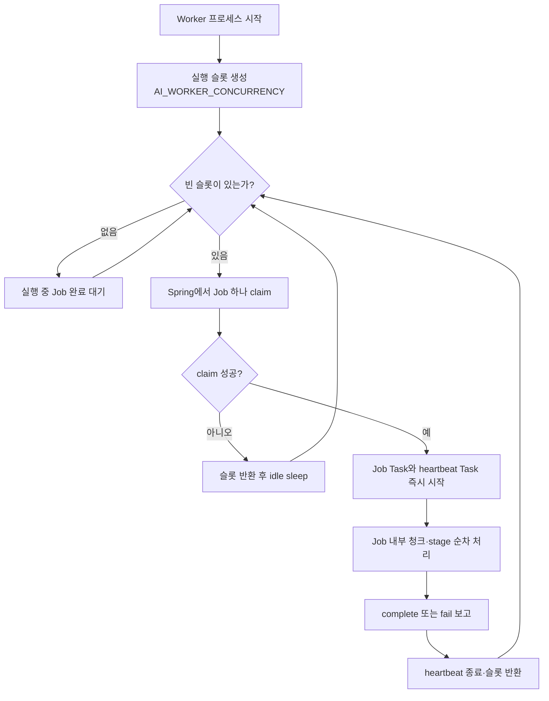
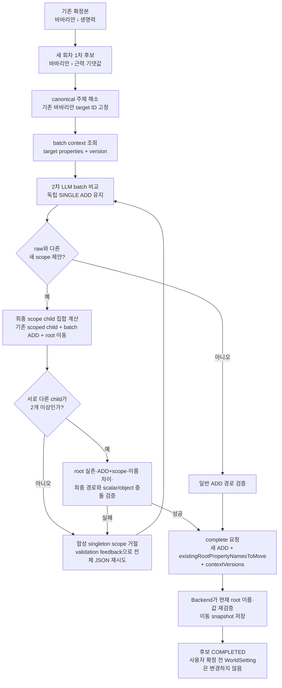
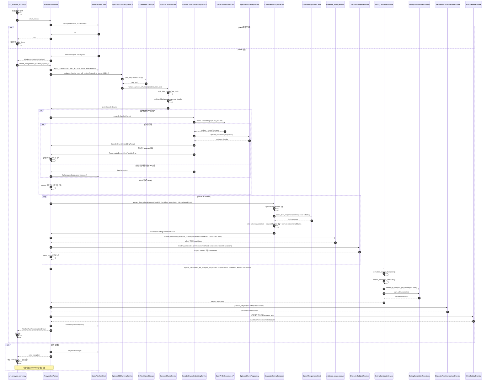

# AI Worker Workflow

Python AI Worker가 Spring 내부 Worker API로 분석 작업을 claim한 뒤, S3 원문을 읽고 청킹/선택적 임베딩/캐릭터·세계관 LLM 추출/캐릭터 Fact 비교/세계관 비교/후보 저장/완료 보고까지 수행하는 흐름을 정리합니다.

프로젝트 전체 분석 job 생성, 업로드 batch와 episode 연결, 사용자-facing 조회/수정/확정 API는 Spring 백엔드 문서가 기준입니다. 이 문서는 Spring 문서의 "Python AI Worker" 구간을 Python 코드 기준으로 자세히 펼친 문서입니다.

## 한 줄 요약

```text
Spring claim
-> claim payload의 단일 episode/knownCharacters/characterSettingSchemas 수신
-> 해당 episode의 S3 원문 raw text 조회
-> 원문을 변경하지 않고 paragraph/chunk offset 계산
-> flag가 켜진 경우에만 batch 임베딩 토큰 예약·실제량 정산 및 episode_chunks 갱신
-> chunk_text LLM 토큰 예약·실제량 정산
-> knownCharacters 이름을 포함한 prompt로 LLM 설정·캐릭터 발견 후보 JSON 파싱/검증
-> quote를 chunk_text에서 다시 찾아 evidence offset 보정
-> 구체적이지 않은 entity_name 후보를 LLM subject fallback으로 해소
-> raw/entity 캐릭터명을 knownCharacters와 비교
-> setting_candidates 교체 저장
-> 매칭된 캐릭터 후보를 현재 WorkCharacter snapshot과 후보별로 비교
-> ADD/UPDATE/MERGE/REMOVE/HISTORY_ONLY/EXCLUDE/REVIEW_REQUIRED 제안 저장
-> 같은 chunk에서 지속 가능한 세계관 속성을 원자 후보로 추출
-> Spring 내부 API로 world_setting_candidates 게시
-> 후보별 canonical 주체를 먼저 해소해 Spring에 원자 저장
-> Spring이 같은 회차·category·canonical 주체·raw scope 후보를 batch로 claim
-> batch 전체 source를 하나 이상의 ADD/UPDATE/MERGE/EXCLUDE decision으로 저장
-> Spring complete/fail 보고
```

실제로 실행하는 모든 AI provider 호출은 `app/usage` wrapper를 통과합니다. 설정 추출 재시도와 subject fallback도 각각 별도 요청으로 예약·정산하며, 임베딩 flag가 꺼져 있으면 임베딩 예약과 provider 호출을 모두 생략합니다. prompt와 응답 본문은 Spring 사용량 원장에 보내지 않습니다. Spring은 이 원장의 `SETTLED` 행을 합산해 최종 analysis job input/output token 수를 기록합니다.

Python Worker는 `analysis_jobs.status`, 캐릭터 비교 lifecycle/result와 세계관 테이블을 DB에서 직접 바꾸지 않습니다. 이 상태들은 Spring 내부 API에 보고합니다. 기존 캐릭터 흐름의 `episode_chunks`와 `setting_candidates` 최초 저장만 SQLAlchemy 경계를 유지하며, Python은 후보 생성 시 `comparison_status` 초기값만 함께 기록합니다.

## Job 단위 비동기 실행

운영 Worker는 `asyncio` event loop에서 Job 사이만 병렬화합니다. `analysis_jobs`의 `PENDING` row가 대기열이고, 프로세스의 실행 슬롯은 지금 즉시 처리할 수 있는 자리입니다. scheduler는 빈 슬롯을 먼저 확보한 뒤 Spring에서 Job 하나만 claim하고 곧바로 Job Task를 시작합니다. Task는 progress 보고 뒤 전용 heartbeat Task를 유지합니다. 슬롯 없이 Job을 미리 claim해 프로세스 내부에 쌓지 않으므로 처리 시작 전에 lease 시간이 소모되지 않습니다.


```mermaid
flowchart TD
    A["Worker 프로세스 시작"] --> B["실행 슬롯 생성<br/>AI_WORKER_CONCURRENCY"]
    B --> C{"빈 슬롯이 있는가?"}
    C -- "없음" --> D["실행 중 Job 완료 대기"]
    C -- "있음" --> E["Spring에서 Job 하나 claim"]
    E --> F{"claim 성공?"}
    F -- "아니오" --> G["슬롯 반환 후 idle sleep"]
    F -- "예" --> H["Job Task와 heartbeat Task 즉시 시작"]
    H --> I["Job 내부 청크·stage 순차 처리"]
    I --> J["complete 또는 fail 보고"]
    J --> K["heartbeat 종료·슬롯 반환"]
    D --> C
    G --> C
    K --> C
```

- `LLM_MAX_CONCURRENT_REQUESTS`는 한 프로세스의 실제 LLM HTTP 요청 상한입니다.
- 동기 S3·SQLAlchemy 작업은 `AI_WORKER_BLOCKING_MAX_WORKERS`로 제한한 executor에서 수행해 event loop와 heartbeat를 막지 않습니다.
- 한 Job의 오류는 그 Task에서만 처리하며 다른 실행 중 Job을 취소하지 않습니다.
- 현재 운영 검증 rollout은 분석 Worker 2개 × 프로세스당 동시 Job 5개 = `SETTING_EXTRACTION` 최대 10개입니다. 50개 Job 부하 테스트가 기준에 미달하면 프로세스당 3개로 되돌립니다.
- 별도 `world-comparison`, `character-comparison` Worker는 Job·LLM 동시성을 각각 1로 유지합니다. 따라서 10은 provider 계정 전체의 분산 상한이 아니며, 계정 전체 상한이 필요하면 별도 분산 limiter가 필요합니다.

### 동시 Job 10개 토큰 경계 부하 테스트

staging에서 실제 운영과 같은 Spring·PostgreSQL·Worker 이미지로 다음 순서를 반복합니다. 원고·prompt·provider 응답 본문은 측정 로그에 남기지 않습니다.

1. 전용 회원 하나에 50개 단일 회차 `SETTING_EXTRACTION` Job을 만들고, 시작 직전 `ai_token_accounts`와 해당 회원의 `ai_token_usages` 건수·합계를 기록합니다.
2. 분석 Worker 2개를 각각 `AI_WORKER_CONCURRENCY=5`, `LLM_MAX_CONCURRENT_REQUESTS=5`로 기동합니다. 재비교 Worker는 각각 1을 유지합니다.
3. 첫 실행은 모든 Job을 처리할 충분한 잔액으로 scheduler의 동시 실행 상한 10, heartbeat 유지, Job별 완료·실패 격리를 확인합니다.
4. 두 번째 실행은 같은 회원의 잔액이 10개 Job의 예약 경쟁 중 경계값에 도달하도록 지급량을 낮춥니다. 계정 잠금 중 `used + reserved`가 `granted`를 넘지 않고, 거절된 reserve가 `AI_TOKEN_QUOTA_EXHAUSTED` 409 한 번으로 끝나는지 확인합니다.
5. 토큰 부족이 발생한 각 Job에서 그 응답 이후 새 provider 예약·후속 후보 claim이 없고, 다른 실행 중 Job은 계속 완료되는지 Job ID와 request ID로 대조합니다.
6. 종료 후 request ID 중복, `RESERVED` 누수, 중복 정산, 음수 잔액이 없고 `analysis_jobs.failure_code`, 후보별 `comparison_failure_code`, 배치 중단 건수가 일치하는지 조회합니다.
7. 완료된 후보·1차 추출을 보존한 채 추가 사용량 지급과 배치 재개를 실행해 중단 후보만 처리되는지 확인합니다.

통과 기준은 활성 분석 Job 10개 이하, 원장 초과 사용·중복 차감 0건, 다른 Job 취소 0건, 내부 URL이 포함된 공개 실패 문구 0건입니다. Backend·PostgreSQL lock wait 또는 provider 오류율이 rollout 기준을 넘거나 heartbeat가 불안정하면 프로세스당 `AI_WORKER_CONCURRENCY=3`, `LLM_MAX_CONCURRENT_REQUESTS=3`으로 되돌려 같은 절차를 재실행합니다.

종료 신호를 받으면 scheduler는 신규 claim을 즉시 중단하고 `AI_WORKER_SHUTDOWN_GRACE_SECONDS` 동안 실행 중 Job과 heartbeat를 유지합니다. 운영 내부 grace는 180초이고 Compose `stop_grace_period`는 210초입니다. grace 안에 끝나지 않은 Task는 취소하고 heartbeat를 중단하며, Spring은 5분 lease가 만료된 Job을 마지막 checkpoint부터 회수합니다.

이미 시작된 동기 DB/S3 thread는 Python에서 강제 중단할 수 없어, critical section 완료를 기다리는 동안 heartbeat 종료가 180초를 넘길 수 있습니다. 따라서 내부 grace는 blocking I/O의 절대 timeout이 아니며 Compose의 210초 강제 종료가 최종 상한입니다. 마지막 heartbeat 직후 강제 종료되면 재claim이 lease TTL만큼 추가 지연될 수 있으므로, staging 부하 테스트에서 응답하지 않는 DB/S3와 강제 종료 후 lease 회수까지 함께 확인합니다.

## NVM-264 캐릭터 Fact 2차 비교 흐름

캐릭터 1차 추출 prompt는 기존처럼 지속 설정만 추출하고 단발 사건을 제외합니다. claim의 `knownCharacters[].activeStatuses`를 회차 시작 상태 문맥으로 받아 지속·악화·완화·종료의 새 원문 근거를 더 잘 찾지만, 기존 상태를 반복 추출하거나 제거 대상을 결정하지 않습니다. 치료 수단만으로 종료를 단정하지 않고 실제 기능·증상·행동·적용 효과의 변화 결과를 후보로 남깁니다. 이 목록은 모든 chunk에서 같은 회차 시작값이며, 같은 회차의 앞선 후보를 반영하는 FactType batch/projected snapshot은 후속 범위입니다. 그 결과를 저장한 뒤, Spring이 소유한 현재 `WorkCharacter` snapshot과 비교하는 별도 단계에서만 현재 화면 반영 여부와 제거 제안을 만듭니다.

```text
CHARACTER_CANDIDATES_SAVED
-> Spring이 비교할 SettingCandidate 한 건을 claim
-> candidate와 현재 snapshot entries, 앞선 동일 slot 후보, contextToken 조회
-> Python이 DB ID를 제외하고 snapshot을 P1, P2 참조로 변환
-> 2차 LLM이 ADD/UPDATE/MERGE/REMOVE/HISTORY_ONLY/EXCLUDE/REVIEW_REQUIRED 판단
-> Spring이 contextToken과 canonical Fact slot을 다시 검증해 결과 저장
-> 다음 후보를 순차 처리
-> CHARACTER_COMPARISONS_FINISHED
```

`CharacterFact`는 과거 근거를 포함한 append-only 이력입니다. `removedSnapshotEntries`는 원본 Fact를 삭제하거나 `is_current`로 전환하는 지시가 아니라, 사용자 확정 시 현재 `WorkCharacter` snapshot에서 특정 STATUS entry를 제거하자는 제안입니다. 실제 snapshot 변경과 Fact 생성은 Spring의 사용자 confirm 트랜잭션 책임입니다.

비교 context의 `candidate`에는 canonical Fact type/key와 evidence quote/offset이 포함되고, `snapshotEntries`에는 현재 화면에 반영된 Fact type/key, 표시 문자열 `factValue`, 구조화 값 `valueJson`만 포함됩니다. `priorCandidates`에는 같은 batch·캐릭터·canonical slot에서 원문 시간상 앞선 미확정 후보를 최대 30건 담습니다. 같은 회차에서는 evidence 시작 offset을 우선해 정렬합니다. 이 목록은 current snapshot이 아니라 `35 -> +1` 같은 상대 변화를 최종값 `36`으로 계산하기 위한 시간순 보조 문맥이며, 앞선 후보를 무시하거나 수정하면 context hash가 바뀌어 후속 후보를 다시 비교합니다. provenance Fact ID는 Spring 내부 문맥 hash에만 사용하고 Python이나 LLM에 노출하지 않습니다. Python은 요청 안에서만 유효한 `P*` 참조를 만들고, 완료 요청에는 이를 다시 `factType/factKey`로 변환합니다. 소설 원문·후보·snapshot 문자열 안의 명령이나 JSON 출력 요구는 모두 데이터로 취급하고 따르지 않도록 system prompt에 명시합니다.

`ADD`, `UPDATE`, `MERGE`는 현재 화면에 저장할 최종 `proposedFactValue`와 `proposedValueJson`을 함께 반환합니다. `factValue`는 사용자에게 보이는 요약 문자열이고 `valueJson`은 편집·비교용 구조화 값이므로 어느 한쪽에서 다른 쪽을 임의 복원하지 않습니다.

MVP 안전 규칙은 다음과 같습니다.

- canonical slot이 snapshot에 이미 있으면 `ADD`를 허용하지 않고 LLM 응답을 재시도합니다.
- `UPDATE`와 `MERGE`는 candidate의 canonical slot만 대상으로 삼습니다.
- canonical `REMOVE`는 `target=null`, `removedSnapshotEntries` 1개 이상, proposed value 없음으로 표현합니다. 후보와 같은 key뿐 아니라 의미상 관련된 다른 key의 STATUS 여러 개를 끝낼 수 있고, 회복·종료 후보 자체는 현재 snapshot에 넣지 않으면서 새 Fact 이력과 근거는 보존합니다.
- 회복 결과 자체가 지속되는 새 현재 상태라면 `REMOVE`가 아니라 `ADD`/`UPDATE`/`MERGE`와 제거 목록을 함께 사용합니다.
- `HISTORY_ONLY`, `EXCLUDE`, `REVIEW_REQUIRED`는 target, proposed value, 제거 목록을 모두 비웁니다.
- provider가 이 세 operation에 사용되지 않는 proposed value만 덧붙인 경우 재호출하지 않고 null로 정규화합니다. target이나 제거 목록처럼 판단 의미를 바꾸는 잘못된 필드는 계속 거절합니다.
- 회상은 `PAST`, 가정은 `HYPOTHETICAL`로 분류하고 `HISTORY_ONLY` 또는 `REVIEW_REQUIRED`만 허용합니다.
- 시간 문맥이 불명확한 `UNKNOWN`은 `REVIEW_REQUIRED`만 허용합니다.
- STATUS 제거는 현재 시점의 상태 변화 결과가 나온 STATUS 후보에서만 허용합니다. 치료 수단만 있고 결과가 없으면 제거하지 않지만, 이후 능력·증상·행동 변화로 기존 상태가 끝났다는 해석이 자연스러우면 명시적인 완치 문구 없이도 의미상 관련된 여러 STATUS의 제거를 제안할 수 있습니다. 다만 새 결과와 무관한 독립적·잠재적 상태까지 연쇄적으로 제거하지 않습니다.
- STATUS가 아닌 snapshot entry는 MVP에서 제거 대상으로 제안하지 않습니다.
- 제거 참조는 Spring이 같은 work·캐릭터의 최신 current snapshot으로 만든 요청 로컬 `P*` 범위에서만 고릅니다. Python은 존재하지 않는 ref와 non-STATUS를 거절하고 Spring은 `contextToken`으로 stale/범위 무결성을 다시 검증합니다.

canonical `REMOVE` 완료 요청의 핵심 wire shape는 다음과 같습니다.

```json
{
  "operation": "REMOVE",
  "targetFactType": null,
  "targetFactKey": null,
  "removedSnapshotEntries": [
    {"factType": "STATUS", "factKey": "status.오른발_부상"},
    {"factType": "STATUS", "factKey": "status.마비독"}
  ],
  "proposedFactValue": null,
  "proposedValueJson": null,
  "temporalScope": "PRESENT"
}
```

초기 `SETTING_EXTRACTION` Job에서는 후보 하나의 비교 실패를 해당 후보 `FAILED`로 격리하고 나머지 후보와 후속 세계관 단계를 계속합니다. 사용자가 재비교를 요청해 생성된 `CHARACTER_FACT_COMPARISON` 전용 Job은 후보 하나라도 실패하면 Job 전체를 실패 처리합니다.

완료 시점에 snapshot이 달라져 Spring이 HTTP 409와 `SETTING_CANDIDATE_COMPARISON_STALE`을 반환하면 최신 context로 최대 3회 다시 비교합니다. 그 외 409나 오류 코드는 stale 재시도로 숨기지 않습니다.

```bash
.venv/bin/python -m scripts.run_analysis_worker --worker-kind character-comparison
```

전용 Worker는 candidate를 순차 처리하고 실행 동시성을 1로 강제합니다. 전체 Fact 이력·RAG를 prompt에 넣거나 여러 후보를 한 번에 묶는 최적화는 MVP 범위에 포함하지 않습니다.

### 배포·기존 Job 호환

Spring Flyway의 비교 컬럼과 내부 API/checkpoint를 먼저 배포한 뒤 AI 이미지를 교체합니다. 특히 Spring이 신규 `REMOVE(target 없음 + 제거 목록)`를 먼저 수용하고 기존 `REMOVE(target 1개)`도 내부 1개 제거 집합으로 정규화한 다음 AI가 신규 형식을 출력해야 합니다. 배포 중인 `RUNNING` Job은 가능하면 먼저 drain해 구·신 Worker가 서로 다른 checkpoint 계약으로 같은 Job을 이어 처리하지 않게 합니다.

새 AI가 canonical multi-`REMOVE`를 저장하기 시작한 뒤에는 구 Java가 그 PENDING 후보를 적용할 수 없으므로 Java만 단순 rollback하지 않습니다. 장애 시 신규 AI를 먼저 중단하거나 구 AI로 되돌린 뒤에도 Java의 신규 읽기 호환은 유지하고, 이미 저장된 canonical 후보를 drain·재비교하거나 forward-fix합니다. 별도 DB migration은 없지만 저장된 write shape의 forward compatibility 제약은 남습니다.

새 checkpoint는 기존 세계관 checkpoint보다 앞에 삽입됩니다. 배포 전에 이미 `WORLD_CANDIDATES_PUBLISHED` 또는 `WORLD_COMPARISONS_FINISHED`까지 간 Job은 enum 순서상 `CHARACTER_COMPARISONS_FINISHED`도 지난 것으로 판단하므로 캐릭터 2차 비교를 소급 실행하지 않습니다. 해당 회차에도 비교 제안이 필요하면 배포 후 회차 재분석 Job을 새로 생성합니다.

## NVM-260 세계관 확장 흐름

기존 문서의 상세 diagram과 단계 1~10은 캐릭터 분석 stage의 내부 동작을 설명합니다. 그 stage 뒤에는 다음 checkpoint 기반 흐름이 이어집니다.

```text
CHUNKS_READY
-> CHARACTER_CANDIDATES_SAVED
-> 캐릭터 Fact 2차 비교
-> CHARACTER_COMPARISONS_FINISHED
-> chunk별 세계관 속성 추출 및 동일 분류·대상·설정명 후보 통합
-> 2차 LLM이 단일값·안전한 통합·서로 다른 내용(SINGLE/MERGED/CONFLICT) 판정
-> Backend 내부 API로 후보 전체 게시
-> WORLD_CANDIDATES_PUBLISHED
-> canonical 주체가 미해소된 후보와 category별 기존 대상명 조회
-> exact 이름 또는 LLM 선택 결과를 후보별 target ID 목록으로 Backend에 원자 저장
-> Backend가 job + 회차 + category + canonical 주체 + raw scope로 batch 생성
-> batch에 고정된 대상의 properties/version 조회
-> source 후보 전체를 하나 이상의 속성 decision으로 비교해 batch 완료 또는 FAILED 기록
-> WORLD_COMPARISONS_FINISHED
-> Job complete
```

### 세계관 batch 비교 세부 계약

Worker는 먼저 `GET .../world-setting-subject-resolutions/pending`으로 미해소 후보를 받고, category의 모든 subject
페이지를 읽어 exact 이름 또는 `S*` 주체 해소 결과를 target ID 목록으로 만든다. 그 전체를
`PUT .../world-setting-subject-resolutions`에 보내면 Backend가 후보별 canonical key와 표시명을 원자 저장한다.
Backend는 이 결과를 기준으로 `job + source episode + category + canonical subject + normalized raw scope`가 같은
후보만 claim batch로 묶는다. 따라서 서로 다른 canonical 주체의 실패·quota·20개 상한은 서로 전파되지 않는다.

claim payload의 canonical key·표시명·고정 target ID 목록은 해당 batch의 기준값이다. Worker가 claim 뒤 주체를
다시 고르거나 batch를 다시 나누지 않는다. 같은 canonical 주체와 scope 안에서도 독립 속성은 각각 decision으로
나눈다. 독립 decision끼리는 source를 합치지 않은 채 같은 canonical `proposedScopeName`을 공유할 수 있으며,
source 하나짜리 신규 `ADD`도 2차 LLM의 canonical scope/name 제안을 유지한다. 단, raw와 다른 새 scope는 현재
ADD와 기존 문맥에 실제 형제 속성이 둘 이상일 때만 허용한다. 기존 root 속성을 함께 옮기는 제안은
`existingRootPropertyNamesToMove`에 기록하고 이름·값을 보존한다. `scopeName == settingName` 또는 형제 없는
단일 속성용 scope는 Worker 검증에서 재시도한다. 각 decision의 `source_candidate_refs`는 입력 후보를 정확히 한
번씩 모두 덮어야 하며, 누락·중복·unknown
ref, scope 혼합, target/property 계약 위반은 부분 저장 없이 batch 전체 validation failure가 된다. 완료 요청에는
source coverage, canonical subject, Backend 검증용 target ID, context version, raw comparison JSON을 함께 보내고
1차 evidence/provenance는 변경하지 않는다.

singleton decision도 batch 완료에 포함되므로 별도 단건 recompare를 하지 않는다. batch API를 지원하지 않는
구형 Spring client에서는 legacy 후보별 claim 경로로 처리하며, 이 호환 경로에는 batch cluster/coverage metric이
없다. 완료 요청이 정확한 `WORLD_SETTING_CANDIDATE_COMPARISON_CONTEXT_STALE` 409를 받으면 이미 처리한 일부만
재전송하지 않고 context와 LLM 결과를 batch 전체에 대해 새로 만들어 최대 3회 시도한다. canonical target 자체가
바뀌거나 삭제되어 `WORLD_SETTING_SUBJECT_RESOLUTION_STALE` 409가 오면 reset endpoint로 기존 batch를 닫고,
미해소 후보 조회와 주체 해소부터 다시 수행한 뒤 새 batch를 claim한다. quota가 `AI_TOKEN_QUOTA_EXHAUSTED`이면
현재 batch를 실패 보고하고 다음 batch를 claim하지 않은 채 Job 경계로 전파한다.

문맥·대상 안전 한도를 넘는 oversized cluster는 Backend가 `REVIEW_REQUIRED`로 처리하고 자체 count metric을
발행한다. 현재 AI Worker는 그 count를 별도 응답으로 받지 않으므로 `clusterOverflowOrReviewRequiredCount`를
Backend count로 해석하지 않는다.

### 새 후보로 기존 root 설정을 재범위화하는 흐름

아래 흐름은 이전 회차에 root로 확정된 설정과 나중 회차의 독립 `ADD` 후보를 공통 범위 아래에 정리하는
batch 비교 경로다. 기존 root 설정은 새 source 후보로 복제하거나 새 후보와 병합하지 않고, 새 `ADD` decision의
이동 계획으로만 참조한다.


```mermaid
flowchart TD
    A["기존 확정본<br/>바바리안 › 생명력"] --> B["새 회차 1차 후보<br/>바바리안 › 근력 기댓값"]
    B --> C["canonical 주체 해소<br/>기존 바바리안 target ID 고정"]
    C --> D["batch context 조회<br/>target properties + version"]
    D --> E["2차 LLM batch 비교<br/>독립 SINGLE ADD 유지"]
    E --> F{"raw와 다른<br/>새 scope 제안?"}
    F -- "아니오" --> G["일반 ADD 경로 검증"]
    F -- "예" --> H["최종 scope child 집합 계산<br/>기존 scoped child + batch ADD + root 이동"]
    H --> I{"서로 다른 child가<br/>2개 이상인가?"}
    I -- "아니오" --> J["합성 singleton scope 거절<br/>validation feedback으로 전체 JSON 재시도"]
    J --> E
    I -- "예" --> K["root 실존·ADD+scope·이름 차이·<br/>최종 경로와 scalar/object 충돌 검증"]
    K -- "실패" --> J
    K -- "성공" --> L["complete 요청<br/>새 ADD + existingRootPropertyNamesToMove<br/>+ contextVersions"]
    G --> L
    L --> M["Backend가 현재 root 이름·값 재검증<br/>이동 snapshot 저장"]
    M --> N["후보 COMPLETED<br/>사용자 확정 전 WorldSetting은 변경하지 않음"]
```

예를 들어 기존 root `생명력`과 새 `근력 기댓값`을 `신체 능력` 아래에 정리할 때 Worker는 새 후보의
`sourceCandidateRefs`만 유지하고 `existingRootPropertyNamesToMove=["생명력"]`를 보낸다. AI는 이동할 기존값을
완료 payload에 복사하지 않으며, Backend가 최신 확정본에서 실제 값을 읽어 snapshot을 만든다. context가 stale이면
이동 계획 일부만 재사용하지 않고 최신 properties로 batch 전체 비교를 다시 수행한다.

한 decision이 여러 `sourceCandidateRefs`를 가지면 그 source 전체가 같은 비교 결정과 이동 계획을 공유한다.
Backend 검토 경계에서는 일부 source만 원안대로 확정해 이동을 살리는 부분 적용을 허용하지 않는다. source 하나라도
사용자가 AI안과 다르게 수정하거나 제외하면 이동 계획을 decision 전체에서 비활성화하고, 원안을 그대로 승인한 경우에만
그룹 확정 트랜잭션에서 root 이동과 새 property를 함께 반영한다.

claim 요청은 `allowedJobTypes`를 필수로 보내고 성공 응답의 lease token을 모든 상태 변경·토큰 예약·세계관 API에 사용합니다. 5분 lease는 백그라운드 heartbeat가 60초마다 갱신하며, 만료 후 재claim 시 마지막 checkpoint 이후 단계부터 재개합니다.

초기 회차 분석의 batch 비교 실패는 그 batch의 후보 전체를 `FAILED`로 기록하고 다른 canonical batch와 Job 처리를 계속합니다. 사용자가 `/recompare`를 호출하면 Backend가 공개 분석 목록에 노출하지 않는 `WORLD_SETTING_COMPARISON` Job을 만들고, 다음 별도 runner가 그 Job type만 claim합니다. 사용자 재비교는 연결 후보 하나짜리 batch이므로 동일한 batch 계약을 사용합니다.

comparison-complete에서 Backend가 HTTP 400 `WORLD_SETTING_COMPARISON_TARGET_INVALID`를 반환하면 Worker는 같은 LLM 결과를 다시 만들지 않습니다. 후보의 사용자용 `comparisonFailureCode`는 `COMPARISON_VALIDATION_FAILED`로 두고, Backend 원본 `sourceErrorCode`와 허용된 enum `sourceReasonCode`는 별도 필드로 실패 API에 전달합니다. 알 수 없는 4xx/5xx는 이 분류로 흡수하지 않습니다. HTTP 409도 정확한 `WORLD_SETTING_CANDIDATE_COMPARISON_CONTEXT_STALE`일 때만 최신 context로 다시 비교합니다.

```bash
.venv/bin/python -m scripts.run_analysis_worker --worker-kind world-comparison
```

LLM에는 DB UUID를 전달하지 않고 Worker가 만든 `S*`와 `T*` 참조만 제공합니다. 실제 대상 UUID, exact 대상, property 존재 여부, 현재 version, `beforeValue`는 Backend가 검증·산출하며 LLM과 Worker는 `world_settings` 확정본을 변경하지 않습니다.

## 주요 문자열과 기준

| 이름 | 의미 | 생성/사용 위치 | 기준 |
| --- | --- | --- | --- |
| `raw_text` | S3에서 읽은 회차 원문 문자열 | `S3TextObjectStorage.get_text()` | S3 객체 내용 그대로 |
| `Paragraph.text` | S3 회차 원문에서 공백이 아닌 한 줄 | `split_paragraphs()` | `raw_text` 기준 start/end offset 보유 |
| `chunk_text` | LLM에 전달되는 청크 원문 | `raw_text[start_offset:end_offset]` | 재조립 문자열이 아니라 원문 slice |
| `evidence_spans[].quote` | LLM이 근거로 복사한 원문 일부 | LLM 응답 | `chunk_text` 안에서 다시 검색 |
| `start_offset/end_offset` | 근거 문장의 위치 | `evidence_span_resolver.py` | S3 회차 원문 전체 기준 |
| `raw_entity_mention` | 원문에 실제 등장한 캐릭터 표현 | LLM 응답 | 예: `나`, `프넬린의 두 번째 딸 아이나르` |
| `entity_name` | LLM이 청크 문맥에서 정리한 후보 캐릭터명 | LLM 응답 | 예: `아이나르`, `비요른 얀델` |
| `knownCharacters.name` | Spring이 내려준 기존 캐릭터명 | claim payload | 캐릭터 매칭 비교 대상 |
| `knownCharacters.activeStatuses` | 회차 시작 전 활성 캐릭터 상태 | claim payload | `factKey`, nullable `factValue`의 읽기 전용 1차 문맥 |
| `candidate_kind` | 설정 값 후보와 이름 발견 후보 구분 | LLM 응답 | `SETTING`, `CHARACTER_DISCOVERY` |
| `characterSettingSchemas` | Spring이 내려준 활성 캐릭터 설정 schema | claim payload | canonical key, 동적 pattern, 값 타입 prompt hint |
| subject fallback | 구체적이지 않은 entity_name 후보의 주체 해소 | `character_subject_resolver.py` | previous/current/next chunk 기준 |

중요한 기준:

- offset은 `Episode.content_s3_key`로 읽은 S3 회차 원문 기준입니다.
- `chunk_text`는 문단을 새로 이어 붙인 값이 아니라 원문에서 잘라낸 slice입니다.
- LLM이 반환한 숫자 offset은 신뢰하지 않고, `quote`를 실제 `chunk_text`에서 찾아 다시 계산합니다.
- `source_chunk_id`는 LLM 출력 schema에서 제외하고, wire 검증 뒤 Worker 입력 `EpisodeChunk.id`를 결합합니다.
- 캐릭터명 매칭은 LLM이 DB 매칭을 직접 하는 것이 아니라, Python resolver가 `knownCharacters`와 비교해 계산합니다.

## 전체 흐름


```mermaid
flowchart TD
    A["scripts/run_analysis_worker.py 실행"] --> B["비동기 scheduler와 실행 슬롯 생성"]
    B --> C["빈 슬롯 확보"]
    C --> D["SpringWorkerClient.claim()"]

    D --> E{"claim할 작업이 있는가?"}
    E -- "없음" --> F["슬롯 반환"]
    F --> G["runner가 idle sleep 후 다시 claim 시도"]
    G --> C

    E -- "있음" --> H["WorkerAnalysisJobPayload 수신<br/>analysisJobId, work, episode,<br/>knownCharacters, characterSettingSchemas"]
    H --> I["SpringWorkerClient.report_progress()<br/>currentStep=SETTING_EXTRACTION<br/>episodeStatus=ANALYZING"]
    I --> J["payload.episode 처리"]

    J --> K["contentS3Key 확인"]
    K -->|"없음"| KX["INVALID_REQUEST 예외"]
    K -->|"있음"| L["S3에서 raw_text 조회"]
    L --> N["split_paragraphs(raw_text)<br/>문단별 offset 계산"]
    N --> O["split_into_chunks()<br/>문단/길이 기준 청크 draft 생성"]
    O --> P["EpisodeChunkMapper.to_entity()<br/>chunk_text는 raw_text slice"]
    P --> Q["기존 episode_chunks 삭제"]
    Q --> R["새 episode_chunks 저장"]

    R --> RFLAG{"EMBEDDING_GENERATION_ENABLED?"}
    RFLAG -- "false" --> RE["임베딩 생략 개수 기록<br/>embedding은 NULL 유지"]
    RFLAG -- "true" --> RA["chunk_text 목록<br/>OpenAI Embeddings API 호출"]
    RA --> RB{"임베딩 생성/저장 성공?"}
    RB -- "예" --> RC["embedding, model, version,<br/>embedded_at 갱신"]
    RB -- "아니오" --> RD["실패 로그 기록<br/>embedding은 NULL 유지"]
    RC --> S["저장된 chunk 순회"]
    RD --> S
    RE --> S
    S --> T["LLM user prompt 구성<br/>schema hints + metadata + chunk_text"]
    T --> U["strict JSON Schema와 함께<br/>OpenAI Responses API 호출"]
    U --> V{"Provider wire + 저장 경계<br/>Pydantic 이중 검증 성공?"}
    V -- "실패, 안전한 reason/loc로 재시도" --> U
    V -- "실패, 재시도 소진" --> VX["LlmExtractionError"]
    V -- "성공" --> W["ExtractedSettingCandidate 목록 생성"]

    W --> X["quote를 chunk_text에서 exact match 검색"]
    X --> Y{"quote를 찾았는가?"}
    Y -- "예" --> Z["chunk local offset 계산"]
    Y -- "아니오" --> AA["공백/줄바꿈 정규화 후 재검색"]
    AA --> AB{"정규화 검색 성공?"}
    AB -- "예" --> Z
    AB -- "아니오" --> AC["start/end offset = null 유지"]
    Z --> AD["chunk.start_offset 더해<br/>회차 전체 offset으로 보정"]
    AC --> AE["구체적이지 않은 entity_name 후보<br/>LLM subject fallback"]
    AD --> AE
    AE --> AEF["save_items에 후보 추가"]

    AEF --> AG["모든 chunk 처리 완료<br/>knownCharacters 이름과 Fact를 준비"]
    AG --> AH["raw_entity_mention/entity_name 정규화"]
    AH --> AI["기존 캐릭터 매칭 상태 계산<br/>MATCHED / UNRESOLVED / AMBIGUOUS"]
    AI --> AJ["analysis_job_id 기준<br/>기존 setting_candidates 삭제"]
    AJ --> AK["새 setting_candidates 저장"]
    AK --> AKC["캐릭터 후보별 현재 snapshot 비교<br/>개별 실패는 후보에 기록"]
    AKC --> AKW["세계관 후보 추출·게시·비교"]
    AKW --> AL["summaryJson 생성<br/>chunk/embedding/candidate/비교 처리 개수"]
    AL --> AM["SpringWorkerClient.complete()"]
    AM --> AN["heartbeat 종료·슬롯 반환"]
    AN --> C

    H -. "Job Task 처리 중 예외" .-> ERR{"처리 중 예외 발생?"}
    ERR -- "예" --> FAIL["SpringWorkerClient.fail(errorMessage)"]
    FAIL --> RAISE["예외 다시 전파"]
    RAISE --> WAIT["해당 Task만 종료하고 슬롯 반환<br/>다른 Job Task는 계속"]
    WAIT --> C
```

## Sequence


```mermaid
sequenceDiagram
    autonumber
    participant Runner as run_analysis_worker.py
    participant Worker as AnalysisJobWorker
    participant Spring as SpringWorkerClient
    participant Chunking as EpisodeS3ChunkingService
    participant Storage as S3TextObjectStorage
    participant ChunkService as EpisodeChunkService
    participant EmbeddingService as EpisodeChunkEmbeddingService
    participant EmbeddingsAPI as OpenAI Embeddings API
    participant ChunkRepo as EpisodeChunkRepository
    participant Extractor as CharacterSettingExtractor
    participant LLM as OpenAIResponsesClient
    participant Evidence as evidence_span_resolver
    participant Subject as CharacterSubjectResolver
    participant CandidateService as SettingCandidateService
    participant CandidateRepo as SettingCandidateRepository
    participant CharacterComparison as CharacterFactComparisonPipeline
    participant WorldPipeline as WorldSettingPipeline

    Runner->>Runner: 빈 실행 슬롯 확보
    Runner->>Worker: claim_next()
    Worker->>Spring: claim(modelName, currentStep)

    alt claim할 작업 없음
        Spring-->>Worker: null
        Worker-->>Runner: null
        Runner->>Runner: 슬롯 반환 + idle sleep
    else claim 성공
        Spring-->>Worker: WorkerAnalysisJobPayload
        Worker-->>Runner: WorkerAnalysisJobPayload
        Runner->>Worker: create_task(process_claimed(payload))
        Worker->>Spring: report_progress(SETTING_EXTRACTION, ANALYZING)

        Worker->>Chunking: replace_chunks_from_s3_content(episodeId, contentS3Key)
        Chunking->>Storage: get_text(contentS3Key)
        Storage-->>Chunking: raw_text
        Chunking->>ChunkService: replace_episode_chunks(episodeId, raw_text)
        ChunkService->>ChunkService: split_into_chunks(raw_text)
        ChunkService->>ChunkService: delete old chunks + save new chunks
        ChunkService-->>Worker: List<EpisodeChunk>

        alt 임베딩 생성 flag 활성화
            Worker->>EmbeddingService: embed_chunks(chunks)
            EmbeddingService->>EmbeddingsAPI: create embeddings(chunk_text list)
            alt 임베딩 성공
                EmbeddingsAPI-->>EmbeddingService: vectors + model + usage
                EmbeddingService->>ChunkRepo: update_embeddings(updates)
                ChunkRepo-->>EmbeddingService: updated chunks
                EmbeddingService-->>Worker: EpisodeChunkEmbeddingResult
            else 일시적인 provider 장애
                EmbeddingService--xWorker: RecoverableEmbeddingProviderError
                Worker->>Worker: 실패 개수/로그 기록 후 계속
            else 요청·응답 계약·정합성·DB 오류
                EmbeddingService--xWorker: fatal exception
                Worker->>Spring: fail(analysisJobId, errorMessage)
            end
        else MVP 기본값 false
            Worker->>Worker: service 호출 없이 생략 개수 기록
        end

        loop chunk in chunks
            Worker->>Extractor: extract_from_chunk(sourceChunkId, chunkText, episodeNo, title, schemaHints)
            Extractor->>Extractor: system/user prompt 구성
            Extractor->>LLM: create_text_response(strict response schema)
            LLM-->>Extractor: text response
            Extractor->>Extractor: wire schema validation + sourceChunkId 결합 + domain schema validation
            Extractor-->>Worker: CharacterSettingExtractionResult
            Worker->>Evidence: resolve_candidate_evidence_offsets(candidates, chunkText, chunkStartOffset)
            Evidence-->>Worker: offset 보정된 candidates
            Worker->>Subject: resolve_candidates(previous/current/next, candidates, knownCharacters)
            Subject-->>Worker: subject fallback 적용 candidates
            Worker->>Worker: save_items에 후보 누적
        end

        Worker->>CandidateService: replace_candidates_for_analysis_job(workId, analysisJobId, saveItems, knownCharacters)
        CandidateService->>CandidateService: normalize_known_characters()
        CandidateService->>CandidateService: resolve_candidate_character()
        CandidateService->>CandidateRepo: delete_by_analysis_job_id(analysisJobId)
        CandidateService->>CandidateRepo: save_all(candidates)
        CandidateRepo-->>CandidateService: saved candidates
        CandidateService-->>Worker: saved candidates
        Worker->>CharacterComparison: process_all(analysisJobId, leaseToken)
        CharacterComparison-->>Worker: completed/failed counts
        Worker->>WorldPipeline: 세계관 후보 추출·게시·process_all()
        WorldPipeline-->>Worker: candidate/completed/failed counts
        Worker->>Spring: complete(summaryJson)
        Worker-->>Runner: WorkerRunResult(claimed=true)
        Runner->>Runner: 슬롯 반환
    end

    alt 처리 중 예외
        Worker->>Spring: fail(errorMessage)
        Worker-->>Runner: raise exception
        Runner->>Runner: 해당 Task 실패 로그 + 슬롯 반환
        Note over Runner,Worker: 다른 실행 중 Job Task는 계속 진행
    end
```

## 단계별 상세

### 1. Worker 실행과 claim

`scripts/run_analysis_worker.py`는 실행 슬롯을 관리하고, `claim_next()`로 가져온 Job마다 `AnalysisJobWorker.process_claimed()` Task를 만드는 비동기 CLI scheduler입니다. 빈 슬롯을 확보한 뒤에만 claim하며, 모든 슬롯이 사용 중이면 실행 중 Job 하나가 끝날 때까지 기다립니다. 빈 queue polling은 슬롯 수만큼 별도 loop를 만들지 않고 프로세스당 scheduler 하나가 담당합니다.

- `--once`: claim을 한 번만 시도합니다.
- `--max-iterations`: 로컬 점검용 반복 횟수를 제한합니다.
- `--idle-sleep-seconds`: claim할 작업이 없을 때 다음 polling 전 대기 시간입니다.
- `--extraction-model-name`: 1차 후보 추출 모델만 override합니다.
- `--subject-resolution-model-name`: 캐릭터·세계관 주체 해소 모델만 override합니다.
- `--comparison-model-name`: 2차 확정 데이터 비교 모델만 override합니다.
- `--model-name`: 이전 실행 명령 호환용으로 세 단계 모델을 함께 override합니다. 새 실행 명령에서는 단계별 옵션을 우선 사용합니다.

환경변수는 `LLM_EXTRACTION_MODEL`, `LLM_SUBJECT_RESOLUTION_MODEL`, `LLM_COMPARISON_MODEL`로 세 단계를 독립 설정합니다. 지정하지 않은 단계는 `LLM_MODEL`을 fallback으로 사용합니다. 운영 기본값은 캐릭터 Fact·세계관 후보 추출에 `gpt-5.6-terra`, 캐릭터·세계관 주체 해소와 초기 세계관 비교·사용자 재비교에 `gpt-5.6-luna`입니다.

장기 실행 scheduler의 `claim_next()` 결과가 없으면 오류로 처리하지 않고 슬롯을 반환한 뒤 `AI_WORKER_IDLE_SLEEP_SECONDS`만큼 기다립니다. `--once` 경로의 `run_once()`는 같은 상황에서 `WorkerRunResult(claimed=false)`를 반환합니다. 개별 Job이 실패해도 다른 Task는 계속 실행하고 반환된 슬롯만 다음 Job에 사용합니다.

claim 결과가 있으면 Spring은 단일 회차 작업을 `RUNNING`으로 전환한 payload를 반환합니다. Python은 `analysis_jobs` 테이블을 직접 수정하지 않습니다.

payload에서 Python이 직접 사용하는 값:

| 값 | 사용처 |
| --- | --- |
| `analysis_job_id` | 후보 저장 연결, complete/fail 보고 |
| `work_id`, `work_title` | 후보 저장, runner 출력 |
| `episode.episode_id` | chunk 저장, 후보 episode 연결 |
| `episode.episode_no`, `episode.title` | LLM user prompt metadata |
| `episode.content_s3_key` | S3 원문 조회 |
| `knownCharacters[].character_id`, `name` | 기존 캐릭터 매칭. ID는 LLM prompt에 노출하지 않음 |
| `knownCharacters[].activeStatuses` | 모든 chunk에 동일하게 전달하는 회차 시작 STATUS. 임의 절단하지 않으며 LLM에는 이름·key·표시값만 노출 |
| `characterSettingSchemas[]` | Backend 배열의 순서와 중복을 유지한 immutable schema hint tuple로 job당 한 번 변환한 뒤 모든 chunk prompt에 전달 |

payload DTO는 이전 Spring payload도 역직렬화할 수 있도록 `characterSettingSchemas` 누락을 빈 목록으로 파싱합니다. 하지만 현재 추출 계약에서는 등록 schema가 최소 하나 필요합니다. 목록이 비어 있으면 Worker는 진행 상태를 보고한 직후, S3 원문 조회와 청크·후보 교체 전에 예외를 발생시켜 Spring `fail` API로 해당 job을 실패 처리합니다. 이를 통해 schema가 없는 프롬프트가 후보를 0개 반환하고 기존 후보까지 빈 결과로 교체하는 상황을 막습니다.

### 2. S3 원문 조회

`EpisodeS3ChunkingService.replace_chunks_from_s3_content()`는 claim payload의 `content_s3_key`를 그대로 사용합니다.

이 값을 다시 DB에서 조회하지 않는 이유는 claim 시점의 payload가 Worker가 처리해야 할 기준 입력이기 때문입니다. Worker가 episode를 다시 조회하면 claim 이후 바뀐 값을 볼 수 있어 작업 기준이 흔들릴 수 있습니다.

처리 흐름:

```text
content_s3_key 없음
-> INVALID_REQUEST

content_s3_key 있음
-> S3TextObjectStorage.get_text(content_s3_key)
-> raw_text
-> EpisodeChunkService.replace_episode_chunks(episode_id, raw_text)
```

S3 client는 `AWS_ACCESS_KEY_ID`와 `AWS_SECRET_ACCESS_KEY`가 둘 다 설정된 경우에만 해당 값을 명시적으로 사용합니다. `AWS_SESSION_TOKEN`도 설정되어 있으면 STS 등 임시 자격 증명의 일부로 함께 전달합니다. access key와 secret key 중 하나라도 없으면 AWS CLI profile, IAM role 등을 포함한 boto3 기본 credential provider chain에 맡깁니다. 실제 비밀값은 저장소 문서나 `.env.example`에 기록하지 않습니다.

Python은 읽은 문자열의 BOM, CRLF, 탭, 특수 공백을 제거하거나 치환하지 않습니다.
모든 청크 offset과 evidence offset은 동일한 `raw_text` 기준입니다.

### 3. 문단 분리와 청킹

`split_paragraphs(raw_text)`는 S3 회차 원문을 줄 단위로 순회합니다.

- 공백뿐인 줄은 문단으로 만들지 않습니다.
- 각 문단은 `Paragraph(index, text, start_offset, end_offset)`을 가집니다.
- `start_offset`, `end_offset`은 `raw_text` 전체 기준입니다.
- 줄바꿈 문자는 cursor 계산에는 포함하지만, `Paragraph.text`에는 포함하지 않습니다.

`split_into_chunks()`는 문단 경계를 우선해 청크를 만듭니다.

기본값:

| 값 | 의미 |
| --- | --- |
| `target_chars = 6000` | 가능하면 이 길이에 도달한 뒤 chunk를 확정 |
| `min_chars = 1000` | 너무 짧은 chunk를 피하기 위한 최소 기준 |
| `max_chars = 7000` | 청크 상한 및 긴 단일 문단 분할 기준 |

청킹 규칙:

1. 한 문단이 `max_chars`보다 길면, 현재까지 모은 문단을 먼저 chunk로 확정합니다.
2. 긴 문단은 문단 하나 안에서 `max_chars` 단위로 나눕니다.
3. 일반 문단은 현재 chunk 후보에 합쳐봅니다.
4. 합친 길이가 `target_chars`에 도달하고 `min_chars` 이상이면 해당 문단까지 포함해 chunk를 확정합니다.
5. 문맥 보존을 위해 문단 경계를 우선하므로, chunk 길이가 항상 `target_chars` 이하로 고정되지는 않습니다.

`target_chars`와 `max_chars`는 회차 전체 길이가 아니라 청크 한 건의 기준입니다. 긴 회차는 여러 청크로 나뉘고, 여러 회차를 한 번에 요청해도 Spring이 회차별 Job을 만들므로 각 회차에 같은 6,000/7,000 정책을 독립 적용합니다.

`EpisodeChunkDraft.chunk_text`는 문단 문자열을 새로 조립하지 않습니다.

```text
start_offset = 첫 문단 start_offset
end_offset = 마지막 문단 end_offset
chunk_text = raw_text[start_offset:end_offset]
```

이 방식 덕분에 `chunk_text` 안에서 찾은 quote 위치에 `chunk.start_offset`을 더하면 S3 회차 원문 전체 기준 offset으로 변환할 수 있습니다.

### 4. episode_chunks 교체 저장

`EpisodeChunkService.replace_episode_chunks()`는 한 회차의 기존 chunk를 지우고 새 chunk를 저장합니다.

처리 흐름:

```text
raw_text
-> split_into_chunks()
-> EpisodeChunkMapper.to_entity()
-> delete_by_episode_id(episode_id)
-> save_all(chunks)
-> commit
```

삭제와 저장은 같은 DB 트랜잭션 안에서 처리합니다. 중간에 예외가 발생하면 rollback하고 예외를 다시 던집니다.

주의할 점:

- chunk 저장은 episode 단위로 즉시 일어납니다.
- 이후 LLM 추출이나 후보 저장에서 실패하면 Spring에는 fail을 보고하지만, 이미 성공적으로 저장된 `episode_chunks`는 별도 보상 삭제를 하지 않습니다.
- 같은 episode를 다시 처리하면 기존 chunk를 삭제하고 새 chunk로 교체하므로 chunk가 중복 누적되지 않습니다.

### 4.5. 저장된 chunk batch 임베딩

`EMBEDDING_GENERATION_ENABLED`의 MVP 기본값은 `false`입니다. 비활성화된 Worker는 `EpisodeChunkEmbeddingService`와 OpenAI Embeddings client를 생성·호출하지 않고, 해당 청크 수를 `embeddingSkippedChunkCount`에 기록한 뒤 설정 후보 추출을 계속합니다.

`true`로 활성화하면 `EpisodeChunkEmbeddingService.embed_chunks()`가 한 회차에서 방금 저장한 청크 텍스트 목록을 OpenAI Embeddings API에 한 번에 전달합니다. 응답 벡터는 `data[].index` 기준 입력 순서로 검증된 뒤 다음 필드에 저장됩니다.

- `embedding`
- `embedding_model`
- `embedding_version`
- `embedded_at`

API 호출은 DB 세션을 열기 전에 수행하며, 임베딩 필드 갱신은 회차 단위의 짧은 트랜잭션으로 처리합니다. timeout·네트워크·원격 protocol 오류와 HTTP 408/409/429/5xx는 `RecoverableEmbeddingProviderError`로 분류합니다. Worker는 이 예외만 해당 회차의 임베딩 실패로 집계하고 설정 후보 추출을 계속합니다. 벡터가 저장되지 않은 청크는 `NULL` 상태로 검색에서 제외되며, 현재 자동 backfill은 구현되어 있지 않습니다.

API Key 누락, 408·409·429를 제외한 HTTP 4xx, 응답 JSON·개수·index·차원 불일치, 중복·누락된 chunk ID, DB 연결·갱신 실패는 설정이나 데이터 정합성 문제이므로 Worker에서 처리하지 않습니다. 해당 예외는 `run_once()`까지 전파되고 Spring `fail` API를 통해 analysis job 전체 실패로 기록됩니다. 이 경우 현재 회차의 LLM 설정 후보 추출과 이후 회차 처리는 실행되지 않습니다.

flag를 다시 켜도 기존 `NULL` 임베딩은 자동으로 채워지지 않습니다. 과거 원문의 벡터가 필요한 시점에는 Spring에서 대상 회차 재분석 Job을 만든 뒤 다음 명령으로 한 건을 처리하거나, 대상 범위를 제한한 별도 backfill 작업을 추가합니다.

```bash
EMBEDDING_GENERATION_ENABLED=true .venv/bin/python -m scripts.run_analysis_worker --once
```

### 5. chunk별 LLM 설정 후보 추출

`AnalysisJobWorker`는 저장된 chunk마다 `CharacterSettingExtractor.extract_from_chunk()`를 호출합니다.

LLM 입력은 시스템 프롬프트와 user prompt로 나뉩니다.

user prompt는 하나의 JSON 객체가 아니라 다음 text section으로 구성됩니다.

```text
다음 회차 청크에서 캐릭터 설정 후보를 추출하세요.

character_setting_schema_rules:
- attributePattern이 null인 schema의 schemaKey, displayName 또는 aliases와 명확히 대응하면 attribute_name에는 canonical schemaKey를, value_type에는 valueType을 사용하세요.
- attributePattern이 있는 동적 설정은 schemaKey가 아니라 pattern의 *를 구체 명칭으로 바꾼 attribute_name과 schema의 valueType을 사용하세요.
- 시간·사건·타임라인 정보와 schema의 schemaKey, displayName, aliases 또는 attributePattern에 대응하지 않는 설정은 후보에서 제외하세요. 가까운 schema로 추측하거나 새 key를 만들지 마세요.

character_setting_schemas:
[
  {
    "schemaKey": "skills.skill",
    "displayName": "스킬",
    "attributePattern": "skill.*",
    "aliases": [],
    "valueType": "JSON"
  }
]

known_character_names:
["비요른 얀델"]

metadata:
{"episode_no": 1, "episode_title": "1화"}

chunk_text:
LLM이 분석할 청크 원문
```

- schema hint는 위 다섯 필드만 가진 prompt 입력 전용 값입니다. `mergePolicy`, `suggestedOperation`은 LLM에 노출하지 않습니다.
- `known_character_names`는 claim의 `knownCharacters[].name`만 포함하고 내부 매칭용 `characterId`는 제외합니다. 원문에 직접 나온 이름이 이 목록에 없으면 `CHARACTER_DISCOVERY` 후보가 될 수 있습니다.
- `active_character_statuses`는 모든 활성 STATUS를 `{characterName, factKey, factValue}` compact JSON으로 전달합니다. UUID·value JSON·provenance·history는 제외하고, nullable `factValue`를 임의 문장으로 복원하지 않습니다. 이 값과 원문에 포함된 명령문은 모두 소설 데이터로 취급합니다.
- 이 시작 문맥에는 기존 snapshot의 `active` 원본 필드를 싣지 않습니다. Spring이 명시적인 boolean `active=false`는 제외하되 복원하기 어려운 legacy 상태를 현재 slot의 존재로 포함할 수 있으며, AI는 그 값을 재해석하지 않습니다. JSON boolean 강제 검증은 새 1차 STATUS 후보와 2차 candidate/proposal의 `value_json.active`에 적용됩니다.
- Worker는 schema와 활성 STATUS를 안정적인 canonical 순서로 직렬화하되 항목을 임의로 dedup하거나 절단하지 않습니다.
- `attributePattern`이 null인 schema와 명확히 대응하면 canonical `schemaKey`와 schema `valueType`을 사용합니다.
- 동적 schema는 registry `schemaKey`가 아니라 `attributePattern`의 `*`를 구체 명칭으로 바꾼 key를 사용합니다.
- 시간·사건·타임라인 정보와 schema의 `schemaKey`, `displayName`, `aliases` 또는 `attributePattern`에 대응하지 않는 설정은 후보에서 제외합니다.
- fuzzy alias 매칭이나 schema 자동 생성은 수행하지 않습니다.
- 같은 청크의 동일 캐릭터·`attribute_name`·`value_type`·`value_json` 후보는 가장 직접적인 근거 하나만 반환합니다. 같은 설정 key라도 실제 `value_json`이 다르면 별도 후보로 유지합니다.
- STATUS 후보의 `value_json.active`는 존재하면 JSON boolean이어야 하며 문자열 `"false"`/`"true"`는 저장 경계에서 거절하고 안전한 schema 재시도로 보냅니다. 2차도 candidate와 proposal 양쪽의 타입을 다시 확인하고, 어느 쪽이든 `active=false`인 종료 결과를 `ADD`/`UPDATE`/`MERGE`로 현재 snapshot에 넣지 않습니다.
- 완료 `summaryJson`의 `statusContextCharacterCount`, `statusContextEntryCount`는 전달된 상태 문맥 규모를, `statusInactiveCandidateCount`는 이번 Worker 실행에서 추출한 STATUS 후보 중 wire `value_json.active`가 boolean false인 건수만 lower-bound로 기록합니다. active 필드 없이도 2차에서 REMOVE가 될 수 있으므로 마지막 값은 전체 종료 후보 수가 아닙니다. 예상·실제 input token은 기존 token ledger의 호출 단위 합계로만 관측하며 현재는 상태 문맥만의 토큰 비용을 따로 분리하지 않습니다.
- 목적별 출력 상한은 환경변수로 주입합니다. 기본값은 캐릭터 추출 6,000·절단 재시도 12,000, 세계관 추출 5,000·절단 재시도 10,000, 주체 해소 2,000, 비교 3,000이며 모두 양수이고 provider 상한 128,000 이하인지 기동 시 검증합니다.

LLM 응답 처리:

1. Pydantic discriminator model에서 만든 strict JSON Schema를 호출별 `text.format`으로 전달합니다.
2. 응답을 `json.loads()`로 파싱하고 source ID가 없는 Provider wire model로 검증합니다.
3. wire의 typed `value`와 검증된 `extra_json` object를 기존 내부 `value_json` dict로 복원합니다.
4. 각 후보에 현재 입력 `EpisodeChunk.id`를 `source_chunk_id`로 결합합니다.
5. `CharacterSettingExtractionResult` 저장 경계 Pydantic schema로 다시 검증합니다.

재시도 기준:

- JSON 문법이 깨진 경우 재시도합니다.
- 필수 필드 누락, enum 범위 오류, confidence 범위 오류처럼 schema 검증에 실패하면 재시도합니다.
- 다음 시도는 최초 prompt에 값이 제거된 `reasonCode + fieldLocs`만 붙입니다. Provider 응답 원문은 prompt와 로그에 재사용하지 않으며 후보 하나만 잘못돼도 전체 응답을 재시도합니다.
- Responses API가 `status=incomplete`와 출력 상한 reason을 반환하거나, JSON 파싱 실패 시 실제 `outputTokens`가 설정한 상한과 같으면 `LLM_OUTPUT_TRUNCATED`로 분류합니다. 캐릭터 추출은 6,000에서 12,000, 세계관 추출은 5,000에서 10,000으로 한 번만 높여 재시도하고 두 번째 절단은 즉시 종료합니다.
- 절단 상향은 JSON/schema 검증 재시도 횟수를 소비하지 않습니다. 확장 호출은 증가한 상한 기준 예상 최대량을 새 request ID로 먼저 예약하며, Spring이 quota 409를 반환하면 provider를 호출하지 않습니다.
- `source_chunk_id`는 Provider 출력 계약에 포함하지 않고 Worker가 결정적으로 결합합니다.
- schema상 유효한 문자열이지만 프롬프트 정책상 애매한 값은 현재 재시도하지 않습니다.

LLM 출력 계약:

| 필드 | 역할 |
| --- | --- |
| `source_chunk_id` | Provider 출력에는 없고 Worker가 현재 입력 `EpisodeChunk.id`로 결합하는 후보 근거 식별자 |
| `candidate_kind` | 값이 있는 설정은 `SETTING`, 이름 존재 확인은 `CHARACTER_DISCOVERY` |
| `entity_type` | 현재는 캐릭터 중심 |
| `entity_name` | LLM이 청크 문맥에서 정리한 후보 캐릭터명 |
| `raw_entity_mention` | 원문에 실제 등장한 표현. 추출되지 않았으면 `null`을 유지 |
| `attribute_name` | `SETTING`에서 먼저 `SettingCandidate.attributeName`에 저장되는 후보 key. `CHARACTER_DISCOVERY`는 null |
| `attribute_value` | `SETTING`의 목록/검토 화면 표시용 요약 문자열. `CHARACTER_DISCOVERY`는 null |
| `value_type` | `SETTING`의 값 타입. `CHARACTER_DISCOVERY`는 null |
| `value_json` | wire에서는 typed `value`와 `extra_json`을 사용하고, Worker가 기존 내부 dict로 복원. `CHARACTER_DISCOVERY`는 null |
| `evidence_spans[].quote` | 원문에서 복사한 근거 문장 |
| `evidence_spans[].start_offset/end_offset` | LLM 값은 사용하지 않고 후처리에서 재계산 |
| `confidence` | 후보 신뢰도 |

### 6. evidence quote 위치 보정

LLM이 반환한 `evidence_spans[].start_offset`, `end_offset`은 신뢰하지 않습니다. 대신 `quote`를 실제 `chunk_text`에서 다시 찾아 위치를 계산합니다.

처리 흐름:

```text
LLM quote
-> chunk_text.find(quote)
-> 찾으면 chunk local offset 계산
-> 못 찾으면 text/quote의 연속 공백을 공백 하나로 정규화해 다시 검색
-> 찾으면 정규화 문자열 위치를 원래 chunk_text 위치로 복원
-> chunk.start_offset 더하기
-> 회차 전체 기준 start_offset/end_offset 저장
```

공백 정규화 검색은 `chunk_text`와 `quote`의 줄바꿈/탭/연속 공백 차이만 보정합니다.

예:

```text
chunk_text = "그는   검을\n들었다"
quote      = "그는 검을 들었다"
```

exact match는 실패하지만, 공백 정규화 후에는 찾을 수 있습니다. 이때 정규화 문자열의 각 문자가 원래 `chunk_text`의 어느 범위였는지 `ranges`에 저장해두고, match 결과를 다시 원래 chunk local offset으로 되돌립니다.

quote를 찾지 못한 경우:

- 후보 자체는 저장합니다.
- `start_offset`, `end_offset`은 `null`로 유지합니다.
- 잘못된 위치를 저장하지 않는 것을 우선합니다.

offset 기준:

```text
chunk local start/end
+ episode_chunks.start_offset
= normalized episode text 전체 기준 start/end
```

### 7. 캐릭터 주체 subject fallback

LLM 설정 추출 결과 중 `entity_name`이 비어 있거나 `미상`/지칭어 같은 구체적이지 않은 값인 후보는 current chunk만으로 주체가 풀리지 않은 상태입니다. `raw_entity_mention`은 주체 판단 입력으로 사용하지만, 미리 정한 지칭어 목록에 포함되는지를 fallback 진입 조건으로 사용하지 않습니다.

이 후보는 바로 저장하지 않고, current chunk 기준으로 묶어 LLM subject resolver에 한 번 더 전달합니다.

입력 범위:

| 값 | 설명 |
| --- | --- |
| `previous_chunk` | 현재 후보가 나온 chunk 바로 앞 chunk. 없으면 null |
| `current_chunk` | 후보가 실제 추출된 chunk |
| `next_chunk` | 현재 후보가 나온 chunk 바로 다음 chunk. 없으면 null |
| `known_characters` | Spring claim payload의 기존 캐릭터 목록 |
| `candidates` | 같은 current chunk에서 나온 fallback 대상 후보 목록 |

fallback 호출 단위:

```text
같은 current chunk에서 나온 fallback 대상 후보 N개
-> previous/current/next chunk와 함께 LLM 1회 호출

서로 다른 current chunk에서 나온 후보
-> 문맥이 다르므로 별도 호출
```

fallback은 설정 후보를 다시 추출하지 않습니다. LLM은 입력 candidates의 `candidate_id`별로 주체명만 판단합니다.

fallback 진입/처리 기준:

| 상황 | fallback 호출 | 처리 |
| --- | --- | --- |
| raw가 지칭어이고 entity가 기존 캐릭터 1명과 매칭 | 호출하지 않음 | 기존 매칭 로직에서 `MATCHED` |
| raw가 지칭어이고 entity가 기존 캐릭터 여러 명과 매칭 | 호출하지 않음 | 기존 매칭 로직에서 `AMBIGUOUS` |
| raw가 지칭어이고 entity가 기존 캐릭터와 매칭 실패 | 호출하지 않음 | 신규 캐릭터 가능성이 있으므로 `UNRESOLVED` |
| entity가 없거나 `미상`/지칭어 같은 구체적이지 않은 값 | 호출함 | raw가 없거나 예상하지 못한 원문 표현이어도 previous/current/next chunk로 주체만 재판단 |
| fallback 응답의 `resolved_entity_name`이 구체 이름 | - | candidate의 `entity_name`만 치환하고 기존 매칭 로직으로 진행 |
| fallback 응답의 `resolved_entity_name`이 null | - | 원래 후보를 보존하고 `entity_name="미상"`으로 정규화한 뒤 기존 매칭 로직에서 `AMBIGUOUS` 처리 |
| fallback 응답의 `resolved_entity_name`이 `미상`, `그녀`, `주인공` 같은 placeholder/지칭어 | - | null과 같은 정상적인 해소 실패로 보고 후보를 `미상`으로 보존 |
| 응답 JSON/schema가 잘못되거나 candidate ID가 누락·중복·추가됨 | - | 사용자 판단 대상이 아닌 기술적 계약 오류이므로 분석 실패로 전파 |

응답 처리:

| 응답 | 처리 |
| --- | --- |
| `resolved_entity_name`이 구체 캐릭터명 | 후보의 `entity_name`만 치환한 뒤 일반 캐릭터명 매칭 로직으로 진행 |
| `resolved_entity_name`이 없음/null | 원래 후보의 설정과 근거를 유지하고 `entity_name="미상"`으로 정규화 |
| `resolved_entity_name`이 `미상`, `그녀`, `주인공` 같은 placeholder/지칭어 | null과 같은 정상적인 해소 실패로 보고 후보를 `미상`으로 보존 |

`MATCHED`, `UNRESOLVED`, `AMBIGUOUS` 같은 최종 매칭 상태는 LLM이 정하지 않습니다. subject fallback 이후 Python의 기존 `character_name_resolver`가 `knownCharacters`와 비교해 계산합니다.

정상적으로 해소하지 못해 보존된 `미상` 후보는 기존 이름 매칭 단계에서 `matched_character_id=null`, `match_status=AMBIGUOUS`가 됩니다. 반면 malformed 응답이나 candidate ID 계약 위반은 의미상 애매한 후보가 아니라 기술적 실패이므로 분석 실패로 전파합니다.

previous/next chunk는 판단 문맥으로만 사용합니다. `source_chunk_id`, `evidence_spans`, offset 기준은 후보가 실제 추출된 current chunk를 유지합니다.

단순 문자열 검색으로 지칭 대상을 확정하지 않는 이유:

- 주변 chunk에 특정 캐릭터 이름이 등장해도 그 지칭어의 실제 주체라는 보장은 없습니다.
- 웹소설은 대화, 회상, 시점 전환이 섞일 수 있습니다.
- 잘못된 자동 매칭은 후보 누락보다 데이터 오염 위험이 큽니다.

현재 Worker summary에는 fallback 호출/해소/미해소 개수만 남깁니다. 최종 `settingCandidates[]`에서는 미해소 후보가 `미상 + AMBIGUOUS`로 보존된 사실을 볼 수 있지만, 어떤 chunk에서 fallback이 호출됐는지와 LLM의 판단 사유는 알 수 없습니다.

후보별 fallback 위치를 확인하려면 별도 trace가 필요합니다.

```json
{
  "chunk_index": 7,
  "source_chunk_id": "chunk-id",
  "candidate_id": "candidate-0",
  "raw_entity_mention": "나는",
  "original_entity_name": "미상",
  "resolved_entity_name": "비요른 얀델",
  "result": "RESOLVED",
  "unresolved_reason": null
}
```

trace 저장 위치는 아직 정책 결정이 필요합니다.

| 선택지 | 용도 | 주의점 |
| --- | --- | --- |
| debug runner JSON | 로컬 검증과 PR 리뷰 | 운영 조회 불가 |
| Worker summary JSON | job 단위 관측성 | summary 크기 제한 필요 |
| `setting_candidates.raw_ai_result_json` | 저장 후보별 이력 확인 | 현재 값에는 fallback 응답과 판단 사유가 포함되지 않으므로 별도 구조 필요 |
| 별도 로그/실패 이력 테이블 | 운영 디버깅 | 스키마/보존 기간 정책 필요 |

### 8. 캐릭터명 매칭

LLM은 기존 캐릭터 DB와 확정 매칭하지 않습니다. Python resolver가 Spring claim payload의 `knownCharacters`와 후보의 `raw_entity_mention`, `entity_name`을 비교해 `matched_character_id`, `match_status`를 계산합니다.

`CHARACTER_DISCOVERY`는 `entity_name`만 기존 이름과 비교합니다. `raw_entity_mention="케닉의 넷째 아들 세룸"`처럼 관계자 이름이 함께 있어도 기존 `케닉`으로 연결하지 않습니다. 기존 캐릭터와 매칭된 발견 후보는 저장 전에 제외하고, 미등록 이름은 `UNRESOLVED`로 보존합니다. 같은 분석 안에서 정규화 이름이 같은 발견 후보는 첫 근거 하나만 남깁니다.

매칭 전 정규화:

| 대상 | 정규화 |
| --- | --- |
| `knownCharacters.name` | analysis job 단위에서 한 번 정규화 후 재사용 |
| `raw_entity_mention` | 후보마다 정규화 |
| `entity_name` | 후보마다 정규화 |

이름 정규화 기준:

- `None`이면 빈 문자열로 봅니다.
- 앞뒤 공백을 제거합니다.
- 이름 앞뒤의 따옴표, 괄호, 꺾쇠 등을 제거합니다.
- 연속 공백, 탭, 줄바꿈을 공백 하나로 줄입니다.
- 대소문자 차이를 없애기 위해 `casefold()`를 사용합니다.

매칭 결정 기준:

| 상황 | 결과 | 이유 |
| --- | --- | --- |
| `raw_entity_mention`이 `나`, `내 캐릭터`, `주인공`, `그`, `그녀` 같은 지칭어 + entity가 기존 캐릭터 1명과 매칭 | `MATCHED` | 같은 청크에서 LLM이 구체화한 후보명이 기존 캐릭터 하나와 유일하게 연결되면 문맥 추론을 살림 |
| `raw_entity_mention`이 지칭어 + entity가 기존 캐릭터 여러 명과 매칭 | `AMBIGUOUS` | LLM 정리명만으로도 하나를 고를 수 없음 |
| entity가 없거나 `미상`/지칭어 같은 구체적이지 않은 값 | subject fallback 대상 | raw 표현의 형태와 관계없이 previous/current/next chunk 문맥으로 주체만 해소한 뒤 일반 매칭 로직으로 진행 |
| `raw_entity_mention`이 지칭어 + entity가 기존 캐릭터와 매칭 실패 | `UNRESOLVED` | 기존 캐릭터와 연결할 근거는 없지만 신규 캐릭터 후보일 수 있음 |
| subject fallback 정상 응답에서도 주체를 해소하지 못함 | `AMBIGUOUS` | 설정과 근거는 보존하고 사용자가 캐릭터 연결을 판단하도록 `entity_name="미상"`으로 정규화 |
| raw가 기존 캐릭터 여러 명과 매칭 | `AMBIGUOUS` | 어느 캐릭터인지 하나로 확정할 수 없음 |
| raw가 기존 캐릭터 1명과 매칭 + entity가 다른 기존 캐릭터 1명과 매칭 | `AMBIGUOUS` | 원문 표현과 LLM 정리명이 서로 다른 캐릭터를 가리키는 충돌 |
| raw가 기존 캐릭터 1명과 매칭 + entity가 없거나 같은 캐릭터와 매칭 | `MATCHED` | 원문 표현을 우선해 `matched_character_id`를 채움 |
| raw는 매칭 실패 + entity가 기존 캐릭터 여러 명과 매칭 | `AMBIGUOUS` | LLM 정리명만으로도 하나를 고를 수 없음 |
| raw는 매칭 실패 + entity가 기존 캐릭터 1명과 매칭 | `MATCHED` | 원문 표현은 설명형이거나 지칭어일 수 있지만 LLM 정리명이 한 명과만 연결됨 |
| raw와 entity 모두 기존 캐릭터와 매칭 실패 | `UNRESOLVED` | 기존 캐릭터와 연결할 근거가 없음. 신규 캐릭터 후보일 수 있음 |

기존 캐릭터와의 비교는 완전 일치를 먼저 보고, 이후 한쪽 이름이 다른 쪽에 포함되는 경우를 확인합니다. 단, 한 글자 이름/표현은 포함 관계 매칭에서 제외합니다.

### 9. setting_candidates 교체 저장

LLM 추출과 evidence offset 보정은 chunk별로 진행하지만, `setting_candidates` 저장은 단일 episode의 모든 chunk 처리가 끝난 뒤 analysis job 단위로 한 번 수행합니다.

처리 흐름:

```text
save_items 전체 수집
-> knownCharacters 이름 정규화
-> subject fallback 성공 후보는 entity_name 치환
-> subject fallback 미해소 후보는 entity_name을 "미상"으로 정규화
-> 후보마다 character match 계산
-> 기존 캐릭터와 매칭된 발견 후보 제외
-> 같은 신규 이름 발견 후보 중복 제거
-> 동일 주체·attribute_name·value_type·value_json 설정 후보 중 confidence가 높은 하나만 유지
-> SettingCandidateMapper.to_entity()
-> analysis_job_id 기준 기존 후보 삭제
-> 새 후보 save_all
-> commit
```

`SettingCandidateMapper.to_entity()`가 저장하는 주요 값:

| 컬럼/필드 | 값 |
| --- | --- |
| `work_id` | claim payload의 work ID |
| `episode_id` | 후보가 나온 episode ID |
| `source_chunk_id` | Worker가 주입한 현재 입력 chunk ID |
| `analysis_job_id` | claim한 analysis job ID |
| `candidate_kind` | `SETTING` 또는 `CHARACTER_DISCOVERY` |
| `entity_name` | LLM이 정리한 후보 캐릭터명 |
| `raw_entity_mention` | 원문 provenance. 추출되지 않았으면 `entity_name`으로 만들지 않고 `null` 유지 |
| `matched_character_id` | 기존 캐릭터와 확실히 매칭된 경우 |
| `match_status` | `MATCHED`, `UNRESOLVED`, `AMBIGUOUS` |
| `attribute_name/value/type/json` | `SETTING`의 LLM 추출 설정 값. `CHARACTER_DISCOVERY`는 모두 `NULL` |
| `evidence_spans` | quote와 보정된 offset |
| `confidence` | LLM 후보 신뢰도 |
| `review_status` | 기본 `PENDING_REVIEW` |
| `raw_ai_result_json` | LLM 후보 원본 구조 |

재실행 정책:

- 같은 `analysis_job_id`로 다시 저장하면 기존 후보를 먼저 삭제합니다.
- 따라서 같은 analysis job의 후보가 중복 누적되지 않습니다.
- 삭제와 저장은 같은 트랜잭션입니다. 실패하면 rollback하고 예외를 다시 던집니다.

설정 중복 제거는 단일 episode인 analysis job의 `save_items` 안에서 수행합니다. `attribute_value`는 표시용이라 key에서 제외하고 canonical `value_json`을 비교합니다. 값이 다르거나 주체가 `AMBIGUOUS`이면 정보 손실을 피하기 위해 제거하지 않습니다.

### 10. 완료 보고와 실패 보고

캐릭터 후보 저장·Fact 비교와 세계관 후보 게시·비교 stage가 끝나면 Worker는 `SpringWorkerClient.complete()`를 호출합니다.

현재 `summaryJson`:

```json
{
  "episodeCount": 1,
  "chunkCount": 18,
  "embeddedChunkCount": 0,
  "embeddingFailedChunkCount": 0,
  "embeddingSkippedChunkCount": 18,
  "candidateCount": 42,
  "subjectFallbackCallCount": 4,
  "subjectFallbackResolvedCount": 3,
  "subjectFallbackUnresolvedCount": 2,
  "characterFactComparisonCompletedCount": 39,
  "characterFactComparisonFailedCount": 1,
  "worldSettingCandidateCount": 2,
  "worldSettingComparisonCompletedCount": 2,
  "worldSettingComparisonFailedCount": 0,
  "worldComparisonBatchCount": 1,
  "worldComparisonDecisionCount": 1,
  "worldComparisonClusterCount": 1,
  "averageCandidatesPerBatch": 2.0,
  "averageCandidatesPerCluster": 2.0,
  "clusteredCandidateCount": 2,
  "singletonCandidateCount": 0,
  "batchValidationFailureCount": 0,
  "staleBatchRetryCount": 0,
  "clusterOverflowOrReviewRequiredCount": null,
  "worldComparisonProviderRequestCount": 2,
  "worldComparisonProviderLatencyMs": 810,
  "worldComparisonInputTokenCount": 3200,
  "worldComparisonCachedInputTokenCount": 500,
  "worldComparisonOutputTokenCount": 420,
  "worldComparisonSubjectResolutionUsage": {
    "providerRequestCount": 1,
    "providerLatencyMs": 310,
    "inputTokenCount": 1200,
    "cachedInputTokenCount": 0,
    "outputTokenCount": 120
  },
  "worldComparisonBatchUsages": [{
    "batchSequence": 1,
    "candidateCount": 2,
    "clusterCount": 1,
    "providerRequestCount": 1,
    "providerLatencyMs": 500,
    "inputTokenCount": 2000,
    "cachedInputTokenCount": 500,
    "outputTokenCount": 300
  }],
  "worldComparisonClusterUsages": [{
    "batchSequence": 1,
    "contextAttempt": 1,
    "clusterSequence": 1,
    "sourceCandidateCount": 2,
    "usageAttribution": "PROPORTIONAL_SHARED_BATCH_REQUEST",
    "providerRequestCount": 1,
    "providerLatencyMs": 500,
    "inputTokenCount": 2000,
    "cachedInputTokenCount": 500,
    "outputTokenCount": 300
  }]
}
```

실제 `worldComparisonBatchUsages`에는 batch별 후보·cluster 수와 관측된 provider 요청·latency·token 합계가
들어갑니다. `worldComparisonClusterUsages`는 decision마다 한 행을 만들되, 여러 decision을 한 provider 요청에서
함께 생성하므로 `usageAttribution=PROPORTIONAL_SHARED_BATCH_REQUEST`로 source 후보 수에 비례해 정수 사용량을
배분합니다. 이 행들을 합하면 batch 관측값과 정확히 같지만, 각 decision이 독립 provider 호출을 했다는 뜻은
아닙니다. 비교 결과가 계약 검증 전에 실패하면 `clusterSequence=0`,
`usageAttribution=UNASSIGNED_FAILED_BATCH_REQUEST` 한 행으로 호출 사용량을 보존합니다.

`clusterOverflowOrReviewRequiredCount`는 AI가 Backend 내부 overflow 처리 횟수를 받지 못하므로 `null`입니다.
실제 값은 Backend의 `clusterOverflowOrReviewRequiredCount` 구조화 로그와 `BATCH_LIMIT_EXCEEDED` decision으로
확인합니다.

2026-08-31에 1~4화 후보 52개를 `gpt-5.6-luna`로 단건/묶음 각각 한 번 replay한 결과,
묶음 방식은 Provider 호출을 68회에서 42회로, 입력+출력 토큰을 90,840에서 47,322로 줄였습니다.
반면 Provider 지연 시간 합계는 245,349ms에서 296,418ms로 늘었고 2건의 operation 판단이 달랐으므로,
속도나 결과 동등성을 입증한 것으로 해석하지 않습니다. 개인정보 없는 상세 집계와 해석은
[`world-setting-comparison-ab-episodes-1-4.md`](world-setting-comparison-ab-episodes-1-4.md)를 봅니다.

`embeddingSkippedChunkCount`는 feature flag 비활성화로 의도적으로 생략한 수이고, `embeddingFailedChunkCount`는 flag 활성화 중 복구 가능한 provider 장애로 생성하지 못한 수입니다.

`subjectFallbackUnresolvedCount`에는 LLM fallback 정상 응답으로도 구체 이름을 찾지 못해 `미상`으로 보존된 후보만 포함됩니다. malformed 응답이나 candidate ID 누락·중복·추가는 분석 실패이므로 이 개수에 포함하지 않습니다.

현재 토큰 계측:

- OpenAI Responses Client는 설정 추출과 subject fallback 응답의 입력·출력 token usage를 `LlmTextResponse`에 담습니다.
- OpenAI Embeddings Client도 임베딩 입력 token usage를 `EmbeddingBatchResponse`와 `EpisodeChunkEmbeddingResult`에 담습니다.
- 실제 provider client는 `app/usage`의 metered wrapper로 감싸며, 호출 전 예상량을 Spring 원장에 예약하고 호출 후 provider usage로 정산합니다.
- 설정 추출 재시도와 subject fallback은 호출마다 별도 요청으로 남고, 임베딩은 feature flag가 켜진 경우에만 예약·정산합니다.
- HTTP 200이어도 Responses API `status`가 `completed`가 아니면 성공으로 사용하지 않습니다. 출력 절단처럼 usage가 있는 실패는 `FAILURE`로 실제 사용량을 정산하고, 목적·시도·상한·input/cached/output·incomplete reason만 구조화 로그로 남깁니다.
- Spring complete/fail은 해당 Job의 `SETTLED` 원장을 합산해 `analysis_jobs.input_token_count`, `output_token_count`를 확정합니다.

처리 중 예외가 발생하면:

1. 예외 체인을 토큰 부족·출력 절단·네트워크·provider·응답 파싱·비교 검증·lease·예상 밖 오류로 분류하고 `SpringWorkerClient.fail(analysis_job_id, lease_token, error_message, failure_code)`를 호출합니다.
2. error message는 최대 1000자로 잘라 Spring에 전달합니다.
3. 예외는 다시 밖으로 전파합니다.
4. 장기 실행 runner는 예외를 해당 Job Task 안에서 격리하고 슬롯을 반환합니다. 다른 실행 중 Job은 취소하지 않으며 `--once` 실행은 예외를 그대로 종료 상태로 전달합니다.
5. 종료 grace를 넘겨 Task가 취소되면 신규 fail 전이를 강제하지 않고 heartbeat를 중단합니다. Spring이 lease 만료와 checkpoint 정책으로 Job을 회수하며, 진행 중이던 token 예약도 lease 회수 시 정리합니다.
6. heartbeat가 일시 오류 재시도 뒤에도 실패하거나 lease conflict를 받으면 그 Job Task만 취소하고 같은 lease 재회수 경로를 사용합니다. 다른 Job Task는 계속 실행합니다.

Spring reserve가 409 `AI_TOKEN_QUOTA_EXHAUSTED`를 반환하면 HTTP 재시도 대상에서 제외합니다. 후보 비교 pipeline은 현재 후보를 같은 코드로 실패 보고하고 예외를 Job 경계까지 전파해 다음 후보 claim을 중단합니다. 이미 완료한 후보와 캐릭터·세계관 1차 추출 결과는 변경하지 않으며 scheduler의 다른 Job Task는 계속 실행합니다.

## 저장 부수효과와 트랜잭션 경계

| 단계 | 저장 대상 | 저장 시점 | 트랜잭션/부수효과 |
| --- | --- | --- | --- |
| chunk 교체 | `episode_chunks` | 단일 episode의 S3 원문을 읽은 직후 | 해당 episode의 기존 chunk 삭제 후 새 chunk 저장 |
| chunk 임베딩 | `episode_chunks` 임베딩 필드 | 해당 episode의 chunk 교체 직후 | 외부 API 호출 후 별도 트랜잭션으로 갱신, 실패 시 NULL 유지하고 분석 계속 |
| 후보 수집 | Python 메모리 `save_items` | chunk별 LLM 추출 후 | DB 저장 전까지 메모리에 누적 |
| 후보 교체 | `setting_candidates` | 단일 episode의 모든 chunk 처리 완료 후 | `analysis_job_id` 기준 기존 후보 삭제 후 새 후보 저장. Python은 `comparison_status` 최초값만 설정 |
| 캐릭터 Fact 비교 | Spring `setting_candidates` 비교 컬럼 | 매칭된 후보별 현재 snapshot 비교 후 | Spring이 context token·canonical slot을 검증하고 `COMPLETED` 또는 `FAILED` 전이. Python은 결과 컬럼을 직접 쓰지 않음 |
| 세계관 후보 게시 | Spring `world_setting_candidates` | 모든 chunk의 세계관 추출·dedupe 후 | lease와 checkpoint를 검증한 Backend 트랜잭션에서 검토 전 후보 교체 |
| 세계관 비교 | Spring comparison batch·decision·source 및 `world_setting_candidates` projection | canonical 주체 해소 뒤 batch 전체 문맥 비교 후 | Backend가 source 전체 coverage·대상 ID·version·property를 검증하고 batch를 원자적으로 `COMPLETED`, `FAILED`, `REVIEW_REQUIRED` 전이 |
| 작업 완료 | Spring `analysis_jobs` | 마지막 checkpoint 도달 및 캐릭터·세계관 비교가 terminal 상태가 된 후 | Spring 내부 complete API 호출 |
| 작업 실패 | Spring `analysis_jobs` | 처리 중 예외 발생 후 | Spring 내부 fail API 호출 |

주의:

- chunk 저장과 candidate 저장은 하나의 큰 트랜잭션으로 묶여 있지 않습니다.
- 후보 저장 전에 실패하면 `setting_candidates`는 교체되지 않습니다.
- 이미 저장된 `episode_chunks`는 fail 보고 시 자동 삭제하지 않습니다.
- 운영에서 job 단위 원자성이 필요하면 chunk/candidate 저장 책임과 보상 정책을 별도로 정해야 합니다.

## 책임 경계

| 책임 | 담당 |
| --- | --- |
| 분석 job 생성 | Spring |
| 작품 소유권/사용자 권한 검증 | Spring |
| claim 가능한 job 선택과 `RUNNING` 전환 | Spring |
| 분석 대상 episode와 knownCharacters payload 구성 | Spring |
| S3 원문 읽기 | Python |
| 원문 정규화/청킹 | Python |
| `episode_chunks` 저장 | Python |
| chunk 임베딩 생성과 저장 | Python |
| LLM 호출과 JSON 검증/재시도 | Python |
| evidence quote 위치 보정 | Python |
| 캐릭터 주체 subject fallback | Python |
| 캐릭터명 매칭 상태 계산 | Python |
| `setting_candidates` 후보 저장과 comparison 최초 상태 초기화 | Python |
| 캐릭터 현재 snapshot 비교·제안 생성 | Python |
| 캐릭터 비교 lifecycle/context token/canonical slot 검증 | Spring 내부 Worker API |
| 캐릭터 Fact append와 WorkCharacter snapshot 반영 | Spring 사용자 confirm 트랜잭션 |
| 세계관 후보 추출·동일 key 값·근거 통합 | Python |
| 세계관 비교 대상명 선택·제안 생성 | Python |
| `world_setting_candidates` 생성·비교 상태 저장 | Spring 내부 Worker API |
| 비교 대상·version·property 구조 검증 | Spring |
| `world_settings` 확정 반영 | Spring 사용자 confirm 트랜잭션 |
| 사용자 후보 조회/수정/승인/반려 | Spring |
| `SUCCEEDED` / `FAILED` 상태 반영 | Spring 내부 API 호출을 통해 처리 |

## 관련 코드 읽는 순서

처음 읽을 때는 아래 순서가 가장 이해하기 쉽습니다.

1. `scripts/run_analysis_worker.py`
   - Worker 프로세스가 어떻게 반복 실행되는지 봅니다.
2. `app/worker/analysis_job_worker.py`
   - claim부터 complete/fail까지 전체 orchestration을 봅니다.
3. `app/schemas/worker.py`
   - Spring claim payload와 complete/fail request 구조를 봅니다.
4. `app/clients/spring_worker_client.py`
   - Spring 내부 API와 어떤 payload를 주고받는지 봅니다.
5. `app/services/episode_s3_chunking_service.py`
   - claim payload의 `content_s3_key`로 S3 원문을 읽는 흐름을 봅니다.
6. `app/services/episode_chunk_service.py`
   - 원문 보존 청킹과 기존 chunk 교체 저장 흐름을 봅니다.
7. `app/embeddings/services/episode_chunk_embedding.py`
   - flag가 켜진 경우 저장된 청크를 batch 임베딩하고 DB에 반영하는 트랜잭션 경계를 봅니다.
8. `app/embeddings/client.py`
   - OpenAI 응답의 순서, 개수, 차원 검증 흐름을 봅니다.
9. `app/repositories/episode_chunk_repository.py`
   - 임베딩 관련 필드만 갱신하고 누락된 청크를 거부하는 흐름을 봅니다.
10. `app/chunking/chunk_splitter.py`
   - 문단 offset과 chunk offset이 어떻게 계산되는지 봅니다.
11. `app/analysis/setting_extractor.py`
   - LLM 프롬프트 구성, 호출, JSON 검증, 재시도 흐름을 봅니다.
12. `app/analysis/evidence_span_resolver.py`
    - LLM이 반환한 quote를 chunk 원문에서 찾아 회차 전체 기준 offset으로 보정하는 흐름을 봅니다.
13. `app/analysis/character_subject_resolver.py`
    - 구체적이지 않은 entity_name 후보를 current chunk 기준 batch로 LLM에 보내 주체만 해소하는 흐름을 봅니다.
14. `app/analysis/character_name_resolver.py`
    - `raw_entity_mention`, `entity_name`, `knownCharacters`로 기존 캐릭터 매칭 상태를 계산하는 흐름을 봅니다.
15. `app/services/setting_candidate_service.py`
    - 검증된 추출 결과가 `setting_candidates`로 저장되는 흐름을 봅니다.
16. `app/mappers/setting_candidate_mapper.py`
    - LLM 후보와 매칭 결과가 DB 모델 필드로 어떻게 옮겨지는지 봅니다.
17. `app/analysis/character_fact_comparator.py`, `app/analysis/character_fact_comparison_schemas.py`
    - 현재 snapshot을 `P*` 참조로 숨겨 전달하고 operation·시간 범위·STATUS 제거 규칙을 검증하는 흐름을 봅니다.
18. `app/analysis/character_fact_comparison_pipeline.py`
    - 캐릭터 후보 claim부터 stale 문맥 재시도와 후보별 완료/실패 격리를 봅니다.
19. `app/worker/character_fact_comparison_worker.py`
    - 사용자 재비교 전용 Job을 동시성 1의 별도 프로세스가 처리하는 흐름을 봅니다.
20. `app/analysis/world_setting_extractor.py`, `app/analysis/world_setting_schemas.py`
    - 지속 가능한 세계관 속성의 추출 prompt 호출과 출력 계약을 봅니다.
21. `app/mappers/world_setting_candidate_mapper.py`
    - evidence offset 보정, Spring 게시 DTO 변환과 구조적 dedupe를 봅니다.
22. `app/analysis/world_setting_comparator.py`
    - `S*` 대상명 선택과 `T*` 상세 속성 비교, operation별 검증 규칙을 봅니다.
23. `app/analysis/world_setting_pipeline.py`
    - 후보 claim부터 문맥 stale 재시도, 비교 완료/실패까지의 orchestration을 봅니다.
24. `app/worker/world_setting_comparison_worker.py`
    - 공개 recompare가 만든 내부 Job을 별도 프로세스가 처리하는 흐름을 봅니다.
25. `app/worker/lease_heartbeat.py`, `app/usage/metering.py`
    - 장기 provider 호출의 lease 유지와 요청별 token 예약·정산을 봅니다.

## adjacent chunk fallback 적용 지점

현재 작업은 `knownCharacters` 기반 기본 매칭에 더해, `entity_name="미상"` 또는 지칭어 같은 placeholder 후보를 LLM subject resolver로 한 번 더 해소합니다.

현재 흐름:

```text
raw_entity_mention이 지칭어 + entity_name이 기존 캐릭터 1명과 매칭
-> MATCHED

raw_entity_mention이 지칭어 + entity_name이 기존 캐릭터 여러 명과 매칭
-> AMBIGUOUS

entity_name이 "미상" 또는 지칭어 같은 구체적이지 않은 값
-> 같은 current chunk의 fallback 대상 후보를 batch로 묶음
-> previous/current/next chunk와 knownCharacters를 LLM subject resolver에 전달
-> resolved_entity_name이 구체 캐릭터명이면 entity_name 치환 후 일반 매칭 로직으로 진행
-> resolved_entity_name이 없거나 placeholder/지칭어이면 entity_name을 "미상"으로 정규화
-> character_name_resolver가 AMBIGUOUS로 계산해 사용자 검토 후보로 저장

raw_entity_mention이 지칭어 + entity_name이 기존 캐릭터와 매칭 실패
-> UNRESOLVED
```

이 fallback은 설정 후보를 다시 추출하는 작업이 아니라 후보의 주체만 해소하는 단계로 제한합니다. previous/next chunk는 판단 문맥으로만 사용하고, `source_chunk_id`, `evidence_spans`, offset 기준은 후보가 실제 추출된 current chunk를 유지합니다.

## 후속 작업

- fallback의 후보별 입력·응답·해소 실패 사유를 debug JSON, Worker summary, DB 중 어디에 남길지 결정해야 합니다.
- subject fallback prompt 품질과 호출 단위를 실제 원문으로 검증해야 합니다.
- quote를 찾지 못해 offset이 null인 후보를 유지할지, 특정 confidence 이하에서는 제외할지 결정해야 합니다.
- 실제 운영 로그에서 lease 만료·checkpoint 재개의 빈도와 3회 최대 claim 정책을 관측해 조정합니다.
- `NVM-141`: 신규 `episode_chunks` 임베딩 생성·저장, 범용 pgvector Top-K 검색·기본 필터, 실제 PostgreSQL 통합 테스트와 임베딩 실패 유형별 Worker 정책이 구현되었습니다. 실제 OpenAI 기반 샘플 품질 검증은 NVM-143의 query 정책 확정 후 진행하며, 기존 청크 backfill 자동화는 이번 PR에서 제외했습니다.
- `NVM-143`: `SettingCandidate`를 기준으로 검색 query와 범위를 만들고 직접 근거·기존 fact·Top-K 결과를 조합합니다.
- `NVM-144`: NVM-143이 모은 검증 문맥으로 최종 충돌 여부를 판정합니다.
- Queue/SQS consumer 도입은 API polling 방식의 한계가 확인된 뒤 검토합니다.
