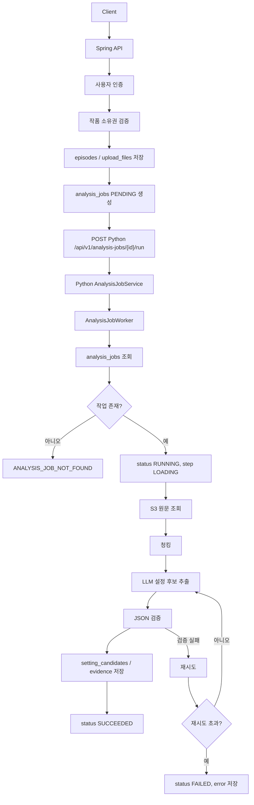
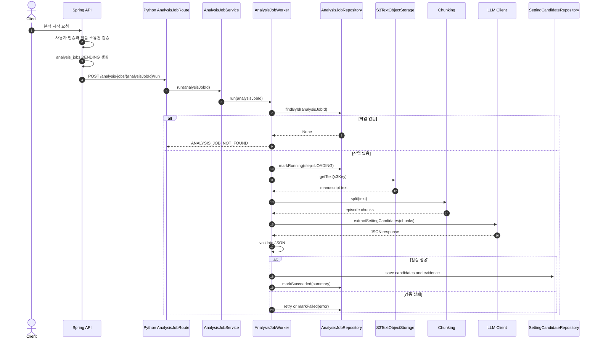

# Analysis Job Workflow

Spring 서버가 Python AI 서버의 분석 API를 호출한 뒤, Python worker가 분석 작업을 처리하는 흐름을 정리합니다.

세부 필드와 상태값은 [Analysis Job](analysis-job.md), DB 스키마는 [Database Schema](database-schema.md)를 기준으로 확인합니다.

## 전체 흐름



## Sequence



## MVP 구현 범위

초기 구현은 한 번에 전체 workflow를 완성하지 않습니다.

| 단계 | 이슈 | 설명 |
| --- | --- | --- |
| DB 접근 기반 | NVM-151 | `analysis_job_id` 조회, 상태 갱신 |
| 원문 로드/청킹 | NVM-152 | S3 원문 조회, episode chunks 저장 |
| AI 추출 | NVM-153 | 캐릭터 수치형 설정 프롬프트와 worker |
| JSON 검증/재시도 | NVM-154 | LLM 출력 schema 검증과 실패 처리 |
| 후보 저장/검색 PoC | NVM-155 | setting candidates 저장, pgvector 검색 |

## Queue 전환 기준

초기에는 Spring 서버가 Python API를 직접 호출합니다.

다음 문제가 확인되면 queue 구조로 전환합니다.

- 분석 작업이 HTTP timeout을 유발함
- Python 서버 재시작 시 작업 유실이 발생함
- 재시도와 동시 작업 제어가 어려움
- 여러 사용자의 업로드가 동시에 들어와 처리량 제어가 필요함
- 분석 작업 우선순위나 예약 실행이 필요함

전환 후 목표 구조:

```text
Spring API
  -> analysis_jobs 생성
  -> SQS message 발행
  -> Python queue consumer
  -> AnalysisJobWorker
  -> DB 상태 갱신
```
