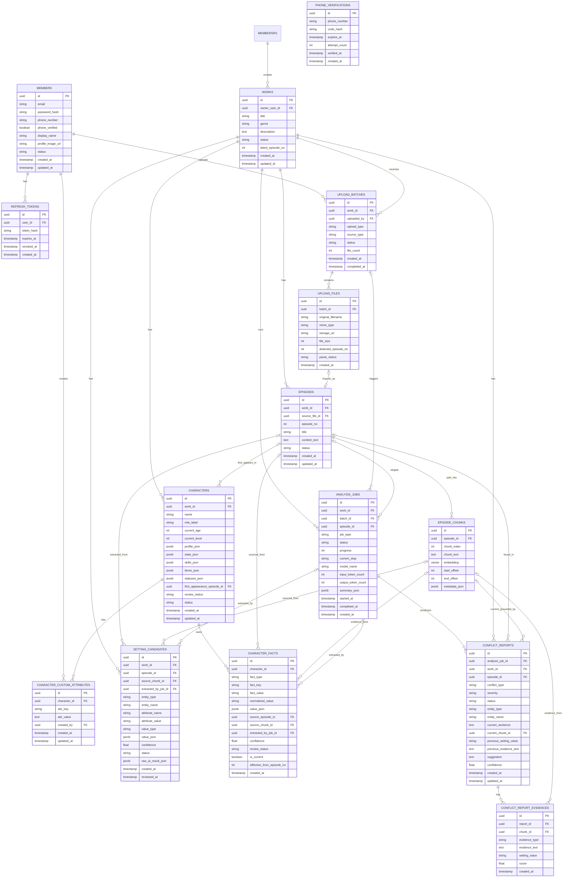

# Database Schema Draft

이 문서는 CatchHole AI 서버가 참조하는 PostgreSQL 스키마 초안을 추적하기 위한 문서다.

Spring 서버가 인증, 작품/회차 API, 사용자 소유권 검증, 사용자-facing 응답을 담당하고, Python AI 서버는 `analysis_jobs`를 기준으로 원문 로드, 청킹, 설정 후보 추출, 근거 저장, 임베딩 검색을 담당한다.

Python AI 서버는 DB 스키마의 주도권을 갖기보다는 Spring 서버와 공유하는 PostgreSQL 스키마에 맞춰 읽기/쓰기 모델을 가진다. 따라서 이 문서의 스키마 변경 사항은 Spring 엔티티/마이그레이션과 함께 맞춰야 한다.

## Scope For First AI Issue

첫 번째 이슈에서는 전체 ERD를 모두 구현하지 않고, 분석 작업 실행 기반에 필요한 최소 테이블부터 접근한다.

- `analysis_jobs`
- `works`
- `episodes`
- `upload_batches`
- `upload_files`

이후 청킹/추출/검색 작업에서 다음 테이블 접근을 추가한다.

- `episode_chunks`
- `setting_candidates`
- `characters`
- `character_facts`
- `conflict_reports`
- `conflict_report_evidences`

## Current Processing Contract

초기 MVP에서는 Queue 없이 Spring 서버가 Python AI 서버의 분석 실행 API를 직접 호출한다.

```text
Spring API
  -> 사용자 인증과 작품 소유권 검증
  -> episodes / upload_files / analysis_jobs 생성
  -> Python AI 서버 분석 API 호출
  -> Python worker가 analysis_job_id 기준으로 DB 조회
  -> Python worker가 S3 원문 조회
  -> episode_chunks / setting_candidates / evidence 저장
  -> Spring API가 DB에서 진행률과 결과 조회
```

작업 유실, 재시도, 동시성 제어, 장시간 처리 문제가 확인되면 SQS 같은 queue 기반 구조로 전환한다.

## Important Decisions

- `setting_candidates`는 설정집 파일 테이블이 아니다. AI가 원문에서 추출한 사용자 검토 전 후보를 저장한다.
- 설정집 파일은 별도 테이블로 관리할 예정이다.
- 청킹은 Python AI 서버가 담당한다.
- 근거 가시화를 위해 `episode_chunks`는 원문 위치 정보를 반드시 보존한다.
- `source_chunk_id`만으로는 화면에서 정확한 근거를 보여주기 어렵다. 후보 저장 시 `evidence_quote`, `start_offset`, `end_offset`도 함께 저장하는 방향을 우선한다.
- MVP의 기본 벡터 검색 대상은 `episode_chunks.embedding`이다.
- `characters`, `setting_candidates`, `character_facts`는 우선 일반 컬럼과 JSONB 조건으로 조회하고, 의미 기반 원문 검색은 `episode_chunks.embedding`으로 수행한다.

## Open Schema Notes

현재 ERD 초안에서 실제 구현 전 조정이 필요한 후보들이다.

| Area | Current Draft | Proposed Direction | Reason |
| --- | --- | --- | --- |
| `MEMBERSRS` relation typo | `MEMBERSRS ||--o{ WORKS` | `MEMBERS ||--o{ WORKS` | ERD 오타로 보임 |
| `refresh_tokens.user_id` | `user_id` | `member_id` | 인증 PR에서 member 기준으로 구현됨 |
| `works.owner_user_id` | `owner_user_id` | `member_id` 또는 Spring 구현명과 동기화 | Java Work 엔티티와 명칭 통일 필요 |
| `upload_files.detected_episode_no` | 단일 추정 회차 번호 | `detected_episode_start_no`, `detected_episode_end_no`, `detected_episode_count` | 한 파일에 여러 회차가 들어갈 수 있음 |
| `episodes.content_text` | 본문 원문 저장 | S3 key + 필요 시 캐시/요약 컬럼 | 원문은 S3 저장을 우선 검토 중 |
| `analysis_jobs` retry | 없음 | `retry_count`, `last_error_code`, `last_error_message` 검토 | JSON 검증/재시도와 실패 추적 필요 |
| `setting_candidates` evidence | `raw_ai_result_json` 중심 | quote/offset 일부 일반 컬럼 승격 검토 | 근거 화면 표시와 검색 편의 |

## ERD Draft



## Change Log

| Date | Change | Reason |
| --- | --- | --- |
| 2026-06-18 | Added initial ERD draft to AI repo docs. | Track schema decisions before implementing SQLAlchemy models/repositories. |
