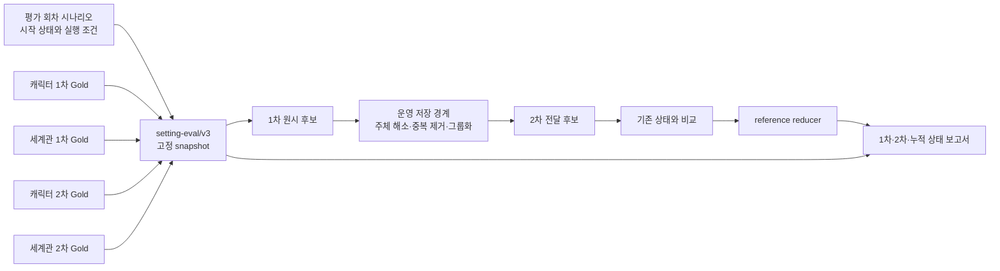

# 캐릭터·세계관 다단계 설정 평가

이 문서는 `setting-eval/v3` 정답과 `evals/multi_stage_setting` 평가기를 함께 운영하는
기준입니다. 기존 `evals/setting_extraction` 평가는 캐릭터 1차 추출 회귀를 위한 레거시 도구로
그대로 유지합니다. v3 평가는 다음 세 결과를 분리해서 봅니다.

1. 1차 LLM이 원문에서 올바른 캐릭터·세계관 후보를 찾았는가
2. 2차 LLM이 기존 상태와 후보를 비교해 올바른 반영 결정을 내렸는가
3. 그 결정을 순서대로 적용한 최종 누적 상태가 올바른가

## 전체 데이터 흐름



Notion에서는 사람이 보기 쉬운 표가 다섯 개지만, 같은 컬럼을 중복 관리하지 않도록 실제
data source는 세 개만 사용합니다.

| 물리 data source | 사람용 view | 기록하는 정답 |
| --- | --- | --- |
| 평가 회차 시나리오 | 평가 회차 시나리오 | 원문, 회차, 대상 도메인, 시작 상태, 이전 회차 연결, 정답지 버전과 검수 상태 |
| 1차 설정 추출 Gold | 캐릭터 1차 정답 입력 | 캐릭터 발견·설정 후보, canonical entity/fact slot, 값과 근거 |
| 1차 설정 추출 Gold | 세계관 1차 정답 입력 | category/subject/scope/setting 경로, 원문에서 추출할 값과 근거 |
| 2차 설정 반영 Gold | 캐릭터 2차 정답 입력 | 기존 캐릭터 상태에 대한 operation, target, 시간 범위, 최종 반영값 |
| 2차 설정 반영 Gold | 세계관 2차 정답 입력 | 기존 세계관 상태에 대한 operation, target/path, consolidation과 최종 반영값 |

캐릭터와 세계관 view는 각각 `도메인` 필터입니다. 별도 표처럼 보이더라도 같은 물리 DB를
공유하므로 export할 때는 캐릭터용·세계관용 ID를 따로 입력하지 않습니다.

## 각 표의 책임

### 평가 회차 시나리오

시나리오는 “이 회차를 평가하기 직전에 어떤 데이터가 쌓여 있어야 하는가”를 고정합니다.
`시나리오 ID`, `회차`, `원문 식별자`, `대상 도메인`, `정답지 버전`, `후보 없음 회차`,
`검수 상태`, `검수 메모`만으로는 시작 상태를 재현할 수 없으므로 다음 필드도 함께 사용합니다.

- `시작 상태 방식`: 첫 회차는 `EMPTY`, 직전 Gold를 잇는 회차는 `PREVIOUS_GOLD`, 독립 fixture는
  `SEED`입니다.
- `이전 시나리오`: `PREVIOUS_GOLD`일 때 직전 시나리오 Relation입니다.
- `누적 기준 회차`: 현재 분석 시작 전에 어느 회차까지 적용되어 있어야 하는지 나타냅니다.
- `회차 제목`: 선택 필드입니다. 값이 있으면 운영 worker와 동일하게 캐릭터·세계관 extractor의
  prompt metadata로 전달합니다. 컬럼이 없는 기존 표도 그대로 export할 수 있습니다.
- `평가 Batch`: 선택 필드입니다. 운영에서 같은 업로드 배치로 분석된 시나리오끼리 같은 값을
  적으면, 앞에서 비교한 동일 캐릭터·동일 slot 후보를 다음 시나리오의 2차 LLM 문맥으로
  이어 줍니다. 배치가 다르거나 독립 평가라면 비워 둡니다.
- `1차 제공 컨텍스트`: 사람이 작성하는 입력이 아닙니다. verified `beforeState`의 ACTIVE
  캐릭터에서 생성 시점 최신순으로 자동 생성한 이름 미리보기입니다. 같은 이름의 서로 다른
  캐릭터도 임의로 합치지 않습니다. exporter는 기존 표 이관을 위해 이 컬럼을 읽지만 runtime은
  사람이 쓴 값을 신뢰하지 않고 상태에서 다시 계산합니다.
- `회차 종료 캐릭터 등록`: 해당 회차 분석 후 사용자가 등록하는 캐릭터를 지정하는 선택
  JSON 배열입니다. 예: `[{"entityRef":"character:bjorn-yandel","name":"비요른 얀델"}]`.
  해당 회차의 1차 입력에는 보내지 않고, 회차 종료 상태와 다음 회차 입력에 반영합니다.
  원문에서 이름을 추출했다는 정답으로 추가하지 않으며, 모델 예측이나 설정값을 보정하지
  않습니다. 이 등록 자체는 모델의 상태 평가 정답·오답으로 세지 않습니다.
- `상태 생성 상태`: `PENDING → GENERATED → VERIFIED`로 snapshot 생성·검증 여부를 기록합니다.
- `beforeState URI/Hash`, `afterState URI/Hash`: 작성자가 파일명을 직접 적는 입력칸이 아니라,
  상태 fixture 도구가 reducer 결과로 만든 산출물을 검증하기 위한 필드입니다. Notion→v3
  exporter는 이 값을 소비하고 검증 계약에 포함하지만 상태 파일 자체를 생성하지는 않습니다.

`원문 식별자`도 평가 결과 JSON 파일명을 적는 칸이 아닙니다. 원문 페이지 URL이나 운영의 논리
식별자를 둘 수 있고, 로컬 loader는 실행 환경의 `--source-file-pattern`으로 private 원고 파일에
연결할 수 있습니다. `후보 없음 회차=true`인 시나리오는 행을 생략하지 않고 유지하여, 아무것도
추출하지 않아야 하는 회차의 false-positive suppression도 평가합니다.

예를 들어 3화만 점수에 포함해도 `PREVIOUS_GOLD` 연결에 필요한 1·2화 시나리오와 Gold 행은
snapshot에 같이 포함됩니다. 실제 평가 대상은 `evaluationScenarioIds`로 3화만 표시하므로, 상태
준비에 사용한 1·2화가 3화 점수에 중복 포함되지는 않습니다.

### 1차 설정 추출 Gold

세계관 설정명 평가 정책은 이슈 [#62](https://github.com/catchhole-soma/catchhole-backend-ai/issues/62)에
배경과 범위를 기록하며, 결과 JSON의 `run.worldSettingNamePolicy`는
`item-scope-value-contextual/v2`로 구분합니다.

1차 Gold는 **원문에서 발견해야 하는 후보**를 기록합니다. `1차 판정`은 `EXTRACT`,
`DO_NOT_EXTRACT`, `REVIEW_REQUIRED`이고, 캐릭터와 세계관 모두 동일한 후보 검출 원칙으로
평가합니다.

- 캐릭터 설정은 `canonical entityRef + factType + canonical factKey`를 사실의 정체성으로
  사용하고 `valueType`, 표시값, 선택적 `valueJson`, 원문 근거를 기록합니다.
- 일반 행에서는 `canonical factKey`가 1차 입력 key이자 최종 key입니다. 다만 STATUS pattern
  정규화 자체를 ORACLE로 평가할 때만 선택 컬럼 `inputFactKey`에 원래 1차 key를 적고,
  `canonical factKey`에는 2차가 해소해야 할 최종 key를 적습니다.
- 캐릭터 발견 후보는 아직 설정 slot이 없으므로 fact/value 필드를 채우지 않습니다.
- 세계관은 `category + normalized subject + scope + setting`을 경로로 사용하고, 같은 경로의
  원문 값은 `sourceValues`로 묶습니다.
- 공용 `허용 factKey 별칭` 컬럼은 세계관 행에서는 `worldSettingName`의 사람이 검수한 별칭으로
  해석합니다. 1차 매칭과 2차 출력 설정명 채점은 정규화한 이름·허용 별칭을 먼저 비교하고,
  일치하지 않으면 같은 category·주체 안에서 문맥상 같은 속성인지 판정합니다. 상위 scope가
  다르면 범위의 의미가 같은지도 별도로 판정하며, 이름 일치만으로 범위나 값까지 인정하지 않습니다.
  Gold의 canonical 이름은 유지하며, 이 평가 때문에 모델의 원시 출력 이름을 고쳐 쓰지 않습니다.
- `valueJson`은 표시값과 별도 품질 지표입니다. `STRING`, 엄격한 `NUMBER`, 엄격한 `BOOLEAN`은
  exporter가 단순 scalar JSON을 만들 수 있지만, `JSON`과 `UNKNOWN` 구조는 추측하지 않습니다.

사람이 입력할 때는 Relation인 `시나리오`와 그 시나리오 안의 `정렬 순서`를 기준으로 행을
구분합니다. `회차`는 시나리오 Relation에서 자동으로 가져오며, 기존 행에 값이 남아 있으면
같은지 검증만 합니다. 정렬 순서는 캐릭터·세계관 도메인별로 1부터 매기고 같은 값이 중복되면
export를 거절합니다. `맥락 태그`, `위치 힌트`, `현재 스키마 표현 가능`, `원본 페이지`는 검수와
진단을 돕는 선택 정보이며 주 정답 매칭을 좌우하지 않습니다. `원문 근거`는 반드시 기록하지만
후보 identity/value와 분리된 evidence 지표로 채점하므로, 인용 범위가 다르다는 이유만으로 후보
전체를 오답 처리하지 않습니다.

평가기는 extractor가 낸 `rawStage1`과 실제 2차로 넘어간 `stage1`을 구분합니다.

| 이름 | 시점 | 알 수 있는 문제 |
| --- | --- | --- |
| `rawStage1` | extractor 직후 | LLM 자체의 후보 발견 성능 |
| `stage1` 또는 handoff | 주체 해소, 캐릭터 중복 제거, 세계관 경로 그룹화·통합 이후 | 2차가 실제로 받은 입력과 저장 경계에서 사라진 후보 |

raw→handoff 개수 차이는 주체 해소나 중복 제거 경계에서 후보가 줄었는지 확인하는 진단값입니다.
현재 개별 Gold 매칭과 2차 도달 여부는 handoff를 기준으로 하므로, handoff에 없는 후보는
`UPSTREAM_MISSING/EXTRACTION_MISS`로 집계합니다. 여기서 `EXTRACTION_MISS`는 extractor 호출만이
아니라 **2차 이전 후보 파이프라인 전체의 누락**을 뜻합니다. 원인을 더 좁힐 때 raw 상세를 함께
확인합니다. 2차 평가는 handoff 후보만 사용합니다.

캐릭터 1차의 추출 또는 주체 해소가 한 청크에서라도 실패하면 운영과 동일하게 해당 시나리오를
`PIPELINE_FAILED`로 표시합니다. 앞에서 성공한 `rawStage1`은 진단용으로 남기지만 캐릭터 handoff,
2차 비교, 후속 세계관 단계는 실행하지 않습니다. 세계관 1차가 실패하면 이미 완료된 캐릭터
결과는 보존하되 세계관 handoff와 2차 비교는 만들지 않습니다.

### 2차 설정 반영 Gold

2차 Gold는 **1차 후보를 기존 상태와 비교했을 때의 결정과 결정 적용 결과**를 기록합니다.
`1차 정답` Relation으로 입력 후보를 연결하며, 캐릭터는 정확히 한 행, 세계관은 같은
category·canonical subject·raw scope 안에서 같은 사실로 통합할 여러 행을 한 결정에 연결할 수
있습니다. 이때 raw `worldSettingName`은 서로 다른 동의 표현일 수 있습니다.

- `operation`, `targetRef`, `removedSnapshotRefs`, 시간 범위 또는 consolidation은 구조적 결정입니다.
- 캐릭터의 `resolvedCanonicalFactKey` 기대값은 연결된 1차 Gold의 `factKey`에서 자동으로
  파생합니다. 사람은 2차 표에 같은 key를 다시 적지 않으며, 실제 2차 출력의 정규화 정확도는
  `characterCanonicalFactKeyResolutionAccuracy`로 따로 확인합니다.
- `beforeValue`는 exporter가 비교 직전 상태에서 자동으로 채웁니다. 캐릭터 batch에서는 같은
  회차의 앞선 확정 Gold를 메모리상으로 적용한 projected state, 세계관에서는 회차 시작
  before state가 기준입니다. 작성자가 직접 입력하지 않습니다.
- `proposedValue`와 proposed path는 reducer가 적용할 최종 출력입니다.
- 세계관 신규 scope ADD가 기존 root property까지 그 scope로 옮겨야 할 때는 선택 컬럼
  `existingRootPropertyNamesToMove`에 property 이름을 한 줄씩 적습니다. reducer는 이름과 값을
  보존해 proposal과 함께 원자적으로 이동합니다.
- `반영 결과 필수 사실`은 최종 문장에 반드시 보존되어야 할 의미이고,
  `반영 결과 금지 사실`은 최종 문장에 남아서는 안 되는 의미입니다. 표현이 달라도 의미가
  같으면 semantic judge가 정답으로 인정할 수 있습니다. 이 제약은 2차 결정뿐 아니라 그
  결정이 만든 E2E after-state의 의미 판정에도 그대로 전달됩니다.
- 과거 `유지/추가/제거/금지 Claim` 컬럼은 이관용 fallback일 뿐입니다. 새 컬럼과 동시에
  작성했는데 의미 목록이 다르면 exporter가 오류로 중단합니다.

`operation=MERGE`와 `consolidationStatus=MERGED`는 다른 축입니다. operation은 **기존 누적
상태와 이번 후보 사이의 처리**이고, consolidation은 **이번 회차에 같은 세계관 경로로 나온
여러 원문 값 사이의 관계**입니다.

세계관 `UPDATE/MERGE`와 기존 property를 지정한 `EXCLUDE`의 `matchedScopeName`은 1차 후보의
scope와 같아야 합니다. 운영 comparator가 생성할 수 없는 교차-scope 정답은 export 검증에서
즉시 거절합니다.

## reference reducer의 상태 변경 규칙

### 캐릭터

| operation | 현재 snapshot | history |
| --- | --- | --- |
| `ADD` | canonical slot을 새 값으로 추가 | 추가 |
| `UPDATE` | 정확한 target slot을 proposed 값으로 교체 | 추가 |
| `MERGE` | 정확한 target slot을 병합 완료된 proposed 값으로 교체 | 추가 |
| `REMOVE` | 후보 자체는 현재값으로 남기지 않고 `removedSnapshotRefs`에 적은 `STATUS`를 1개 이상 제거 | 추가 |
| `HISTORY_ONLY` | 변경 없음 | 과거·가정 사실 또는 현재 발생했지만 지속되지 않는 사건을 이력에 추가 |
| `EXCLUDE` | 변경 없음 | 변경 없음 |
| `REVIEW_REQUIRED` | 자동 변경 없음 | 자동 변경 없음 |

`UPDATE`나 `MERGE`의 proposed 값은 단순히 새 문장만 담는 값이 아닙니다. 예를 들어 기존
`평균 키는 140cm`에 `희귀한 큰 변종은 190cm`가 추가되면, proposed 값에는 두 사실이 모두
남아야 합니다. 필수·금지 사실은 문장 구조가 달라도 이 의미 보존을 채점하기 위한 필드입니다.

`removedSnapshotRefs`는 현재 시점에 해소할 상태를 명시하며, reference reducer에서는 같은
캐릭터의 `STATUS` slot에만 허용합니다. `REMOVE`는 target을 쓰지 않고 이 목록을 반드시
채웁니다. 후보와 같은 key를 종료할 수도 있고, 회복 후보 하나로 부상·중독처럼 서로 다른
key를 함께 종료할 수도 있습니다. 후보 자체도 현재 상태로 남겨야 한다면 `ADD/UPDATE/MERGE`
중 하나를 사용하면서 `removedSnapshotRefs`를 함께 작성합니다.
`removedSnapshotSetAccuracy`는 Gold나 예측 중 하나에라도 제거 reference가 있는 케이스만
분모에 넣습니다. 제거가 없는 일반 판단 수가 늘어도 상태 해소 정확도가 부풀지 않습니다.

캐릭터의 `proposedValueJson`은 참고용 문자열이 아니라 실제 저장 결과의 일부입니다. Gold에
구조화 JSON이 있으면 표시 문장이 맞아도 Gold가 지정한 JSON subset을 만족해야
`fullDecisionAccuracy`, E2E structured state, transition에서 정답입니다. 서술형 문자열의
표현 차이는 의미 판정으로 확인하되, 숫자·불리언·식별자는 결정적으로 비교합니다. Gold가 지정하지
않은 추가 JSON 필드는 세 지표 모두 허용하며, transition도 Gold before/after subset에 투영한
값만 비교합니다.

### 세계관

| operation | 적용 결과 |
| --- | --- |
| `ADD` | 새 canonical path를 추가 |
| `UPDATE` | target path를 proposed path/value로 교체 |
| `MERGE` | target path를 병합 완료된 proposed path/value로 교체 |
| `EXCLUDE` | snapshot을 변경하지 않음 |
| `REVIEW_REQUIRED` | 범위 모호성을 자동 적용하지 않고 snapshot을 변경하지 않음 |

신규 `ADD`는 원문의 유동적인 setting 이름을 canonical proposed path로 바꿀 수 있습니다. raw와
다른 새 scope를 만들 때는 최종적으로 서로 다른 하위 property가 둘 이상이어야 하며, 같은
회차의 다른 ADD·기존 scoped property·`existingRootPropertyNamesToMove`로 옮긴 root property를
합쳐 판단합니다. 하나뿐인 속성을 위한 scope와 `scopeName == settingName`은 Gold 검증에서
거절합니다.

같은 회차·같은 세계관 경로에 고유 값이 하나면 `SINGLE`, 둘 이상이 서로 양립하면 `MERGED`,
서로 충돌하면 `CONFLICT`입니다. `CONFLICT`는 임의로 하나를 선택하지 않습니다. 원시 대안을
held-conflict ledger에 보존하고 현재 world snapshot은 그대로 두는 **HOLD** 정책을 사용합니다.

> 이 reducer는 AI 저장소의 평가용 reference contract입니다. Java 영속화 reducer를 직접
> 호출하는 것은 아니므로, 운영 상태 변경 로직이 달라질 때 parity fixture와 계약 테스트를 먼저
> 갱신해야 합니다. reference reducer 통과만으로 실제 DB 반영 동작이 동일하다고 가정하지 않습니다.

## 평가 모드

| 모드 | 1차 입력 | 2차 before state | 목적 |
| --- | --- | --- | --- |
| `ORACLE` | Gold 1차 후보 | Gold 상태 | 1차 누락의 영향을 제거하고 comparator만 격리 평가 |
| `FIXED` | 실제 1차 handoff | 각 시나리오의 Gold before state | 회차마다 동일한 기준에서 1차·2차·E2E 평가 |
| `ROLLING` | 실제 1차 handoff | 직전 회차의 predicted after state | 앞 회차 예측을 모두 승인했다고 가정한 누적 스트레스 테스트 |

일상적인 comparator 회귀 확인은 비용과 원인 분리가 쉬운 `ORACLE`을 기본으로 사용합니다.
추출기를 포함한 통합 평가는 `FIXED`, 누적 안정성 확인은 `ROLLING` 순서로 확장합니다.

`ROLLING`은 운영의 사람 검수 시점을 재현하지 않습니다. 운영에서는 비교 결과가
`PENDING_REVIEW`로 저장되고 사람이 확정한 뒤 snapshot이 바뀌지만, 이 모드는 모든 예측 결정을
즉시 반영합니다. prediction/report의 `stateApplicationPolicy=ACCEPT_ALL_PREDICTIONS`로 이 가정을
명시합니다. `FIXED`와 `ORACLE`은 `SCENARIO_LOCAL`입니다.
prediction 입력에서 mode와 이 정책을 반대로 명시하면 실제 상태 적용과 보고서 설명이 달라지므로
계약 오류로 거절합니다. 정책을 생략하면 mode에 맞는 값을 자동으로 기록합니다.

`FIXED`의 1차에는 Gold before state, `ROLLING`의 1차에는 직전 predicted after state에서
현재 활성인 캐릭터 `STATUS`를 가져와 `factKey`와 사람이 읽는 `factValue`만 전달합니다.
내부 ref·구조화 JSON·이력은 보내지 않으며, 같은 회차의 모든 chunk는 동일한 회차 시작
상태를 받습니다. `ORACLE`은 Gold 1차 후보를 직접 사용하므로 extractor를 호출하지 않고,
이 STATUS들은 comparator의 persisted `P*` 문맥으로만 들어갑니다.

캐릭터 2차 비교는 한 회차(scenario) 안의 동일 캐릭터·FactType 후보를
원문 순서로 묶습니다.
실제 추출에서는 LLM 배열 순서보다 검증된 evidence startOffset을 우선하고,
offset을 확정할 수 없을 때만 안정적인 추출 순서를 사용합니다. ORACLE은 Gold의 정렬 순서를 사용합니다.
각 판단이 만든 상태 변경은 DB가 아니라 메모리상 projected snapshot에만 먼저 적용되고, 다음
후보는 이 상태를 비교 문맥으로 받습니다. 따라서 같은 회차에서 생긴 상태가 뒤의 종료 근거로
쓰여도 재현할 수 있습니다. 회차 경계를 넘은 provider batch나 legacy prior candidate는
만들지 않습니다. 이전 회차의 확정 결과는 다음 회차의 before state에 들어온
persisted `P*` snapshot으로만 이어집니다. STATUS를 포함한 해당 FactType의 현재 slot을
운영과 같은 context 제한 안에서 전달합니다. `평가 Batch`는 데이터셋 출처 추적용
메타데이터일 뿐, 서로 다른 회차의 후보를 하나의 comparator 호출로 합치는 기준이 아닙니다.
동일 그룹이 운영 claim 상한(기본 10개)을 넘으면 별도 provider batch로 나누고, 각 batch의
`P*`/`Q*` projected 문맥과 요청 로컬 ref를 새로 시작합니다. 앞 batch의 미확정 projection을
다음 batch가 본 것처럼 재사용하지 않습니다.

### 1차 누락을 2차에서 다시 오답 처리하지 않는 이유

Gold 2차 결정에 필요한 후보를 1차가 찾지 못하면 comparator는 그 결정을 받을 기회가 없습니다.
이 경우 `UPSTREAM_MISSING`과 `EXTRACTION_MISS`를 기록하고, 2차 conditional accuracy의 분자와
분모에서는 제외합니다. 2차 operation 오답까지 추가하면 같은 원인을 두 번 벌점 주게 되기
때문입니다.

누락이 사라지는 것은 아닙니다. E2E after-state에는 기대한 사실이 생성되지 않으므로 state recall과
transition recall에서 오답으로 반영됩니다. 이 구조로 “추출기가 놓쳤다”와 “비교기가 잘못
판단했다”를 구분하면서 최종 제품 영향도 그대로 측정합니다.

그 밖의 upstream 상태는 `UPSTREAM_PARTIAL`, `UPSTREAM_VALUE_ERROR`, `UPSTREAM_EXTRA`,
`UPSTREAM_BLOCKED_SUBJECT`로 분리하고, 실패 원인은 `EXTRACTION_MISS`, `RETRIEVAL_MISS`,
`COMPARISON_ERROR`, `STATE_APPLICATION_ERROR`, `UPSTREAM_FALSE_POSITIVE`로 집계합니다.

### 인물 연결을 기다리는 1차 정답

원문에서 설정을 추출했더라도 어느 캐릭터에게 연결할지 확정되지 않으면 운영 pipeline은
2차 LLM을 호출하지 않습니다. 이 동작을 기대하는 캐릭터 `EXTRACT / SETTING` 정답에는
`stage2Policy=WAIT_FOR_CHARACTER_MATCH`를 명시합니다. Notion의 선택형 **2차 처리 기준**
컬럼에 같은 값을 기록하며, 이 행에 연결된 2차 정답은 두지 않습니다.

1차의 대상·설정 분류·값·근거는 계속 채점합니다. 올바른 추출 뒤의 인물 연결 대기는
2차 답안 누락이나 추출 실패로 세지 않습니다. 보고서의 인물 연결 대기 수는 답지에 이 정책을
지정한 항목 수이며, 실제 추출에 성공한 수와는 다릅니다. 해당 1차 설정을 놓쳤거나 잘못
추출한 경우에는 원래의 1차 오류를 그대로 기록합니다. 2차 정확도의 분모에는 2차 정답이 있는
항목만 포함하며, 대기 항목에 대해 확정 설정이 저장될 것으로 기대하지 않습니다.

기본값 `REQUIRED`는 기존처럼 설정마다 2차 정답 하나를 요구합니다. 기존 Notion DB에 컬럼이
없거나 값이 비어 있으면 기본값을 사용합니다. 기본값은 JSON에 새 필드를 추가하지 않아 기존
fixture hash를 보존합니다. 세계관이나 캐릭터 발견 정답에는 대기 정책을 사용할 수 없습니다.

정책은 회차의 개별 Gold 행에만 적용합니다. 예를 들어 1화의 표시명이 `미상`이어도 내부
`entityRef`는 유지하고, 2화의 캐릭터 발견·이름 연결과 2차 판단은 기존 기준으로 평가합니다.
평가기에서 이후 회차의 이름을 앞선 입력에 주입하거나 운영의 인물 해소 로직을 바꾸지 않습니다.

Notion 변경 시 1차 대기 정책 지정과 연결된 2차 정답 제거를 함께 적용하고, 이 정책을
지원하는 브랜치에서 다시 export합니다. 2차만 삭제하거나 대기 정책과 2차 정답을 함께
남기면 계약 검증 오류입니다. 변경 후 누적 상태를 다시 생성해 이후 회차의 동일 인물 연결도
검증합니다.

### 세계관 설정 항목·범위·값 판정

세계관 의미 판정은 같은 category·주체인 후보 쌍에만 적용합니다. `worldSettingName`이 가리키는
설정 항목, `worldScope`의 적용 범위, 설정값의 내용은 서로 독립된 세 축입니다.

1. 정규화한 이름이 같으면 `EXACT`, Gold에 등록된 허용 별칭이면 `ALIAS`로 항목을 인정합니다.
   범위와 값도 각각 정규화 일치로 먼저 확인합니다. 한 축이 일치해도 나머지 축의 판정을 생략하지
   않습니다.
2. 결정적으로 일치하지 않는 축은 이름·양쪽 범위·추출값·기존값·근거·필수/금지 사실과 관련
   경로를 함께 제공해 LLM이 판정합니다. `sameSetting`은 같은 설정 항목인지,
   `scopeEquivalent`는 범위가 의미상 동등한지, 의미 보존 필드는 내용이 맞는지를 나타냅니다.
3. 빈 scope는 root property입니다. 빈 범위를 모든 범위와 자동으로 일치시키지 않습니다.
   신규 `ADD`에서 독립 속성들을 `게임 규칙` 같은 상위 범위로 묶었더라도 적용 대상이나 조건이
   바뀌지 않았다면 의미상 동등할 수 있습니다. 특정 지역·인물·시기 등으로 범위를 넓히거나
   좁힌 경우에는 같은 값이 적혀 있어도 범위가 같다고 인정하지 않습니다.

예를 들어 root의 `캐릭터 사망 규칙`과 `게임 규칙 › 사망 규칙`은 같은 항목인지, 새 상위 범위가
의미를 바꾸지 않는 묶음인지, 사망 후 재육성해야 한다는 내용이 보존됐는지를 각각 확인합니다.
이름이 비슷하거나 내용이 같다는 이유만으로 세 판정을 한꺼번에 통과시키지 않습니다.

이 기준은 1차 일대일 후보 연결, 2차 proposed path/value, E2E 누적 상태와 전이에 적용합니다.
1차에서 인정한 표현이 있어도 2차가 새로 출력한 경로와 값은 다시 확인합니다. 후보 하나로 서로
다른 Gold 여러 개를 충족시키거나, 여러 예측을 평가용 키 하나에 덮어써 중복을 숨기지 않습니다.

기존 target reference와 실제 `matchedScopeName/matchedPropertyName`, operation, consolidation,
기존 root property 이동 대상은 계속 Gold와 실제 상태를 기준으로 엄격히 검증합니다.
`UPDATE/MERGE`의 matched 경로와 proposed 경로도 같아야 합니다. 의미상 비슷하다는 이유로
다른 기존 속성을 수정하거나 경로를 바꾸는 계약 위반을 정답으로 보정하지 않습니다. 신규 scope의
실제 하위 속성이 둘 이상이어야 한다는 reducer 규칙도 그대로 적용합니다.

### 캐릭터 의미 판정

캐릭터의 서술형 값은 표현이 달라도 필수 사실 보존·금지 사실·모순·근거 없는 추가 정보를 기준으로
판정합니다. 같은 인물·factType 안에서 동적으로 정하는 STATUS pattern 이름과 JSON 안의
서술형 문자열에도 의미 판정을 적용합니다. 현재 평가 bundle에는 스키마 원본이 없으므로
동적 이름 판정은 기본 `status.*` namespace로 제한하며, 다른 namespace의 자유 이름을
임의로 승인하지 않습니다. 인물 ID, factType, 고정 canonical key,
숫자·불리언, target 및 제거 대상 reference는 계속 결정적으로 비교합니다. STATUS 이름 대응을
인정해도 실제로 종료할 상태나 수정할 대상의 선택까지 바꾸지는 않습니다.

### 의미 판정의 미확정 결과와 실행 설정

judge가 항목·범위의 동등성을 결정할 수 없으면 nullable 판정으로, 값은 `valueResolved=false`로
응답할 수 있습니다. judge를 사용하지 않거나 유효한 판정이 없는 경우도 해당 축을 `PENDING`으로
남깁니다. 미확정을 정답·오답으로 추정하거나 후보 TP로 계산하지 않으며, 이 상태를 1차·2차·E2E에
전파합니다. 다른 의미 축이나 구조 필드가 명시적으로 틀린 경우 그 오류는 그대로 유지합니다. caseId
누락·중복, 잘못된 타입처럼 응답 계약이 깨진 경우는 미확정과 구분해 평가 오류로 거절합니다.

이 판정은 평가에만 적용합니다. 제품 추출·비교 프롬프트, 원시 prediction, reference reducer의
상태, before/after state와 fixture hash를 바꾸지 않습니다. 승인된 대응은 상태·전이 채점의
일대일 평가용 키에만 사용하며, 원시 상태 해시 차이와 실제 상태 적용 오류는 보존합니다.
캐릭터 이력의 후보 ID와 Gold ID 대응도 승인된 일대일 연결을 채점할 때만 사용합니다.
전이는 먼저 원시 상태에서 계산한 뒤 평가용 대응을 적용하므로, 대응 방식의 변화만으로
실제로 없던 ADD/UPDATE를 만들지 않습니다.

`ROLLING`에서 일부 회차만 채점하면 누적 상태를 만든 이전 회차의 의미 판정도 필요할 수 있습니다.
의존 회차의 추가 judge 사용량은 `semanticJudgeUsage`에 포함하지만, 그 회차의 1차·2차 항목을
점수의 분자·분모에 추가하지 않습니다. 의존 회차의 판정은 선택 회차의 상태 대응에만 사용합니다.

평가 judge 기본값은 `gpt-5.6-sol`, reasoning effort는 `medium`입니다. 각각 `--judge-model`과
`--judge-reasoning-effort`로 지정하며 제품의 추출·주체 해소·비교 모델 및 공통 추론 강도와
독립적으로 주입합니다. 평가만 실행해도 제품 모델 설정을 바꾸지 않습니다.

요청 묶음은 회차를 섞지 않으며, 같은 회차 안에서 **입력 64,000토큰·출력 32,000토큰**을
기본 상한으로 사용합니다. 기존 8쌍 고정 제한은 없고 비교 데이터의 길이에 따라 개수가 달라집니다.
입력은 지시문·비교 JSON·응답 schema를 tokenizer로 계산한 뒤 message framing 여유분
10% + 256토큰을 포함한 추정량입니다. 따라서 비교 데이터만으로 64,000토큰을 채우지 않습니다.
기존 모델별 tokenizer 선택과 미지원 모델의 byte 상한 fallback을 공통 사용량 계산과 공유합니다.
출력 상한은 실제 사용량이 아니라 추론과 최종 JSON에 허용하는 최대량입니다.
출력이 잘리면 해당 묶음만 반으로 나눠 다시 판단하고, 잘린 호출의 사용량도 `semanticJudgeUsage`에
포함합니다. 단일 비교에서도 출력이 잘리면 실패로 종료하며, 누락·중복 응답은 계속 거절합니다.
단일 비교의 입력이 상한을 넘으면 해당 `judge_many` 호출의 API 전송 전에 오류로 알리고,
문맥을 자르거나 일부 비교를 생략하지 않습니다. 입력 상한 변경은 평가 단계·표·공개 JSON 구조를
바꾸지 않습니다.

의미 judge 요청은 `multi-stage-setting-eval:semantic-outcome:v4` 캐시 키를 사용합니다. v4는
항목·범위·값의 독립 판정과 미확정 응답 계약을 포함하므로 이전 v3 응답을 재사용하지 않습니다.
같은 이름 쌍이라도 분류·주체·양쪽 범위·값·근거·관련 경로가 바뀌면 다른 판정 문맥입니다.
실제 문맥을 요청에 보내 판정하며, 캐시 키를 정오 판정의 근거로 쓰지 않습니다. 이 버전은
평가 judge 프롬프트 버전이며 `setting-eval/v3` 데이터 계약이나 제품 프롬프트 버전은 유지합니다.

## 주요 지표 읽는 법

- 1차: 도메인별 후보 Precision/Recall/F1, identity/path/value/valueJson/evidence, raw→handoff 수
- 2차: upstream reach, operation/target/removed/temporal/consolidation/path/value 정확도,
  full decision accuracy
- 보수적 자동화: selective coverage/accuracy, `REVIEW_REQUIRED` recall, false-positive suppression,
  harmful action rate
- 누적 상태: after-state Precision/Recall/F1, transition Precision/Recall/F1,
  rolling state divergence
- 재현 정보: fixture hash, 캐릭터 schema hash, 모델·프롬프트 버전, `maxChunks`, token 사용량과
  가능한 경우 비용

`summary.md`는 집계 지표 아래에 회차·도메인별 완전 일치, 부분 일치, 추출하지 못한 설정,
불필요하게 추출한 설정 개수와 Gold/예측의 주체·경로·표시값 및 불일치 축을 표시합니다. 이는 기존 Hungarian 매칭과
점수 결과를 설명하는 진단 표현일 뿐 매칭이나 분모·분자를 다시 계산하지 않습니다. 실패·미판정
항목은 바로 표시하고 완전 일치 항목만 접어서 표시합니다. Candidate TP는 주체와 경로가 맞으면
성공이지만 진단의 완전 일치는 값까지 맞아야 하므로 두 개수가 다를 수 있습니다. 축별 비율에는
일치 건수/판정 건수를 함께 쓰며, 2차 target과 캐릭터 STATUS 제거 대상 및 세계관 root 이동 대상은
내부 ref 대신 canonical 주체·경로·이름으로 표시합니다. 전체 상세 행에는 공개 요약 크기를 제한하는
상한을 둡니다.

항목별 진단의 `CHARACTER`·`WORLD` 이름과 완전 일치·부분 일치는 유지합니다.
표 안의 `누락 Gold`·`추가 예측`도 각각 '추출하지 못한 설정'·'불필요하게 추출한 설정'으로
통일합니다. 이 판정은 답지와 연결된 항목의 유무를 뜻하며, 내용 자체를 추출하지 않았거나
원문에 없는 정보를 만들었다고 단정하지 않도록 판정 이유에 연결 여부를 설명합니다.
캐릭터는 '인물 / 설정 분류·세부 항목 / 설정값', 세계관은 '설정 대상 / 설정 범위·세부 항목 /
설정값'으로 표시하고, 비교 셀에는 '답지 / 모델'을 명시합니다. 알려진 분류·항목 코드에는
괄호 설명을 붙이고 알 수 없는 코드는 원래 표시를 보존합니다.

2차 상세는 '답지에서 기대한 처리 / 모델이 판단한 처리'를 비교하며 처리 방식, 기존 설정,
설정값, 정보의 시점, 종료할 상태, 추출값 통합 판단, 함께 옮길 기존 설정을 구분해 적습니다.
관련 ID에도 2차 답지·1차 답지·모델 추출 항목을 명시합니다. 판정은 완전 일치, 판단 불일치,
2차 답안 없음, 채점 미완료, 2차 채점 제외로 표시하고 괄호에 각각의 조건을 설명합니다.
2차 채점에서 제외된 항목에 결과가 없으면 '이 답지 항목과 연결된 2차 결과 없음'으로
표시하며, 2차 호출 자체가 없었다고 해석하지 않습니다. 판정 이유는 내부 upstream 코드 대신
답지와 다른 부분을 설명하고, 1차 문제로 2차에서 제외되면 연결된 1차 진단의 차이도 표시합니다.

1차에서 '불필요하게 추출한 설정'으로 분류된 캐릭터·세계관 후보도 같은 2차 표에 표시합니다.
연결된 실제 결과가 있으면 '과추출 항목의 2차 처리' 행에서 ADD·EXCLUDE·REVIEW_REQUIRED 등의
처리 방식과 제안 경로·값을 확인할 수 있습니다. 결과 기록이 없으면 '과추출 항목의 2차 결과 없음'으로
표시하며, 이 표시만으로 실제 호출 여부나 실패 원인을 단정하지 않습니다. 대응하는 2차 답지는
없으므로 기대 처리 칸에 이를 명시하고, 이 진단 행을 정답·오답으로 채점하거나 Gold 기준 정확도의
분모에 추가하지 않습니다. 표의 열과 집계 전용 `score.json` 구조는 유지합니다.

여러 세계관 후보가 한 2차 결과로 합쳐지면 비공개 예측의 선택 필드 `sourceCandidateIds`에 원래
후보 ID 전체를 기록합니다. 각 과추출 후보는 이 연결을 따라 같은 실제 결과를 표시하며, 기존
`sourceCandidateId`를 사용하는 채점·상태 적용은 그대로 한 번만 수행합니다. 이 필드가 없는
기존 예측은 단일 source 연결로 읽으며, 기록되지 않은 통합 관계를 이름·값으로 추정하지 않습니다.
모델의 자유 형식 비교 이유는 공개하지 않고 기존 허용 필드와 고정 안내 문구만 사용합니다.

세계관 진단의 선택 필드 `settingNameMatch`는 제안 설정명, 2차의 `matchedPropertyNameMatch`는
비교한 기존 속성명의 `status`와 `method`를 기록합니다. 두 이름을 별도로 판정하며,
공개 보고서는 `status=MATCH/MISMATCH/PENDING`, `method=EXACT/ALIAS/SEMANTIC/UNRESOLVED`만
허용하고 다음 고정 문구로 설명합니다. 완전 일치 항목과 1차 문제로 제외된 2차의 원인에도
같은 설명을 사용합니다.

| 이름 판정 | 공개 설명 |
| --- | --- |
| 허용 별칭으로 일치 | 정답지에 등록된 별칭으로 같은 설정 항목임을 인정했습니다. |
| 문맥 판정으로 일치 | 이름은 다르지만 문맥상 같은 설정 항목으로 판단했습니다. |
| 문맥 판정으로 불일치 | 문맥상 다른 설정 항목으로 판단했습니다. |
| 판정 미완료 | 설정명의 의미를 확인하지 못했습니다. |

설정명이 일치로 인정됐는데 양쪽 경로의 상위 범위가 다르면, 같은 기존 판정 이유 셀에서 범위의
인정·불일치·미확정을 별도로 설명합니다. `PARTIAL_MATCH`에 `PENDING` 필드가 있으면 의미 판정이
끝나지 않았음을 명시합니다. 공개 JSON 구조, 표·컬럼·지표명은 추가하거나 바꾸지 않습니다.

`EXACT`는 별도 설명을 생략할 수 있습니다. 모델이 만든 자유 형식 `reason`·`settingReason`·`scopeReason`은
원문을 인용할 수 있으므로 공개 allowlist에 넣지 않습니다. quote, raw 응답과 함께 공개
산출물에서 제외하며, 공개 화면은 답지·모델의 허용된 이름과 고정 설명만 표시합니다. 표시 문자열은
HTML·Markdown을 이스케이프하고 기존 길이 제한을 적용합니다. 집계 전용 `score.json`에는
개별 이름 판정이나 설명을 추가하지 않습니다.

1차 집계에서는 예측을 '모델이 추출한 설정', 연결을 '비교한 설정 쌍', TP를
'대상·설정 항목 일치'로 표시합니다. P·R·F1과 가중 Recall에는 뜻을 괄호로 설명하고,
주체·경로·값은 '설정 대상·설정 항목·설정 내용 일치율'로 표시합니다. 근거 위치는
'인용문 원문 확인율', 커버리지는 '정답 근거 포함률'로 표시합니다. 명칭 변경은
계산 기준을 바꾸지 않으며, 내용 일치 여부는 TP와 별도로 확인합니다.

2차 집계는 수량과 정확도를 분리하고, `Full accuracy` 같은 원래 지표명에도 의미를
한국어 괄호로 설명합니다. 도달은 '2차 채점에 포함', 차단은 '2차 채점에서 제외'로
표시하며 1차 입력 조건을 함께 설명합니다. 응답 수 대신 '오답 중 2차 결과가 없는 경우'를
표시하고, 미판정은 답안의 의미 채점이 끝나지 않았다는 설명과 함께 '채점 미완료'로
표시합니다. 2차 축별 비율은 집계 범위가 다른 상세 행의 개수를 병기하지 않고
기존 백분율을 표시합니다. 점수 계산과 JSON 필드명은 유지합니다.

누적 상태·전이는 '반영 후 데이터·변경 내역 평가'로 표시하고, after-state·Precision·Recall·
coverage·pending 및 오류 코드에는 한국어 괄호 설명을 붙입니다. after-state는 회차별 처리 후
데이터를 비교한 결과이며, 전체 F1은 도메인별 F1의 평균입니다. 런타임 오류 집계는 복구 성공을
검증하지 않으므로 '실행 중 기록된 오류'로 표시하고, 단계별·유형별 집계가 같은 오류를
다른 기준으로 분류한 수임을 명시합니다.

의미 판정이 필요한 항목·범위·값에 judge를 사용하지 않거나 판단할 수 없으면 해당 축은 `pending`으로
남습니다. pending이 하나라도 있으면 해당 주 지표(`valueAccuracy`, `fullDecisionAccuracy`,
`afterStateF1`, `transitionF1`)는 `null`입니다. 판정이 끝난 항목만 보는 `resolved*`, pending을
오답으로 보는 보수적인 `*LowerBound*`, `semanticCoverage`를 함께 제공합니다. 보고서에서 대상
없음과 pending을 0점 또는 100점으로 혼동하지 않습니다.

## 정답 검수와 snapshot 규칙

- 자동 평가와 GitHub Actions는 `FINAL` 행만 읽습니다.
- 작성 중인 `DRAFT`나 `IN_REVIEW`는 명시적으로 요청한 로컬 검수에서만 사용할 수 있습니다.
  이 상태가 하나라도 포함된 snapshot은 `scorable=false`로 표시됩니다.
- 시나리오·1차·2차 행의 `검수 상태`가 모두 선택한 상태에 포함되어야 Relation이 해소됩니다.
- 선택 회차가 이전 Gold를 참조하면 exporter가 전체 dependency chain을 함께 포함합니다.
- v3 모델은 알 수 없는 필드, 중복 ID, 끊어진 Relation, 잘못된 operation 필드 조합을 즉시
  거절합니다.
- `schemaVersion`은 반드시 `setting-eval/v3`입니다. 버전이 없는 레거시 JSON을 v3로 추측해
  읽지 않습니다.
- canonical JSON의 SHA-256인 `fixtureHash`가 Gold와 prediction에 함께 들어갑니다. 서로 다른
  snapshot의 결과는 비교하지 않습니다.
- 외부 `SEED` 상태를 쓰는 FINAL 시나리오는 `beforeState Hash`와
  `상태 생성 상태=VERIFIED`가 모두 필요합니다. loader는 파일을 읽을 때 hash를 다시 계산합니다.
- request-local `P1`, `T1`, 실행 UUID를 정답에 저장하지 않습니다. `entityRef`, character slot ref,
  world property ref처럼 실행 사이에 안정적인 참조만 사용합니다. 세계관 `UPDATE`, `MERGE`, 기존
  property 중복 `EXCLUDE`의 `targetRef`는 stable property ref입니다. 기존 subject에 새 property를
  `ADD`할 때는 `gold:world-subject:<CATEGORY>:<subject>` 형식의 stable subject ref를 사용할 수
  있고, 신규 subject `ADD`는 `targetRef=null`입니다.
- 외부 `SEED`의 `worldFacts`는 Backend subject ID를 `subjectRef`로 함께 보존합니다. 표시명과
  category가 완전히 같은 subject가 여러 개여도 이 ID를 기준으로 별도 비교 target을 만들며,
  property ref는 `gold:world-by-subject-ref:...`, subject target은
  `gold:world-subject-ref:...` namespace로 만듭니다. `subjectRef`가 없는 기존 fixture만
  category+표시명으로 만든 legacy ref를 사용합니다.
- 원문 본문은 snapshot 직렬화에서 제외되고 Git·Actions artifact에 올리지 않습니다.

현재 Notion 새 컬럼인 `반영 결과 필수 사실`, `반영 결과 금지 사실`을 우선 사용합니다. 기존
Claim 컬럼은 이관이 끝날 때까지만 fallback으로 허용합니다.
export CLI는 행을 읽기 전에 세 data source의 컬럼명과 타입을 검증합니다. 새 결과 컬럼 중 하나만
없으면 즉시 실패하며, 둘 다 없고 레거시 Claim 4개가 모두 정확한 타입으로 남아 있을 때만 경고와
함께 legacy 모드로 진행합니다.

## 로컬 실행

세 data source ID와 read-only integration token을 설정합니다.

```bash
export NOTION_API_TOKEN='<read-only integration token>'
export NOTION_SCENARIO_DATA_SOURCE_ID='<평가 회차 시나리오 data source ID>'
export NOTION_STAGE1_GOLD_DATA_SOURCE_ID='<1차 설정 추출 Gold data source ID>'
export NOTION_STAGE2_GOLD_DATA_SOURCE_ID='<2차 설정 반영 Gold data source ID>'
```

FINAL 정답을 내보냅니다. `--episodes 3`처럼 일부 회차를 골라도 시작 상태에 필요한 이전 Gold는
snapshot에 자동 포함됩니다.

```bash
python -m evals.multi_stage_setting.notion_cli \
  --episodes 1,2,3 \
  --review-status FINAL \
  --output build/eval/multi-stage/gold.json
```

작성 중인 표를 검증할 때만 상태를 명시해서 로컬로 내보냅니다. 이 결과를 기준 점수나 CI
artifact로 사용하지 않습니다.

```bash
python -m evals.multi_stage_setting.notion_cli \
  --episodes 1,2,3 \
  --review-status DRAFT,IN_REVIEW,FINAL \
  --output build/eval/multi-stage/gold-draft.json
```

작성 중인 DRAFT Gold로 Scenario 페이지의 누적 상태 검수표를 만들려면 기본 `preview` 모드를
사용합니다. preview는 `*.before.notion.md`와 검수용 hash만 만들고, `--updated-gold`의 상태를
`GENERATED`로 표시합니다. 공식 before/after state JSON·URI·Hash는 만들지 않습니다.

```bash
python -m evals.multi_stage_setting.state_cli \
  --gold build/eval/multi-stage/gold-draft.json \
  --output-dir build/eval/multi-stage/private/state-preview \
  --updated-gold build/eval/multi-stage/private/gold-with-preview.json
```

FINAL 2차 Gold를 reference reducer에 적용해 결정적인 before/after state와 hash를 만들려면
`verified` 모드를 명시합니다. 포함된 Scenario·1차·2차 Gold가 모두 FINAL이 아니면 실패합니다.
`--updated-gold` 결과에는 각 상태 URI/hash와 `VERIFIED` 상태가 들어가며,
비어 있던 Stage2 `beforeValue`/`beforeValueJson`도 해당 회차의 beforeState fixture에서 자동으로
채워집니다. 이미 작성된 값은 reducer가 fixture와 일치하는지 검증하고 덮어쓰지 않습니다.
이후 runtime과 scorer에는 갱신된 Gold를 사용합니다. state 파일은 원문 파생 정보이므로 private
입력과 같이 취급합니다.

```bash
python -m evals.multi_stage_setting.state_cli \
  --gold build/eval/multi-stage/gold.json \
  --output-dir build/eval/multi-stage/private/states \
  --updated-gold build/eval/multi-stage/private/gold-with-states.json \
  --mode verified
```

상태 디렉터리에는 JSON과 함께 회차별 `*.before.notion.md`가 생성됩니다. 이 파일은
`beforeState`에서 파생한 사람용 검수 표이며 캐릭터명·특성·현재 값과 세계관
분류·주체·설정·현재 값만 표시합니다. `entityRef`, state ref, `valueJson` 같은 채점용 필드는
숨기지만 원본 `beforeState`에는 그대로 남습니다. Scenario 페이지의
`평가 시작 전 누적 상태 · 자동 생성` 영역에는 이 내용을 사용하며, 표에 표시된 짧은 hash로
어떤 상태에서 생성됐는지 확인합니다. 이전 Gold가 바뀌면 state CLI를 다시 실행해 JSON과
사람용 표를 함께 갱신해야 합니다.

`*.before.notion.md` 역시 원고에서 파생된 상세 정답을 포함하므로 공개 Actions artifact에는
업로드하지 않습니다.

기본인 ORACLE 예측 생성, 평가, 원문·근거 인용과 raw 응답을 제외한 정제된 진단 요약은 다음
진입점을 사용합니다. ORACLE은 1차 Gold를 직접 사용하므로 원문과 캐릭터 스키마 파일이 필요하지
않습니다.

```bash
python -m evals.multi_stage_setting.runtime_cli \
  --gold build/eval/multi-stage/gold.json \
  --mode ORACLE \
  --domains CHARACTER,WORLD \
  --episodes 1,2,3 \
  --analysis-model gpt-5.6-terra \
  --subject-resolution-model gpt-5.6-luna \
  --comparison-model gpt-5.6-luna \
  --output build/eval/multi-stage/predictions.json

python -m evals.multi_stage_setting.cli \
  --gold build/eval/multi-stage/gold.json \
  --predictions build/eval/multi-stage/predictions.json \
  --semantic-judge openai \
  --judge-model gpt-5.6-sol \
  --judge-reasoning-effort medium \
  --output build/eval/multi-stage/report.json

python -m evals.multi_stage_setting.report_cli \
  --report build/eval/multi-stage/report.json \
  --markdown-output build/eval/multi-stage/summary.md \
  --json-output build/eval/multi-stage/score.json
```

`FIXED`와 `ROLLING`에서는 추출, 주체 해소, 비교 모델을 각각 `--analysis-model`,
`--subject-resolution-model`, `--comparison-model`로 고정합니다. runtime 명령에
`--source-root private/eval/sources`를 추가하고,
`CHARACTER`를 평가할 때는
`--character-setting-schemas private/eval/character-setting-schemas.json`도 추가합니다. 평가
명령에도 같은 `--source-root`를 전달합니다. `SEED` 시나리오가 외부 상태 URI를 사용하면 runtime과
평가 명령에 `--state-root`도 전달합니다. semantic judge를 끄려면
`--semantic-judge none`을 사용하거나 옵션을 생략합니다.

캐릭터 schema fixture는 Spring claim의 필드에 평가 전용 `canonicalFactType`을 선택적으로
추가할 수 있습니다. `profile.*`, `stats.*`, `status.*`처럼 표준 namespace는 기존과 같이
결정적으로 추론하지만, 작품별 임의 `schemaKey`는 Java DB에 저장된 `factType`을
`canonicalFactType`으로 반드시 함께 export해야 comparator handoff를 정확히 재현할 수 있습니다.
이 필드는 extractor prompt나 prompt cache key에는 넣지 않습니다.

```json
{
  "schemaKey": "guild.rank",
  "displayName": "길드 계급",
  "attributePattern": null,
  "aliases": ["계급"],
  "valueType": "STRING",
  "canonicalFactType": "PROFILE"
}
```

runtime이 선택한 `--domains`는 prediction의
`evaluationDomains`에 고정되고 evaluator는 그 범위만 채점합니다. 따라서 `WORLD`만 실행한
결과에서 `CHARACTER`를 누락으로 계산하지 않습니다.

모델 가격은 코드에 고정하지 않습니다. 비용 추정이 필요하면 runtime 명령에
`--input-usd-per-million`, `--cached-input-usd-per-million`, `--output-usd-per-million`을 모두
전달합니다. prediction에는 provider token 사용량과 이 단가로 계산한 `estimatedCostUsd`가
기록됩니다. 형식 검증 실패나 출력 잘림으로 재시도한 유료 응답도 예외에 포함된 token usage를
누락하지 않고 합산합니다.

## GitHub Actions 운영

새 평가는 `.github/workflows/setting-multi-stage-score.yml`을 수동 실행합니다. 기존
`setting-extraction-score.yml`은 레거시 캐릭터 1차 지표를 위해 그대로 둡니다.

기존 1차 평가와 같은 Actions environment `setting-extraction-evaluation`을 사용합니다. Notion,
OpenAI, AWS 인증과 `AWS_REGION`, `SETTING_EVAL_INPUT_S3_URI`는 기존 값을 재사용하며, 다단계
평가용 Notion data source ID 세 개만 같은 environment에 추가합니다.

| 종류 | 이름 | 용도 |
| --- | --- | --- |
| 기존 secret | `NOTION_API_TOKEN` | 세 data source에 대한 read-only integration token. 새 표에도 integration을 공유해야 함 |
| variable | `NOTION_SCENARIO_DATA_SOURCE_ID` | 시나리오 data source ID |
| variable | `NOTION_STAGE1_GOLD_DATA_SOURCE_ID` | 공용 1차 Gold data source ID |
| variable | `NOTION_STAGE2_GOLD_DATA_SOURCE_ID` | 공용 2차 Gold data source ID |
| 기존 secret | `OPENAI_API_KEY` | extractor/comparator와 선택적 judge 호출 |
| 기존 variable | `SETTING_EVAL_INPUT_S3_URI` | 두 평가가 공유하는 private 원문·스키마·외부 seed state 입력 위치 |
| 기존 variable | `AWS_REGION` | private 입력 다운로드 region |
| 기존 secret | `AWS_ROLE_TO_ASSUME` 또는 access key 쌍 | private 입력 read 권한 |

S3 prefix 아래에는 live 평가 원문 `sources/`, 캐릭터 도메인을 평가할 때 필요한
`character-setting-schemas.json`, 외부 `SEED`를 사용할 때 필요한 `states/`를 둡니다.

워크플로는 `FINAL`만 export하고, `confirm_run=RUN`일 때만 모델 호출을 시작합니다. 낮은 점수로
실패시키지 않으며 인증, 입력, Notion 계약, 모델 실행 또는 평가 자체가 실패한 경우에만
실패합니다. 모델 호출 전 reference reducer로 before/after state와 hash를 검증·생성하고,
beforeValue가 비어 있는 2차 Gold도 같은 상태에서 자동으로 채운 뒤 갱신된 Gold를 평가합니다.
provider의 HTTP/인증 장애는 개별 후보 오답으로 삼키지 않고 실행 자체를 실패시키며,
형식 오류처럼 후보 단위로 복구 가능한 실패만 `runtimeFailures`에 집계합니다.
캐릭터 2차의 `STRING` proposal은 `valueJson.value`가 JSON 문자열인지 모델 응답을 받는 즉시
검증하고, 타입이 다르면 수정 지시와 함께 재시도합니다. 재시도 후에도 잘못된 후보는
`COMPARISON_VALIDATION_FAILED`로 기록하며 정상 후보의 결과와 보고서 생성은 계속합니다.
숫자·배열·객체를 임의로 문자열로 변환해 통과시키지 않습니다. 업로드 artifact에는
`summary.md`와 집계 전용 `score.json`만 포함합니다. `summary.md`에는 허용 목록으로 정제한
주체·경로·표시값 기반 항목 진단과 `runtimeFailures` 집계가 포함되지만 `score.json`은 자동 비교용
집계 지표만 유지합니다.
두 파일 모두 원문 본문·근거 quote/offset·raw LLM 응답·Gold/prediction 원본·상세 report·구조화
`valueJson`을 포함하지 않습니다.

일반 `ORACLE`은 private 원문을 다운로드하지 않습니다. 다만 선택 fixture에 본문으로 포함되지
않은 `SEED` before state가 있으면 Gold를 확인한 뒤 private 입력을 내려받아 `states/`를 runtime과
scorer에 전달합니다. `FIXED`와 `ROLLING`은 항상 private 입력을 내려받습니다.
