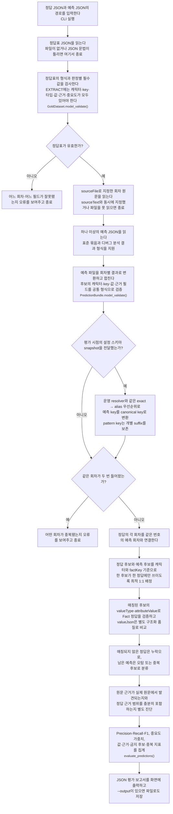
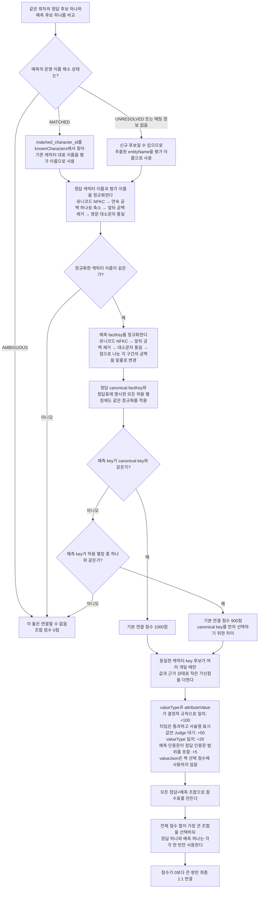
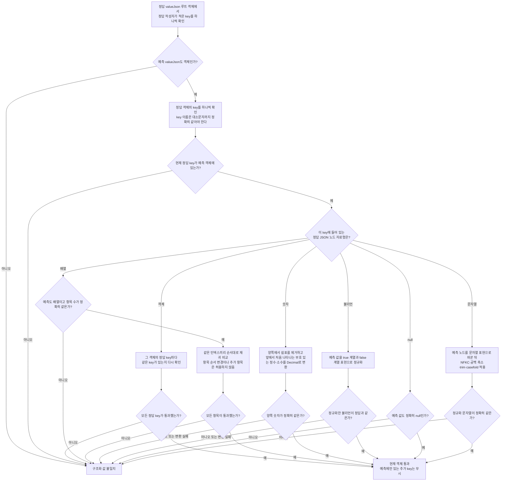

# 설정 추출 평가

설정 추출 프롬프트나 모델을 변경했을 때 같은 정답 데이터로 결과를 다시 채점하기 위한
로컬 평가 도구입니다. 현재 범위는 **이미 생성된 예측 JSON을 재현 가능하게 채점하는 것**입니다.
기준 브랜치와 변경 브랜치에서 OpenAI 분석을 자동 실행하는 A/B runner와 GitHub Actions 연동은
후속 작업으로 둡니다.

## 평가 원칙

- 사람이 관리하는 정답의 source of truth는 Notion `설정 추출 답안지`의 빨간 컬럼입니다.
- 회차·캐릭터·factKey를 먼저 1:1 매칭한 뒤 valueType과 attributeValue로 Fact 정답을 채점합니다.
- valueJson은 Fact 정답 여부와 분리해 `structuredValueAccuracy`로만 관찰합니다.
- 규칙으로 확정할 수 없는 서술형 attributeValue만 선택적으로 LLM Judge에 맡깁니다.
- 원문 근거는 Fact 정답 여부에서 분리하여 인용 품질 지표로 관찰합니다.
- `MUST`, `SHOULD`, `NICE`는 각각 3, 2, 1 가중치를 갖습니다.

## 파일 구성

| 위치 | 역할 |
| --- | --- |
| `evals/setting_extraction/models.py` | 정답·예측 데이터 계약과 실행용 정답 ID 생성 |
| `evals/setting_extraction/loader.py` | 정답 및 기존 디버그 분석 결과 JSON 로딩 |
| `evals/setting_extraction/schema_normalizer.py` | 운영 설정 스키마 snapshot으로 예측 alias key를 canonical key로 변환 |
| `evals/setting_extraction/normalization.py` | 문자열, factKey, 숫자, 불리언, JSON 비교 정규화 |
| `evals/setting_extraction/value_comparator.py` | 값 타입별 규칙 채점과 LLM 판정 필요 여부 결정 |
| `evals/setting_extraction/evidence.py` | 예측 근거의 원문 존재 여부와 정답 근거 범위 확인 |
| `evals/setting_extraction/assignment.py` | 하나의 예측을 여러 정답에 배정하지 않는 최적 1:1 매칭 |
| `evals/setting_extraction/semantic_judge.py` | 규칙으로 확정하지 못한 서술형 표시값의 LLM 판정 |
| `evals/setting_extraction/evaluator.py` | 회차별 매칭과 전체 지표 집계 |
| `evals/setting_extraction/cli.py` | 로컬 실행 진입점 |

## 자연어로 보는 전체 실행 흐름

아래 다이어그램은 함수 이름보다 **그 단계에서 무엇을 확인하고 어떤 결과를 만드는지**를
중심으로 읽습니다. 괄호 안 함수명은 문제가 생겼을 때 코드를 찾아가기 위한 보조 정보입니다.



### 정답표 검증에서 실제로 확인하는 것

`정답표의 형식과 판정별 필수값을 검사한다`는 단순히 JSON 문법만 확인한다는 뜻이 아닙니다.

- 같은 `episodeNo`가 두 번 작성되지 않았는지 확인합니다.
- 한 회차에 `sourceFile`과 `sourceText`를 동시에 지정하지 않았는지 확인합니다.
- `EXTRACT` 행에 소속 캐릭터, canonical factKey, valueType, attributeValue, valueJson,
  원문 근거, 중요도가 모두 있는지 확인합니다.
- `attributeValue`처럼 값이 필요한 필드가 빈 문자열은 아닌지 확인합니다.
- 사람이 관리하지 않아도 되도록 각 정답 행에 내부용 `goldId`를 생성합니다.

즉 이 단계의 목적은 **채점하다가 애매한 오류가 나는 대신, 잘못 작성된 정답표를 실행 초기에
구체적으로 거절하는 것**입니다.

### 예측 묶음 검증에서 실제로 확인하는 것

`예측 파일을 회차별 결과로 변환하고 합친다` 단계에서는 서로 다른 출력 형식을 하나의
`PredictionBundle`로 맞춥니다.

- `episodes` 배열이 있는 표준 평가 결과를 읽습니다.
- 단일 회차 결과 또는 디버그 스크립트의 `settingCandidates`도 같은 후보 형식으로 바꿉니다.
- 각 후보에 회차 번호, 캐릭터 이름, factKey, valueType, attributeValue 같은 필드가 올바른
  타입으로 들어왔는지 확인합니다.
- 여러 파일에 같은 회차가 중복되면 어느 결과를 써야 할지 임의로 고르지 않고 오류로 종료합니다.

이 단계의 목적은 **파일마다 모양이 조금 달라도 이후 채점 로직은 하나의 일관된 예측 계약만
보도록 만드는 것**입니다.

### 운영 스키마 별칭을 정답표가 아니라 snapshot으로 해소하는 이유

추출기는 `stats.육체`처럼 운영 스키마의 별칭을 반환할 수 있지만, 정답표 canonical key는
`stats.physique`입니다. 이 둘을 정답표의 `factKeyAliases`에 매번 복사하면 스키마 변경 시
정답표와 서비스 정책이 쉽게 어긋납니다. `--setting-schemas`로 평가 시점의 활성 스키마 snapshot을
전달하면 평가기는 Java 운영 resolver와 같은 순서로 key를 해소합니다.

1. `schemaKey` exact 일치가 하나면 그 canonical key를 사용합니다.
2. exact가 없으면 alias 단독 값 또는 같은 namespace가 붙은 alias를 찾습니다. 예를 들어
   `육체`, `stats.육체`는 `stats.physique`가 될 수 있지만 `profile.육체`는 되지 않습니다.
3. `skill.*`, `item.*`, `status.*` 같은 pattern key는 suffix가 개별 사실의 이름이므로 원래 key를
   유지합니다.
4. 같은 단계에서 여러 스키마가 매칭되면 임의로 고르지 않고 원래 key를 유지하여 정답으로
   과대 집계하지 않습니다.

원본 `attributeName`은 보고서에 그대로 남기고, canonicalized key는 매칭에만 씁니다. 따라서
어떤 raw key가 들어왔는지 추적하면서도 운영 alias 때문에 Detection Recall이 낮아지는 오류를
막을 수 있습니다.

snapshot 파일은 Worker claim의 `characterSettingSchemas`와 같은 필드를 가진 JSON 배열 또는
그 배열을 `characterSettingSchemas` key로 감싼 객체를 받습니다.

```json
[
  {
    "schemaKey": "stats.physique",
    "displayName": "육체",
    "attributePattern": null,
    "aliases": ["육체", "physical", "physique"],
    "valueType": "NUMBER"
  }
]
```

### 평가 실행에서 실제로 하는 일

`정답과 예측을 채점한다`는 한 번의 단순 문자열 비교가 아니라 다음 작업을 묶어 부르는 말입니다.

1. `EXTRACT`, `DO_NOT_EXTRACT`, `REVIEW_REQUIRED` 정답을 분리합니다. key까지 적힌
   `REVIEW_REQUIRED`와 같은 예측도 아직 정오를 확정할 수 없으므로 평가 분모에서 제외합니다.
2. 같은 회차 안에서 운영 이름 해소 결과가 가리키는 캐릭터와 canonical factKey 또는 별칭이
   맞는 후보 조합을 찾습니다.
3. 한 예측을 두 정답에 중복 사용하지 않도록 전체 조합의 점수가 가장 높은 1:1 배정을 만듭니다.
4. 매칭된 후보에 대해 타입과 사용자 표시값으로 Fact 정답을 검증합니다.
5. 구조화 JSON은 같은 후보에서 비교하지만 Fact 정답과 분리된 지표로 기록합니다.
6. 규칙만으로 의미가 같은지 결정할 수 없는 서술형 표시값만 선택적 LLM Judge로 보냅니다.
7. 매칭되지 않은 정답은 누락, 남은 예측은 오탐·중복·금지 후보 위반으로 분류합니다.
8. 원문 근거 품질은 Fact 정답 여부와 분리하여 진단합니다.
9. 회차별 결과를 합쳐 전체 Precision, Recall, F1과 세부 지표를 계산합니다.

## 자연어로 보는 후보 1:1 연결

값을 채점하기 전에 먼저 “이 예측이 어느 정답을 맞히려고 만든 후보인가”를 결정합니다.
이 단계에서는 이름이나 key의 **의미를 평가기가 새로 추측하지 않습니다**. 기존 캐릭터 이름은
운영 `character_name_resolver`의 확정 결과를 재사용하고, key는 정답표에 적은 canonical key와
별칭만 규칙으로 비교합니다.

### 운영 캐릭터 이름 해소 결과의 사용

디버그 분석 결과에는 추출된 `entityName` 외에 `match_status`, `matched_character_id`,
`knownCharacters`가 포함됩니다. 평가기는 서비스와 다른 부분 일치 규칙을 별도로 만들지 않고 다음
정책으로 이 결과를 사용합니다.

- `MATCHED`: `matched_character_id`가 가리키는 기존 캐릭터의 대표 이름으로 정답 이름을 비교합니다.
  예를 들어 추출명이 `비요른`이어도 운영 resolver가 `비요른 얀델` 한 명으로 확정했다면 같은
  캐릭터로 detection 합니다.
- `UNRESOLVED`: 아직 DB에 없는 정상적인 신규 캐릭터일 수 있으므로 추출된 `entityName`과 정답
  이름을 exact 비교합니다.
- `AMBIGUOUS`: 여러 기존 캐릭터가 가능하거나 원문 지칭이 충돌하므로 자동 detection으로 인정하지
  않습니다.
- 과거 표준 예측 파일처럼 매칭 필드가 없으면 기존처럼 추출된 `entityName`을 exact 비교합니다.

`MATCHED` 후보의 ID가 `knownCharacters`에 없으면 잘못 만들어진 디버그 결과이므로 평가를 계속해
임의의 이름으로 채점하지 않고 입력 오류로 종료합니다.



예를 들어 정답 캐릭터가 `비요른  얀델`, canonical key가 `stats.combat_power`, 별칭이
`stats.전투지수`라면 다음과 같이 처리합니다.

- 예측 추출명이 `비요른`이어도 `matched_character_id`가 `비요른 얀델`의 ID라면 대표 이름으로
  바꿔 비교합니다.
- 예측 캐릭터 `비요른 얀델`은 연속 공백을 하나로 줄인 결과가 같으므로 통과합니다.
- 예측 key `Stats.Combat Power`는 `stats.combat_power`로 정규화되어 canonical key와
  연결됩니다.
- 예측 key `stats.전투지수`는 명시한 별칭이므로 연결됩니다. 나머지 조건도 같다면 canonical key가
  기본 점수 100점 차이로 우선합니다.
- 예측 key `stats.전투력`은 사람이 별칭으로 적지 않았다면 의미가 비슷해도 연결하지 않습니다.

값과 근거 가산점은 **캐릭터와 key가 이미 일치하는 여러 예측 중 어느 것을 선택할지** 정하는
보조 기준입니다. 값이 좋아 보인다는 이유로 다른 캐릭터나 다른 key를 연결하지 않습니다.

### 1000·900점과 가산점은 어디에 쓰이는가

이 숫자는 모델 성능 점수나 최종 정확도 점수가 아닙니다. **같은 회차에 비슷한 후보가 여러 개
있을 때 정답과 예측을 1:1로 짝짓기 위한 내부 선택 점수**입니다.

| 내부 점수 | 부여 조건 | 선택 과정에서 나타내는 의미 |
| --- | --- | --- |
| `+1000` | 캐릭터가 같고 예측 key가 canonical key와 일치 | 가장 직접적인 identity 후보 |
| `+900` | 캐릭터가 같고 예측 key가 정답표의 허용 별칭과 일치 | 같은 사실로 허용하지만 canonical보다 기본 우선순위가 낮은 후보 |
| `+100` | valueType과 attributeValue가 결정적 규칙으로 일치 | LLM 없이 Fact 값이 맞다고 확정 가능한 후보 |
| `+50` | valueType은 통과했지만 서술형 attributeValue 문자열이 달라 Judge가 필요 | 값이 명백히 틀린 후보보다 먼저 연결할 유력 후보; 아직 정답 확정은 아님 |
| `+20` | valueType이 대소문자를 제외하고 일치 | 저장 타입 계약이 같은 후보 |
| `+5` | 예측 인용문 중 하나가 정답 인용문을 포함하거나 반대로 포함되거나, 유사도 0.9 이상 | 같은 원문 범위를 본 후보일 가능성이 조금 더 높음 |

점수는 누적됩니다. 예를 들어 별칭 key를 사용했지만 모든 값과 근거까지 규칙상 맞는 후보는
`900 + 100 + 20 + 5 = 1025점`입니다. canonical key이지만 타입만 맞고 값이 틀린
후보는 `1000 + 20 = 1020점`일 수 있습니다. 이 경우에는 **표현만 별칭일 뿐 실제 값과 근거가
더 잘 맞는 1025점 후보**가 선택됩니다. 따라서 canonical의 100점 우위는 절대 규칙이 아니라
동일한 품질에서 canonical을 선호하게 하는 기본 차이입니다.

모든 정답×예측 조합의 점수를 계산한 뒤에는 다음과 같은 점수표가 만들어집니다.

|  | 예측 A | 예측 B |
| --- | ---: | ---: |
| 정답 1 | 1125 | 1075 |
| 정답 2 | 1120 | 0 |

정답 1만 보면 예측 A의 1125점이 가장 높지만, 먼저 연결하면 정답 2는 예측 B와 연결할 수 없어
전체 합이 1125점에 그칩니다. 평가기는 정답 1→예측 B와 정답 2→예측 A를 선택해 전체 합
`1075 + 1120 = 2195점`을 만듭니다. 이렇게 해야 한 예측을 두 정답에 재사용하지 않으면서
회차 전체에서 가장 자연스러운 조합을 선택할 수 있습니다.

짝짓기가 끝나면 1000·900·100 등의 내부 점수는 최종 보고서의 Precision, Recall 또는 가중치에
더하지 않습니다. 최종 지표에는 다음 결과만 사용합니다.

- identity가 연결됐는가
- valueType·attributeValue가 최종적으로 맞았는가
- valueJson 구조화 품질이 별도 지표에서 맞았는가
- 매칭되지 않은 정답과 예측이 몇 개인가
- `MUST=3`, `SHOULD=2`, `NICE=1` 중요도 가중치가 얼마인가

즉 **1:1 연결 점수와 중요도 기반 평가 점수는 서로 다른 체계**입니다.

### “값 전체가 규칙상 일치”의 정확한 뜻

`+100`은 다음 조건이 모두 참일 때만 붙습니다.

1. valueType이 대소문자를 제외하고 같습니다.
2. attributeValue가 타입별 결정적 규칙으로 일치합니다.
   - NUMBER: 처음 찾은 숫자를 Decimal로 변환한 값이 같음
   - BOOLEAN: 허용 표현을 true/false로 변환한 값이 같음
   - STRING·JSON·UNKNOWN: NFKC·공백·대소문자 정규화 후 문자열이 정확히 같음

서술형 문자열이 다르기 때문에 LLM Judge가 필요한 상태는 아직 규칙상 일치가 아니므로 `+100`을
받지 않고 `+50`을 받습니다.

### “valueJson 핵심 필드”는 누가 정하는가

핵심 필드의 전역 고정 목록은 없습니다. **정답 작성자가 해당 행의 정답 `valueJson`에 넣은
key/value 전부가 그 행의 구조화 품질 측정 대상**이 됩니다. 이 필드는 Fact 정답을 좌우하지
않고 `structuredValueAccuracy`에서만 사용합니다.

예를 들어 정답표를 다음처럼 작성하면:

```json
{"name": "화염구", "level": 3}
```

`name`과 `level`은 모두 핵심 필드입니다. 예측 JSON에 두 필드가 모두 있고 값 비교까지 통과해야
구조화 값 정답으로 기록됩니다. 하나라도 틀리면 `structuredValueAccuracy`에서 실패하지만,
attributeValue가 맞는 Fact까지 오답으로 바꾸지는 않습니다. 예측에 `effect`, `range` 같은
필드가 더 있는 것은 허용합니다.

반대로 정답표에 다음처럼 핵심만 적으면:

```json
{"name": "화염구"}
```

`name`만 검사하고 예측의 `level`은 채점하지 않습니다. 정답을 `{}`로 작성하면 구조화 값 채점을
아예 생략합니다. 따라서 정답 작성자는 “모델이 출력할 법한 모든
부가 정보”가 아니라 **이 사실의 정답 여부를 가르는 데 반드시 필요한 구조만** 적어야 합니다.

### “서술형 의미 판정 필요 +50”의 정확한 뜻

`+50`은 다음 상태를 뜻합니다.

- 캐릭터와 factKey는 이미 일치합니다.
- valueType도 일치합니다.
- 하지만 STRING·JSON·UNKNOWN attributeValue를 정규화한 문자열이 정확히 같지는 않습니다.

예를 들어 정답 attributeValue가 `오른쪽 발목 부상`, 예측이 `고블린 덫으로 오른쪽 발목을 다침`이면
규칙만으로 동일 사실인지 확정할 수 없습니다. 이 후보를 숫자나 구조가 명백히 틀린 후보와 같은
수준으로 취급하지 않도록 매칭 단계에서 `+50`을 주어 유력한 짝으로 남깁니다.

중요한 점은 이 시점에는 LLM을 호출하지도 않았고 정답으로 확정하지도 않았다는 것입니다.
1:1 연결이 끝난 뒤에만 선택된 후보를 LLM Judge에 보내며, Judge가 불일치라고 판정하면 최종
Fact는 오답입니다. Judge를 끈 경우에는 정답이나 오답으로 추측하지 않고 의미 판정 대기로 남깁니다.

이 방식은 모든 정답×예측 조합을 LLM으로 미리 판정하지 않아 평가 비용을 줄이는 대신, 같은
캐릭터·key에 서술형 후보가 여러 개 겹치면 가산점과 근거로 먼저 하나를 고른 뒤 그 후보만
Judge가 확인한다는 제한이 있습니다. 현재는 동일 identity 중복이 드물다는 전제로 둔 MVP
절충안이며, 중복 후보가 많은 평가 세트에서는 Judge 전 매칭 정책을 별도로 재검토해야 합니다.

## 자연어로 보는 후보 값 검증

아래 흐름은 캐릭터와 factKey가 같은 후보끼리 연결된 뒤, 그 후보의 **값이 실제로 맞는지**
판단하는 과정입니다.

```mermaid
flowchart TD
    A["1:1로 연결된 정답 후보와 예측 후보의<br/>값 검증 시작"] --> B["valueType의 영문 대소문자만 통일한다<br/>NUMBER와 number는 같지만 NUMBER와 STRING은 다르다"]
    B --> C{"통일한 valueType이 같은가?"}
    C -- "아니오" --> X["Fact 값 오답 처리<br/>저장 계약 자체가 다르므로<br/>LLM에게 다시 묻지 않는다"]
    C -- "예" --> H{"attributeValue의 valueType은 무엇인가?"}
    H -- "NUMBER" --> I["양쪽 문자열에서 쉼표를 제거하고<br/>앞에서 처음 나타나는 부호 있는 정수·소수를 Decimal로 변환"]
    H -- "BOOLEAN" --> J["true·1·yes·y·예·참은 true로,<br/>false·0·no·n·아니오·거짓은 false로 변환"]
    H -- "STRING·JSON·UNKNOWN" --> K["유니코드 NFKC → 연속 공백 하나로 축소 →<br/>앞뒤 공백 제거 → 영문 대소문자 통일 후 문자열 비교"]

    I --> L{"양쪽 모두 숫자로 변환됐고 값이 같은가?"}
    J --> M{"양쪽 모두 불리언으로 변환됐고 값이 같은가?"}
    K --> N{"정규화한 문자열이 정확히 같은가?"}
    L -- "예" --> Y["값 정답 처리"]
    M -- "예" --> Y
    N -- "예" --> Y
    L -- "아니오" --> X
    M -- "아니오" --> X
    N -- "아니오" --> O{"LLM Judge를 켰는가?"}
    O -- "아니오" --> P["의미 판정 대기로 남긴다<br/>오답으로 가정하지 않고 Fact 종합 지표를 null로 표시"]
    O -- "예" --> Q["정답 표시값·예측 표시값·양쪽 인용문과<br/>찾을 수 있는 원문 주변 문맥을 Judge에 전달"]
    Q --> R{"Judge의 네 조건을 모두 만족하는가?<br/>핵심 의미 포함=true<br/>원문 근거 지지=true<br/>모순=false<br/>근거 없는 세부정보=false"]
    R -- "예" --> Y
    R -- "아니오" --> X

    A -. "Fact 판정과 독립 실행" .-> S{"정답 valueJson이 빈 객체인가?"}
    S -- "예" --> T["구조화 값 채점을 생략한다<br/>structuredValueAccuracy 분모에서도 제외"]
    S -- "아니오" --> U["정답 valueJson의 key/value만<br/>예측 valueJson에 포함되는지 재귀 비교"]
    U --> V{"정답에 적은 구조가 모두 일치하는가?"}
    V -- "예" --> W["structuredValueAccuracy 정답"]
    V -- "아니오" --> Z["structuredValueAccuracy 오답<br/>Fact 정답 여부에는 영향 없음"]
```

여기서 LLM Judge는 문자열 표현이 다른 경우만 보조합니다. 잘못된 캐릭터, factKey,
valueType을 뒤집을 권한은 없습니다. 반대로 valueJson 불일치는 Judge 대상 여부나 Fact 정답
여부를 막지 않으며 `structuredValueAccuracy`에만 반영됩니다.

### valueJson 재귀 비교의 정확한 규칙

`valueJson이 같은 의미인가`라고 LLM에 묻지 않습니다. 정답 JSON은 별도 구조화 품질 지표에서
검사할 핵심 구조의 부분집합으로 보고, 아래 규칙을 자료형마다 반복 적용합니다.

여기서 루트 `valueJson`은 Java의 JSONB 컬럼과 Python의 `dict[str, Any]` 계약에 따라 항상
**객체**입니다. 아래의 객체·배열·숫자·불리언·null·문자열 분기는 루트 객체 안의 각 value를
재귀적으로 비교할 때 필요한 **JSON 노드 자료형별 비교 전략**입니다. Java/Python 설정 타입에
객체나 배열이 추가된 것이 아니며, 설정 `valueType`은 계속 `STRING`, `NUMBER`, `BOOLEAN`,
`JSON`, `UNKNOWN` 다섯 가지입니다.

또한 이 분기는 JSON 노드의 자료형을 무조건 동일하게 요구한다는 뜻도 아닙니다. 구조화 값은
추출기가 만든 표현 차이를 흡수하기 위해 숫자와 불리언에 한해서 안전한 정규화를 허용합니다.
예를 들어 정답 숫자 `3`은 예측 문자열 `"Lv.3"`과 같다고 볼 수 있고, 정답 불리언 `true`는
예측 문자열 `"예"`와 같다고 볼 수 있습니다. 객체·배열·null은 컨테이너 종류를 그대로
요구하고, 문자열은 텍스트 정규화 후 비교합니다.



예시는 다음과 같습니다.

- 정답 `{"name":"화염구"}`와 예측 `{"name":"화염구","level":3}`은 통과합니다.
  정답 객체에 적지 않은 `level`은 부가 정보이기 때문입니다.
- 정답 `{"level":3}`과 예측 `{"level":"Lv.3"}`은 숫자 규칙으로 둘 다 3이 되어 통과합니다.
- 정답 `{"name":"화염구"}`와 예측 `{"Name":"화염구"}`은 실패합니다. JSON key 이름은
  정규화하지 않습니다.
- 정답 `{"effects":["화상","기절"]}`과 예측 `{"effects":["기절","화상"]}`은
  같은 항목이 있어도 배열 순서가 다르므로 실패합니다.
- 정답이 `{}`이면 구조화 값은 의도적으로 채점하지 않습니다.
- 객체·배열·숫자·불리언·null·문자열 분기는 현재 추출기가 반환하는 `valueType` 목록이 아닙니다. 배열이나
  중첩 객체가 실제 `valueJson` 안에 들어온 경우에도 구조화 지표가 예측 가능하게 동작하도록 둔
  일반 재귀 비교 규칙입니다.

따라서 이 단계의 “같음”은 자연어 의미 동치가 아니라 **정답표에 적은 핵심 JSON 구조가 위의
결정적 규칙으로 예측 JSON에 포함되는지**를 뜻합니다.

### attributeValue 규칙 비교의 정확한 범위

- `NUMBER`는 문자열 전체가 숫자일 필요는 없고, 앞에서 처음 찾은 숫자를 현재값으로 봅니다.
  예를 들어 `36`, `36.0`, `36 (New +1)`은 모두 36으로 비교됩니다. 반면 `New +1 → 36`은
  첫 숫자인 `+1`로 읽히므로 36과 같지 않습니다.
- `BOOLEAN`은 문서에 명시한 표현만 변환합니다. 예를 들어 `활성`, `비활성`은 현재 규칙에
  없으므로 사람이 보기에 참·거짓 의미가 있어도 자동 비교에 실패합니다.
- `STRING`, `JSON`, `UNKNOWN`은 NFKC·공백·대소문자 차이만 무시합니다. `발목 부상`과
  `오른쪽 발목을 다침`처럼 표현이 다른 경우에는 규칙으로 같다고 하지 않고 LLM Judge 대상으로
  보냅니다.

즉 질문을 코드 흐름으로 풀면 **타입을 먼저 확인하고, 모든 타입에서 결정적 exact 비교를 먼저
시도한 뒤, 자연어 표현이 가능한 `STRING`·`JSON`·`UNKNOWN`의 불일치만 LLM에 맡기는 방식**입니다.
`NUMBER`와 `BOOLEAN`은 파싱 결과가 다르면 의미 Judge가 값을 임의로 뒤집지 않도록 즉시
오답으로 끝냅니다. 캐릭터·factKey·valueType이 다른 경우도 LLM 호출 대상이 아닙니다.

### LLM Judge가 실제로 통과시키는 조건

Judge는 다음 네 값을 JSON으로 반환하며, 네 조건을 모두 만족할 때만 정답입니다.

| Judge 결과 | 통과에 필요한 값 | 의미 |
| --- | --- | --- |
| `core_meaning_covered` | `true` | 예측값이 정답값의 핵심 사실을 포함함 |
| `supported_by_evidence` | `true` | 예측 인용문이나 전달된 원문 문맥에서 그 값을 확인할 수 있음 |
| `contradiction` | `false` | 정답 또는 원문과 충돌하는 내용이 없음 |
| `unsupported_detail` | `false` | 원문에 없는 원인·수치·상태 등을 임의로 덧붙이지 않음 |

Judge에게는 전체 원고를 보내지 않습니다. 정답 인용문과 예측 인용문 중 원문에서 처음 찾은
인용문 앞뒤 300자만 전달합니다. 원문에서 인용문을 그대로 찾지 못하면 정규화 원문에서 한 번 더
찾고, 이 경우 좌표가 달라질 수 있어 원문 앞 600자를 fallback 문맥으로 전달합니다.

### 원문 근거가 같다고 판단하는 정확한 기준

원문 근거도 자연어 의미를 LLM으로 채점하지 않고 다음 두 진단을 별도로 계산합니다.

1. **원문에서 찾을 수 있는가**
   - 원문 전체와 예측 인용문에 NFKC·공백 축소·trim·casefold를 적용합니다.
   - 정규화한 예측 인용문이 정규화한 원문의 연속 부분 문자열이면 찾은 것으로 셉니다.
   - 저장된 start/end offset은 없거나 어긋날 수 있어 현재 판정에는 사용하지 않습니다.
2. **정답 근거 범위를 덮는가**
   - 정답 인용문이 예측 인용문에 포함되거나, 예측 인용문이 정답 인용문에 포함되면 통과합니다.
   - 포함 관계가 아니면 두 정규화 문자열의 순서 기반 유사도가 0.9 이상일 때 통과합니다.
   - 정답 인용문이 여러 개라면 그중 하나 이상을 덮었는지 집계합니다.

근거 진단이 실패해도 캐릭터·key·type·value가 맞은 Fact를 오답으로 바꾸지는 않습니다. 근거는
`evidenceLocatableRate`, `goldEvidenceCoverageRate`로 따로 관찰합니다.

## Notion 컬럼과 평가 입력 매핑

현재 채점에 사용하는 빨간 컬럼은 다음과 같습니다.

| Notion 컬럼 | JSON 필드 | 용도 |
| --- | --- | --- |
| 판정 | `decision` | `EXTRACT`, `DO_NOT_EXTRACT`, `REVIEW_REQUIRED` 구분 |
| 소속 캐릭터 | `entityName` | 신규·미해소 후보의 exact 비교 이름 또는 MATCHED 대표 이름의 정답 |
| canonical factKey | `factKey` | 정답 설정 key |
| 추가 허용 factKey 별칭 | `factKeyAliases` | 같은 사실로 허용할 전체 key 목록 |
| valueType | `valueType` | `STRING`, `NUMBER`, `BOOLEAN`, `JSON`, `UNKNOWN` 계약 |
| 정답 attributeValue | `attributeValue` | Worker가 반환하는 사용자 표시용 요약값 |
| 정답 valueJson | `valueJson` | Fact 정답과 분리된 `structuredValueAccuracy`용 핵심 구조 |
| 원문 근거 | `evidenceQuotes` | 별도 근거 품질 진단에 사용할 문장 목록 |
| 중요도 | `importance` | `MUST`, `SHOULD`, `NICE` 가중치 |
| 비고 | `note` | 판정 사유와 검수 메모; 점수에는 직접 사용하지 않음 |

`원문 이름`, `factType`, `위치 힌트`, `맥락 태그`, `CharacterFact 저장 가능`,
`동일 사실 그룹`은 현재 자동 채점 입력으로 사용하지 않습니다. `factType`은 factKey prefix에서
알 수 있지만, 현재 점수를 위해 별도 정답 컬럼을 요구하지 않습니다.

`goldId`와 `valueMatchMode`도 Notion에 추가하지 않습니다.

- `goldId`는 `회차:캐릭터:factKey:중복 순번`으로 평가기 내부에서 생성합니다.
- 의미 비교 필요 여부는 valueType과 규칙 비교 결과로 평가기가 결정합니다.

## 정답 데이터 계약

정답은 회차별로 작성합니다. 원고는 저장소에 커밋하지 않고 `sourceFile`로 연결하며,
작은 테스트 fixture에서만 `sourceText`로 직접 넣습니다. `datasetVersion`, `name`, `episodeNo`,
`sourceFile`은 Notion 정답 행이 아니라 평가 파일을 구성하기 위한 기술 필드입니다.

```json
{
  "datasetVersion": "game-barbarian-v1",
  "name": "게임 속 바바리안 설정 추출 평가",
  "episodes": [
    {
      "episodeNo": 2,
      "sourceFile": "02화.txt",
      "candidates": [
        {
          "decision": "EXTRACT",
          "importance": "MUST",
          "entityName": "비요른 얀델",
          "factKey": "profile.species",
          "factKeyAliases": ["profile.race"],
          "valueType": "STRING",
          "attributeValue": "바바리안",
          "valueJson": {"value": "바바리안"},
          "evidenceQuotes": ["나는 바바리안이다."],
          "note": "종족을 직접 밝히므로 추출"
        }
      ]
    }
  ]
}
```

판정별 필수 조건은 다음과 같습니다.

- `EXTRACT`: 소속 캐릭터, canonical factKey, valueType, attributeValue, valueJson, 원문 근거,
  중요도가 모두 필요합니다. 구조화 채점 대상이 없을 때도 `valueJson: {}`를 명시합니다.
- `DO_NOT_EXTRACT`: 소속 캐릭터만으로도 보존할 수 있지만, canonical factKey 또는 별칭이 있어야
  자동 오탐 감점이 가능합니다. key가 비어 있는 행은 보고서의 `unscoredHardNegativeGoldIds`에
  표시하고 오탐률 분모에서는 제외합니다.
- `REVIEW_REQUIRED`: 아직 정답이 확정되지 않은 행이므로 모든 점수의 분모에서 제외합니다.
  캐릭터와 key가 적힌 행은 동일 identity의 예측도 제외합니다. key가 비어 있으면 어떤 예측을
  제외해야 하는지 특정할 수 없으므로 그 예측을 임의로 숨기지 않습니다.

별칭에는 suffix만 쓰지 않고 `status.기절`, `status.블랙아웃`처럼 허용할 전체 factKey를 적습니다.
서로 다른 표현이 실제로 같은 사실일 때만 별칭으로 추가합니다.

## 값 채점

Fact 하나가 맞으려면 다음 순서를 통과해야 합니다.

1. 회차, 운영 이름 해소 결과를 반영한 소속 캐릭터, canonical factKey 또는 허용 별칭으로 같은
   후보를 찾습니다.
2. valueType을 대소문자 무시 exact match로 확인합니다.
3. attributeValue를 valueType에 맞게 비교합니다.

같은 매칭 후보의 valueJson은 별도로 비교합니다. 정답 valueJson이 비어 있지 않으면 정답에 적힌
모든 key/value가 예측 valueJson에 있는지 확인하고, 예측에 부가 필드가 더 있는 것은 허용합니다.
이 결과는 `structuredValueAccuracy`에만 들어가며 위 Fact 판정에는 합치지 않습니다.

attributeValue의 비교 방식은 다음과 같습니다.

- `NUMBER`: 쉼표와 `36 (New +1)` 같은 부가 표기를 제거하고 첫 현재 숫자를 비교합니다.
- `BOOLEAN`: `true/false`, `1/0`, `예/아니오`, `참/거짓`을 정규화합니다.
- `STRING`, `JSON`, `UNKNOWN`: NFKC·공백·대소문자를 정규화한 값이 같으면 통과하고,
  다르면 의미 판정 대상으로 둡니다.

attributeValue가 Fact 값 판정의 중심입니다. 예를 들어 valueJson이
`{"name":"화염구","level":3}`으로 맞더라도 attributeValue가 `화염구를 잃음`처럼 다른
의미면 Fact는 오답입니다. 반대로 attributeValue가 맞고 구조화된 `level`만 4라면 Fact는
정답이고 `structuredValueAccuracy`만 오답입니다. 이렇게 해야 현재 제품 화면과 저장 흐름에서
주로 사용하는 표시값 정확도와, 향후 고도화를 위한 구조화 정보 품질을 섞지 않을 수 있습니다.

정답 valueJson에는 **채점할 핵심 필드만** 적습니다. AI가 만들 수 있는 모든 부가 필드를
정답에 강제하면 같은 의미의 정상 결과를 불필요하게 오답 처리할 수 있습니다.

## 선택적 LLM Judge

정규화 후에도 다른 문자열 표현은 `SEMANTIC_JUDGE_REQUIRED`로 남습니다. CLI에서 Judge를
활성화하면 해당 행만 OpenAI에 전달합니다.

```bash
.venv/bin/python -m evals.setting_extraction.cli \
  --gold path/to/gold.json \
  --predictions path/to/results.json \
  --source-root /absolute/path/to/private/episodes \
  --setting-schemas path/to/character-setting-schemas.json \
  --semantic-judge openai \
  --output build/setting-extraction-eval.json
```

Judge의 기본 모델은 `gpt-5.6-luna`입니다. 제품의 설정 추출 모델 환경값과 분리되어 있어 제품
모델을 바꾸어도 평가용 의미 판정 모델은 흔들리지 않습니다. 필요할 때만 `--judge-model`로
override합니다. Luna는 비용에 민감한 대량 작업용 모델이며 Responses API와 Structured Outputs를
지원하므로, 짧은 서술값 동치 판정에 적합합니다.

서술형 불일치 한 건마다 요청하지 않고 **같은 회차에서 최대 8건을 한 Responses API 요청으로
묶습니다**. 각 case에는 고유 `caseId`와 독립된 값·근거·원문 문맥을 넣고, 응답에 모든 caseId가
정확히 한 번씩 없으면 평가를 실패시킵니다. 이 방식은 즉시 결과를 받는 동기식 mini-batch이며,
24시간 안에 비동기로 처리하는 OpenAI Batch API와는 다릅니다. 작은 로컬 평가의 호출 지연과
반복 prompt 비용은 줄이면서 한 요청 오류가 전체 데이터셋으로 번지는 범위는 회차·8건 이내로
제한합니다.

Judge는 attributeValue의 표현 차이만 판정합니다. 잘못된 캐릭터, factKey, valueType을
정답으로 바꾸지 않습니다. valueJson은 Judge 입력의 정답 조건으로 쓰지 않고 별도 구조화 지표로
남깁니다. 다음을 모두 만족해야 의미가 같은 값입니다.

- 정답의 핵심 의미를 포함한다.
- 예측 근거와 원문 문맥이 그 값을 뒷받침한다.
- 정답 또는 원문과 모순되지 않는다.
- 원문에 없는 구체 정보를 추가하지 않는다.

Judge를 끄고 의미 판정 대기 행이 남으면 `factPrecision`, `factRecall`, `factF1`과
`weightedFactRecall`은 `null`입니다. 미판정 행을 임의로 정답이나 오답으로 계산하지 않습니다.

## 원문 근거 평가 정책

원문 근거는 현재 Fact Precision/Recall의 통과 조건이 아닙니다. 같은 사실을 뒷받침하는 문장은
여러 개일 수 있고, 올바른 예측이 정답 작성자가 선택한 문장보다 조금 길거나 짧을 수 있기
때문입니다. 대신 다음 지표로 별도 관찰합니다.

- 예측 인용문을 정규화한 실제 원문에서 찾을 수 있는지
- 정답 근거와 예측 근거가 서로 포함되거나 충분히 유사한지
- 매칭된 후보가 근거를 하나라도 제공했는지

정답 근거는 점수를 쉽게 만들기 위해 길게 적지 않습니다.

- 주체와 설정을 확인할 수 있는 최소한의 완결 문장을 적습니다.
- 앞 문장이 없으면 의미가 불분명할 때만 바로 앞 문장 하나를 추가합니다.
- 떨어진 여러 문장이 필요하면 한 문장으로 합치지 않고 `evidenceQuotes`의 여러 항목으로 둡니다.
- 문단 전체나 청크 전체를 정답 근거로 복사하지 않습니다.

근거는 LLM Judge가 서술형 attributeValue의 과잉 해석을 막는 문맥으로도 사용합니다. 이는
정답 근거와 예측 근거의 문자열이 정확히 같아야 Fact 정답이 된다는 의미는 아닙니다.

## 예측 데이터와 실행

다음 두 형태를 읽을 수 있습니다.

1. 표준 묶음: `{"episodes": [{"episodeNo": 2, "candidates": [...]}]}`
2. `scripts/run_episode_text_analysis_debug.py`가 만드는 단일 회차 JSON

기존 캐릭터에 대한 운영 `MATCHED` 판정을 평가하려면 디버그 분석을 실행할 때 실제 분석과 같이
`--known-characters-json`을 전달해야 합니다. 이를 생략하면 기존 캐릭터 목록이 없으므로 신규 후보와
마찬가지로 추출된 `entityName` exact 비교만 가능합니다.

같은 회차를 여러 예측 파일에 중복 전달하면 잘못된 비교를 막기 위해 실패합니다.
규칙 기반 평가는 OpenAI 호출 없이 실행됩니다.

```bash
.venv/bin/python -m evals.setting_extraction.cli \
  --gold path/to/gold.json \
  --predictions path/to/episode-2-result.json \
  --predictions path/to/episode-3-result.json \
  --source-root /absolute/path/to/private/episodes \
  --setting-schemas path/to/character-setting-schemas.json \
  --output build/setting-extraction-eval.json
```

## 매칭과 주요 지표

같은 회차에서 운영 이름 해소 결과를 반영한 캐릭터와 factKey가 맞는 후보를 찾고 전체 조합의 최대
점수가 되도록 1:1로 배정합니다. canonical key를 별칭보다 우선하고, 동일 identity 후보가 여러
개일 때만 값과 근거를 tie-breaker로 사용합니다. 따라서 한 예측이 여러 정답을 동시에 맞힌 것으로
집계되지 않습니다.

| 지표 | 의미 |
| --- | --- |
| `detectionPrecision/Recall/F1` | 캐릭터와 factKey가 맞는 후보를 생성한 정확도·재현율 |
| `factPrecision/Recall/F1` | identity에 더해 valueType과 attributeValue가 맞은 비율 |
| `weightedDetectionRecall` | 중요도 3/2/1을 적용한 후보 검출 재현율 |
| `weightedFactRecall` | 중요도 3/2/1을 적용한 Fact 전체 정답 재현율 |
| `valueTypeAccuracy` | identity가 매칭된 후보 중 valueType이 맞은 비율 |
| `attributeValueAccuracy` | identity가 매칭된 후보 중 표시값이 맞은 비율 |
| `structuredValueAccuracy` | 정답 valueJson이 있는 후보 중 핵심 구조가 맞은 비율 |
| `evidenceProvidedRate` | 매칭 후보 중 예측 근거를 하나 이상 제공한 비율 |
| `evidenceLocatableRate` | 예측 인용문을 실제 원문에서 찾을 수 있는 비율 |
| `goldEvidenceCoverageRate` | 정답 근거와 같은 범위를 예측 근거가 포괄한 비율 |
| `hardNegativeViolationRate` | 자동 채점 가능한 `DO_NOT_EXTRACT` key를 생성한 비율 |
| `duplicatePredictionRate` | 같은 회차·캐릭터·key를 중복 생성한 비율 |
| `unknownSubjectPredictionRate` | 전체 원시 예측 중 최종 주체가 `미상`으로 남은 비율 |
| `subjectOnlyFailureRate` | 전체 `EXTRACT` 정답 중 캐릭터명만 해소됐다면 유일하게 복구 가능한 예측의 비율 |
| `unknownSubjectRecoverableRate` | `미상` 예측 중 key·type·값이 유일한 정답과 일치해 주체 해소만 실패한 것으로 볼 수 있는 비율 |
| `ambiguousUnknownSubjectRate` | `미상` 예측 중 같은 key·type·값을 가진 정답이 여러 개이거나 한 정답에 여러 예측이 걸려 자동 귀속할 수 없는 비율 |
| `pendingUnknownSubjectRate` | `미상` 예측 중 key·type은 맞지만 서술형 값의 의미 판정이 필요해 보수적으로 보류한 비율 |

보고서의 `predictionTotal`은 입력된 전체 예측 수이고, `predictions`는 key가 확정된
`REVIEW_REQUIRED` 대응 예측을 제외해 실제 Precision 분모에 들어간 수입니다.
`reviewExcludedPredictions`와 회차별 `reviewExcludedPredictionIndexes`로 제외 대상을 확인할 수
있습니다.

보고서에는 Judge의 input, cached input, output token 수도 합산하여 점수와 평가 비용을 함께
확인할 수 있습니다.

### `미상` 주체 진단 지표

`미상` 지표는 기존 Detection/Fact 점수를 보정하거나 올리는 지표가 아닙니다. 본 평가에서는
캐릭터명이 맞지 않으므로 그대로 미탐·오탐으로 남기고, 청크 크기나 subject resolver를 변경했을 때
주체 해소 품질만 따로 비교할 수 있도록 원인을 추가 분류합니다.

`unknownSubjectPredictionRate`의 분자는 `matchStatus=MATCHED`가 아니면서 최종
`entityName`이 정확히 `미상`인 후보입니다. 분모는 `REVIEW_REQUIRED` 제외 전 원시 예측 수인
`predictionTotal`입니다. `AMBIGUOUS`라는 상태만으로는 집계하지 않습니다. 정상적으로 서로 다른
두 캐릭터 사이에서 애매한 후보까지 모두 `미상`으로 오해하지 않기 위해서입니다. 반대로 추출 이름이
한때 `미상`이었어도 운영 이름 해소 결과가 `MATCHED`라면 실패로 집계하지 않습니다.

주체만 해소됐다면 정답인지 확인하는 순서는 다음과 같습니다.

1. 기존 캐릭터명+factKey 1:1 배정에서 아직 매칭되지 않은 `EXTRACT` 정답과 `미상` 예측만 봅니다.
2. 캐릭터명 비교만 생략하고 canonical factKey 또는 정답표 별칭이 같은지 확인합니다.
3. `valueType`이 같은지 확인합니다.
4. NUMBER·BOOLEAN은 자료형별 결정 규칙, 나머지는 정규화한 `attributeValue` 완전 일치 규칙으로
   값이 맞는지 확인합니다. valueJson과 근거는 Fact 정답처럼 이 진단의 귀속 조건에도 넣지 않습니다.
5. 예측 하나와 정답 하나가 양쪽에서 유일하게 연결될 때만 `subjectOnlyMatches`로 확정합니다.
6. 같은 설정과 값이 여러 캐릭터에게 있거나 중복 예측 여러 개가 정답 하나를 가리키면
   `ambiguousMatches`로 둡니다.
7. key·type은 같지만 서술형 값이 달라 의미 판정이 필요한 경우 `pendingMatches`로 둡니다.
   진단 지표 때문에 OpenAI 호출과 평가 비용이 몰래 늘지 않도록 Semantic Judge를 추가 호출하지
   않습니다.
8. 위 어느 경우에도 해당하지 않으면 `unmatchedIndexes`로 둡니다. 이 후보는 주체뿐 아니라 key,
   type 또는 값에도 문제가 있을 가능성이 큽니다.

회차별 `subjectResolutionDiagnostics`에는 다음 세부 목록이 기록됩니다.

| 필드 | 의미 |
| --- | --- |
| `unknownPredictionIndexes` | 해당 회차의 최종 `미상` 예측 인덱스 |
| `subjectOnlyMatches` | 주체만 해소하면 유일한 정답과 연결되는 `predictionIndex`와 `goldId` |
| `ambiguousMatches` | 여러 정답 또는 중복 예측 때문에 자동 귀속할 수 없는 후보와 가능한 `goldId` 목록 |
| `pendingMatches` | 서술형 값의 의미 판정 없이는 주체만의 실패인지 확정할 수 없는 후보 |
| `unmatchedIndexes` | 캐릭터명을 제외해도 정답 key·type·값 조합을 찾지 못한 후보 |

청크 크기 효과를 비교할 때는 같은 원고·모델·프롬프트·overlap을 유지하고 청크 크기만 바꾼 뒤
`detectionRecall`, `unknownSubjectPredictionRate`, `subjectOnlyFailureRate`를 함께 봅니다. 미상 비율은
낮아졌지만 Detection Recall도 낮아졌다면 주체 해소가 좋아진 것이 아니라 후보 자체를 덜 추출한
것일 수 있습니다.

## 남은 후속 작업

- Notion 정답표를 위 JSON 계약으로 내보내는 변환기
- 동일 원고를 기준 브랜치와 변경 브랜치에서 각각 실행하는 A/B runner
- 모델 호출 비용과 평가 점수를 함께 비교하는 보고서
- GitHub Actions에서 private 원고를 안전하게 가져오는 방식
- 회귀 실패 기준과 PR 체크 임계값 합의
- 작품·장르·회차 길이가 다른 고정 train/dev/test 평가 세트 구성
