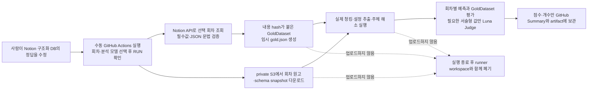

# Notion 정답 데이터와 수동 평가 운영

## 결정 사항

이 문서는 설정 추출 평가 데이터가 어디에 있고, 어떤 시점의 데이터로 평가했는지 재현하기 위한
운영 기준입니다. 대화 컨텍스트와 관계없이 다음 원칙을 source of truth로 사용합니다.

- 사람이 수정하는 정답의 원본은 Notion `설정 추출 답안지`입니다.
- 기존 1~8화 페이지 표는 이관 후에도 삭제하거나 덮어쓰지 않습니다.
- 자동화는 구조화 Notion data source를 읽어 실행마다 `GoldDataset` JSON snapshot을 만듭니다.
- snapshot 버전은 정렬한 평가 내용의 SHA-256 앞 12자리로 생성합니다. 같은 내용은 같은 버전입니다.
- 원고는 저작권·보안 때문에 Git에 커밋하거나 Actions artifact로 올리지 않고 private S3에서만 읽습니다.
- 평가는 `workflow_dispatch`로만 실행합니다. 점수가 낮다는 이유로 workflow를 실패시키지 않습니다.
- 인증, Notion 형식, S3 조회, OpenAI 분석, 평가 실행 오류만 workflow 실패입니다.
- 평가 기준을 고정한 단일 브랜치 실행이 현재 범위이며, baseline/변경 브랜치 A/B 비교는 후속입니다.

## Notion 구조

기존 페이지의 서로 다른 표 형태를 자동화에서 안정적으로 읽기 위해 아래 구조화 DB를 추가했습니다.
원본 페이지의 내용은 유지하고, 2~8화의 기존 행 95개를 회차·원본 순서와 함께 이관했습니다.

- 원본 답안지: <https://app.notion.com/p/3acb33c8d387805681bdf05e4d1cadec>
- 구조화 DB: <https://app.notion.com/p/3aca1853d5b14adf835d8eacd05fd6de>
- data source ID: `63780acf-5001-451b-91c3-8679aba281f3`

### 작성용 View

Notion 데이터베이스는 속성 이름마다 글자색을 따로 지정하는 방식보다 View별로 필요한 속성만
노출하는 방식이 안전합니다. 구조화 DB에는 다음 View를 둡니다.

- `자동 평가 입력`: 현재 평가에 사용하는 속성만 순서대로 표시하는 기본 작성 화면
- `EXTRACT 누락 확인`: `EXTRACT`인데 필수 채점값이 비어 있는 행만 표시하는 실행 전 점검 화면
- `보존·고도화 메모`: 현재 자동 평가에는 쓰지 않지만 향후 분석을 위해 유지하는 속성 확인 화면

데이터베이스 설명에도 모든 행의 공통 필수값, `EXTRACT` 전용 필수값, 선택값과 현재 미사용값을
구분해 두었습니다. 평가 실행 전 `EXTRACT 누락 확인` View가 비어 있는지 확인합니다.

| Notion 속성 | 자동 평가 사용 | 설명 |
| --- | --- | --- |
| `정답 ID` | 오류 위치 표시 | 사람이 행을 찾는 식별자 |
| `회차` | 필수 | 회차별 정답 묶음과 원고 파일 선택 |
| `정렬 순서` | 필수 | Notion 화면 순서와 snapshot의 결정적 정렬 유지 |
| `판정` | 필수 | `EXTRACT`, `DO_NOT_EXTRACT`, `REVIEW_REQUIRED` |
| `소속 캐릭터` | 필수 | 정답 주체 이름 |
| `canonical factKey` | EXTRACT 필수 | 정답 설정 key |
| `추가 허용 factKey 별칭` | 선택 | JSON 문자열 배열. 예: `["profile.종족"]` |
| `valueType` | EXTRACT 필수 | `STRING`, `NUMBER`, `BOOLEAN`, `JSON`, `UNKNOWN` |
| `정답 attributeValue` | EXTRACT 필수 | Fact 정답 판단의 중심 표시값 |
| `정답 valueJson` | EXTRACT 필수 | JSON 객체. Fact 정답과 분리된 구조화 품질 지표 |
| `원문 근거` | EXTRACT 필수 | 여러 인용문은 한 셀에서 줄바꿈으로 구분 |
| `중요도` | EXTRACT 필수 | `MUST`, `SHOULD`, `NICE` |
| `비고(판정 사유·검수 메모)` | 선택 | 보고서 판단을 위한 사람 메모 |
| 그 밖의 원본 컬럼 | 보존 | 향후 평가 고도화를 위해 유지하지만 현재 snapshot에는 넣지 않음 |

`EXTRACT` 행의 필수값이나 JSON 문법이 잘못되면 해당 `정답 ID`를 포함한 오류로 내보내기를
중단합니다. 자동화가 빈 값을 임의로 보정해 잘못된 정답을 만드는 것보다 사람이 Notion 원본을
수정하도록 하는 정책입니다.

`DO_NOT_EXTRACT`는 금지한 설정이 실제로 추출됐는지 자동 채점하려는 경우에만
`canonical factKey`를 입력합니다. key가 없는 `DO_NOT_EXTRACT` 행은 메모로는 보존되지만 자동
오탐 지표에는 포함되지 않습니다. `REVIEW_REQUIRED`는 아직 정답이 확정되지 않은 행이므로 모든
평가 분모에서 제외합니다.

### 현재 이관 데이터에서 먼저 정리할 부분

- 1화 원본 표는 헤더만 있고 정답 행이 없습니다.
- 2화는 현재 평가 계약으로 내보낼 수 있도록 작성되어 있습니다.
- 3~8화에는 일부 `EXTRACT` 행의 `정답 attributeValue`가 비어 있습니다.
- 3~8화의 일부 `정답 valueJson`은 `name=...; value=...` 같은 메모 형식이라 JSON 객체가 아닙니다.

따라서 첫 Actions 실행의 기본 회차는 `2`입니다. 3~8화를 평가하려면 해당 회차의 EXTRACT 행을
먼저 완성해야 합니다. REVIEW_REQUIRED와 DO_NOT_EXTRACT 행은 판정 정책에 맞는 범위에서 빈
채점 필드를 허용합니다.

## 데이터 흐름



Actions artifact에는 원문 파생 상세값을 뺀 `score.json`과 `summary.md`만 14일 보관합니다.
private 원고, Notion에서 만든 `gold.json`, 회차별 prediction JSON과 상세 평가 report는
artifact와 로그에 포함하지 않습니다.

## S3 입력 묶음

GitHub variable `SETTING_EVAL_INPUT_S3_URI`가 가리키는 prefix는 다음 구조로 둡니다.

```text
s3://<private-bucket>/<evaluation-prefix>/
├── sources/
│   ├── 02화.txt
│   ├── 03화.txt
│   └── ...
├── character-setting-schemas.json
└── known-characters.json          # 선택; 없으면 신규 캐릭터 기준으로 분석
```

- `character-setting-schemas.json`은 평가 시점의 활성 설정 schema snapshot이며 빈 배열일 수 없습니다.
- `known-characters.json`은 `characterId`와 `name`을 가진 배열입니다. 운영 이름 해소까지 평가할 때만 둡니다.
- 파일명은 기본적으로 `{회차 두 자리}화.txt`입니다. 다른 규칙이 필요하면 exporter의
  `--source-file-pattern`으로 명시적으로 바꿉니다.

## 최초 1회 권한 설정

### 1. Notion integration

이 단계는 개인 Notion workspace의 integration secret과 페이지 공유 권한이 필요하므로 사용자가
직접 해야 합니다.

1. Notion에서 internal integration을 만들고 최소한 `Read content` capability만 허용합니다.
2. 구조화 DB 우측 상단 메뉴의 `Connections`에서 해당 integration을 연결합니다.
3. integration secret을 GitHub Environment secret `NOTION_API_TOKEN`에 저장합니다.
4. GitHub Environment variable `NOTION_GOLD_DATA_SOURCE_ID`에
   `63780acf-5001-451b-91c3-8679aba281f3`을 저장합니다.

data source는 상위 database의 공유 권한을 상속하므로 data source를 별도로 공개할 필요는 없습니다.
Notion 페이지를 웹 전체 공개로 바꾸지 않습니다.

### 2. GitHub Environment

Repository `Settings → Environments`에서 `setting-extraction-evaluation` 환경을 만들고, 가능하면
required reviewer를 지정합니다. 이 승인은 실수로 OpenAI 비용이 발생하는 것을 한 번 더 막습니다.

| 종류 | 이름 | 내용 |
| --- | --- | --- |
| Secret | `NOTION_API_TOKEN` | Read-only Notion integration secret |
| Secret | `OPENAI_API_KEY` | 평가 분석과 선택적 semantic judge 호출용 |
| Variable | `NOTION_GOLD_DATA_SOURCE_ID` | 위 구조화 data source ID |
| Variable | `SETTING_EVAL_INPUT_S3_URI` | private 평가 입력 S3 prefix |
| Variable | `AWS_REGION` | 평가 bucket region. 예: `ap-northeast-2` |
| Secret | `AWS_ROLE_TO_ASSUME` | 권장. GitHub OIDC가 assume할 read-only role ARN |

OIDC role을 당장 만들지 못한 경우 기존 `DEPLOY_AWS_ACCESS_KEY_ID`,
`DEPLOY_AWS_SECRET_ACCESS_KEY` 쌍으로 임시 실행할 수 있지만, 장기적으로는 OIDC를 사용합니다.

S3 권한은 해당 prefix에 대한 다음 최소 권한만 필요합니다.

- bucket의 지정 prefix `s3:ListBucket`
- 지정 prefix 객체의 `s3:GetObject`

쓰기·삭제 권한은 평가 workflow에 주지 않습니다.

## 실행 방법

현재 workflow는 프롬프트 파일 변경이나 main 머지를 감지해 자동으로 실행하지 않습니다.
main에 머지하면 GitHub Actions에 평가 workflow가 등록되고, 아래 절차로 사람이 실행을 승인합니다.
Notion 조회부터 원고 분석·채점·요약 생성까지는 실행 이후 자동으로 진행합니다. OpenAI 비용과
private 정답 데이터 변경 가능성을 고려해 현재는 이 수동 시작 방식을 유지합니다.

1. GitHub의 `Actions → Setting Extraction Score → Run workflow`를 엽니다.
2. `episodes`에 `2` 또는 `2,3`처럼 평가할 회차만 입력합니다.
3. 분석 모델을 확인합니다. 기본값은 `gpt-5.6-terra`입니다.
4. 서술형 값 의미 판정이 필요하면 `semantic_judge`를 켭니다. Judge는 `gpt-5.6-luna`를 사용합니다.
5. 비용 발생 확인란에 정확히 `RUN`을 입력하고 실행합니다.
6. 완료 후 workflow Summary에서 지표를 확인하고 필요하면 집계 점수 artifact를 내려받습니다.

낮은 Precision/Recall은 작업 실패가 아니라 프롬프트·모델 비교 결과입니다. 반대로 Notion 필수값
누락, 원고 파일 없음, OpenAI 오류처럼 평가 자체를 신뢰할 수 없는 경우에는 workflow가 실패합니다.

## 로컬 내보내기

```bash
export NOTION_API_TOKEN='<read-only integration secret>'
export NOTION_GOLD_DATA_SOURCE_ID='63780acf-5001-451b-91c3-8679aba281f3'

python -m evals.setting_extraction.notion_cli \
  --episodes 2 \
  --output build/eval/gold.json
```

secret과 생성한 원고·snapshot 파일은 Git에 추가하지 않습니다.
